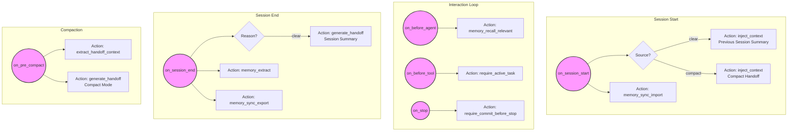
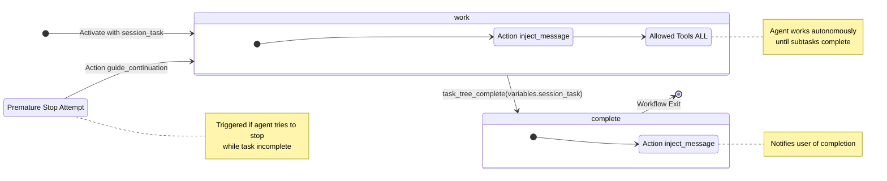

# Workflow Diagrams

This document contains Mermaid diagrams visualizing the Gobby workflow system, based on actual workflow definitions.

## Session Lifecycle (`session-lifecycle.yaml`)

This diagram illustrates the lifecycle triggers and actions that occur during a session, using the `session-lifecycle.yaml` workflow. It shows how context handoff and memory operations are orchestrated at different points in the session.

## Autonomous Task (`autonomous-task.yaml`)

This diagram details the state machine for the `autonomous-task` step workflow. It visualizes the flow from activation to completion, including the `work` loop where the agent has full tool access, and the transition to `complete` once the task tree is finished.

