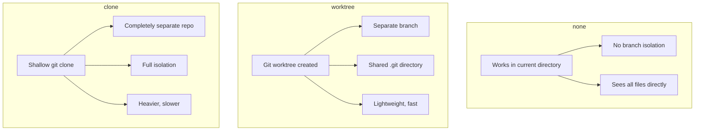
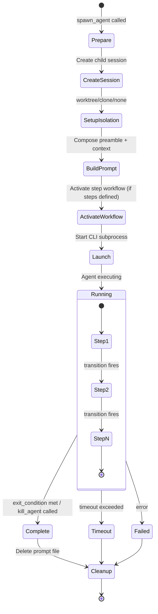

# Agents

Agents are intelligent workers with phased behavior. An agent definition combines identity (who the agent is) with a step workflow (what it does and in what order). Each step phase has tool constraints, a goal, and automatic transitions triggered by MCP tool success.

Agents are LLMs with a playbook. The developer agent claims a task, implements it, submits for review, then terminates — each phase enforced by the rule engine, each transition automatic. The agent doesn't decide when to move to the next phase; the system does.

For how agents fit into the broader workflow system, see [Workflows Overview](./workflows-overview.md).

---

## Quick Start

Agent definitions are YAML files that define identity and behavior:

```yaml
name: my-agent
description: A simple worker agent

role: "You are an autonomous coding assistant."
goal: "Complete your assigned task."
instructions: "Use progressive discovery for MCP tools."

mode: terminal          # Spawn as subprocess
isolation: worktree     # Work in isolated git worktree

steps:
  - name: work
    description: "Do the work"
    allowed_tools: "all"

  - name: terminate
    description: "Shut down"
    allowed_tools:
      - mcp__gobby__call_tool
    allowed_mcp_tools:
      - "gobby-agents:kill_agent"

exit_condition: "current_step == 'terminate'"
```

Import and spawn:

```bash
gobby workflows import my-agent.yaml
gobby agents spawn --agent my-agent --prompt "Implement feature X"
```

---

## Agent Definition Schema

Agent definitions are stored in the database as `workflow_definitions` where `workflow_type = 'agent'`.

### Identity Fields

| Field | Type | Default | Description |
|-------|------|---------|-------------|
| `name` | string | Required | Unique agent name |
| `description` | string | — | Human-readable description |
| `role` | string | — | Role prompt (## Role in preamble) |
| `goal` | string | — | Goal prompt (## Goal in preamble) |
| `personality` | string | — | Personality prompt (## Personality in preamble) |
| `instructions` | string | — | Instructions prompt (## Instructions in preamble) |

These fields compose into a structured preamble at spawn time:

```
## Role
{role}

## Goal
{goal}

## Personality
{personality}

## Instructions
{instructions}
```

### Execution Fields

| Field | Type | Default | Description |
|-------|------|---------|-------------|
| `mode` | string | `"inherit"` | Execution mode: `terminal`, `autonomous`, `self`, `inherit` |
| `isolation` | string | `"inherit"` | Isolation mode: `none`, `worktree`, `clone`, `inherit` |
| `provider` | string | `"inherit"` | LLM provider (claude, gemini, etc.) |
| `model` | string | — | Specific model to use |
| `base_branch` | string | `"inherit"` | Git branch for worktree/clone |
| `timeout` | float | `0` | Max execution time in minutes (0 = unlimited) |
| `max_turns` | int | `0` | Max agent turns (0 = unlimited) |
| `enabled` | bool | `true` | Whether definition is active |
| `priority` | int | `100` | Evaluation priority |
| `version` | string | `"1.0"` | Definition version |

### The `inherit` Sentinel

For `provider`, `model`, `base_branch`, `mode`, and `isolation`, the value `"inherit"` means the agent adopts its configuration from its parent session or system defaults.

**Source**: `src/gobby/workflows/definitions.py` — `AgentDefinitionBody`

---

## Execution Modes

| Mode | Description | Use Case |
|------|-------------|----------|
| `self` | No subprocess spawned. Definition manages the current session's preamble, rules, skills, and variables. | Interactive terminal sessions (the `default` agent) |
| `terminal` | Spawns a subprocess in a tmux pane. Full CLI session with hooks. | Worker agents (developer, QA, merge) |
| `autonomous` | Spawns a headless subprocess. No terminal UI. | Background automation |

`self` mode is used exclusively by the `default` agent — it configures the user's interactive session rather than spawning a new one.

`terminal` and `autonomous` modes create a child session, prepare the environment (isolation, prompts, variables), and launch the CLI agent as a subprocess.

---

## Isolation Modes

Isolation determines where the agent works:



| Mode | Branch | Disk | Speed | Use Case |
|------|--------|------|-------|----------|
| `none` | Shared | None | Instant | Merge agent, read-only agents |
| `worktree` | New branch | Shared `.git` | Fast | Most worker agents (Claude) |
| `clone` | New branch | Full copy | Slow | Gemini CLI (no worktree support) |

### Worktree Behavior

- Creates a branch named `task-{seq_num}-{slug}` (or custom)
- Shares the `.git` directory with the main repo
- Hooks are installed in the worktree for the specified provider
- The orchestrator creates one worktree per epic and reuses it for all tasks

### Clone Behavior

- Creates a shallow clone of the repo
- Fully independent git state
- Used primarily for Gemini CLI, which doesn't support worktrees

**Source**: `src/gobby/agents/isolation.py`

---

## Step Workflows

Step workflows define phased behavior with tool constraints and automatic transitions. Steps are defined inline in the agent definition.

### Step Fields

| Field | Type | Default | Description |
|-------|------|---------|-------------|
| `name` | string | Required | Step identifier |
| `description` | string | — | What this step does |
| `status_message` | string | — | Instructions shown to the agent |
| `allowed_tools` | list \| `"all"` | `"all"` | Native tools allowed |
| `blocked_tools` | list | `[]` | Native tools explicitly blocked |
| `allowed_mcp_tools` | list \| `"all"` | `"all"` | MCP tools allowed (`"server:tool"`) |
| `blocked_mcp_tools` | list | `[]` | MCP tools blocked |
| `on_mcp_success` | list | `[]` | Handlers for MCP tool completion |
| `transitions` | list | `[]` | Automatic step transitions |
| `on_enter` | list | `[]` | Actions on entering this step |
| `on_exit` | list | `[]` | Actions on leaving this step |
| `exit_when` | string | — | Condition to exit the step |

### Automatic Transitions

Transitions fire when a step variable (set by `on_mcp_success`) satisfies a `when` condition:

```yaml
steps:
  - name: claim
    allowed_mcp_tools:
      - "gobby-tasks:claim_task"
      - "gobby-tasks:get_task"
    on_mcp_success:
      - server: gobby-tasks
        tool: claim_task
        action: set_variable
        variable: task_claimed
        value: true
    transitions:
      - to: implement
        when: "vars.task_claimed"
```

When `claim_task` succeeds, `task_claimed` is set to `true`. The transition condition `vars.task_claimed` evaluates to true, and the step automatically advances to `implement`. The agent doesn't need to know about transitions — the rule engine handles it.

### Tool Enforcement

Each step can restrict tools via allow-lists and block-lists:

```yaml
# Locked-down step: only specific tools allowed
- name: claim
  allowed_tools:
    - mcp__gobby__call_tool
    - mcp__gobby__list_mcp_servers
    - mcp__gobby__list_tools
    - mcp__gobby__get_tool_schema
  allowed_mcp_tools:
    - "gobby-tasks:claim_task"
    - "gobby-tasks:get_task"

# Open step with specific blocks
- name: implement
  allowed_tools: "all"           # Everything allowed...
  blocked_mcp_tools:             # ...except these
    - "gobby-tasks:close_task"
    - "gobby-agents:kill_agent"
```

Discovery tools (`list_mcp_servers`, `list_tools`, `get_tool_schema`) always pass regardless of step restrictions — agents need progressive discovery in every phase.

MCP tool patterns support wildcards: `"gobby-merge:*"` allows all tools on the `gobby-merge` server.

**Source**: `src/gobby/workflows/definitions.py` — `WorkflowStep`

---

## Agent Lifecycle



### Lifecycle Steps

1. **Prepare** — Create child session with parent ancestry, set initial variables
2. **Isolate** — Create worktree/clone if needed, determine working directory
3. **Build prompt** — Compose preamble from identity fields + spawn prompt + context
4. **Activate workflow** — If agent has `steps`, activate step workflow on the child session
5. **Launch** — Start CLI subprocess (tmux pane) with prompt file and environment
6. **Execute** — Agent runs, constrained by step workflow and rules
7. **Complete** — Agent calls `kill_agent` or exit condition is met
8. **Cleanup** — Delete prompt file, publish completion event

### Depth Limits

Agents can spawn other agents, creating a tree. Depth is limited to prevent runaway recursion:

- Default depth limit: **5** (configurable)
- Each spawn increments `agent_depth` from the parent
- The spawn API rejects requests that would exceed the limit

---

## Selectors

Agent definitions control which rules, skills, and variables are active for their sessions.

### Selector Types

```yaml
workflows:
  rule_selectors:
    include: ["tag:gobby"]
    exclude: ["name:dangerous-rule"]
  skill_selectors:
    include: ["*"]
    exclude: []
  variable_selectors:
    include: ["*"]
```

### Selector Syntax

| Pattern | Matches |
|---------|---------|
| `*` | Everything |
| `<name>` | Exact name match |
| `tag:<tag>` | Entities with the specified tag |
| `group:<group>` | Entities in the specified group |
| `source:<source>` | By origin: `bundled`, `installed`, `template`, `user` |
| `category:<category>` | By skill/entity category |

### Resolution Rules

- `exclude` always beats `include`
- `null` (omitted) selectors are permissive — equivalent to `include: ["*"]`
- Rules use explicit selectors (enforcement requires intent)
- Skills and variables default to permissive (convenience)

### Inherited Selectors

When an agent definition specifies `extends`, selectors accumulate:
- Parent `include` lists merge with child `include` lists
- Parent `exclude` lists merge with child `exclude` lists
- Child overrides take precedence for scalar values

**Source**: `src/gobby/workflows/definitions.py` — `AgentSelector`, `AgentWorkflows`

---

## Production Agent Examples

### default — Baseline Interactive Agent

The `default` agent configures the user's interactive session. Mode `self` means no subprocess is spawned.

```yaml
name: default
description: Baseline agent — loads all gobby-tagged rules
mode: self
provider: inherit

role: >
  You are Gobby — pair programmer, system architect, and the daemon
  that keeps the whole show running.

personality: >
  Technically sharp, opinionated when it matters, honest even when
  uncomfortable.

instructions: |
  ## Platform Context
  Gobby is a local-first daemon unifying AI coding assistants...

workflows:
  rule_selectors:
    include: ["tag:gobby"]
  # skill_selectors: null (all enabled skills available)
  # variable_selectors: null (all enabled variables apply)
```

**Key pattern**: `mode: self`, explicit `rule_selectors`, permissive skill/variable selectors.

### developer — Task Implementation Worker

A phased agent: claim → implement → submit → terminate.

```yaml
name: developer
version: "2.0"
enabled: false
priority: 20

instructions: |
  You are a developer agent spawned by an orchestrator pipeline.
  1. CLAIM: claim_task + get_task
  2. IMPLEMENT: code, test, commit
  3. SUBMIT: mark_task_needs_review
  4. TERMINATE: kill_agent

step_variables:
  task_claimed: false
  review_submitted: false

steps:
  - name: claim
    allowed_tools: [mcp__gobby__call_tool, ...]
    allowed_mcp_tools: ["gobby-tasks:claim_task", "gobby-tasks:get_task"]
    on_mcp_success:
      - server: gobby-tasks
        tool: claim_task
        action: set_variable
        variable: task_claimed
        value: true
    transitions:
      - to: implement
        when: "vars.task_claimed"

  - name: implement
    allowed_tools: "all"
    blocked_mcp_tools: ["gobby-tasks:close_task", "gobby-agents:kill_agent"]
    on_mcp_success:
      - server: gobby-tasks
        tool: mark_task_needs_review
        action: set_variable
        variable: review_submitted
        value: true
    transitions:
      - to: terminate
        when: "vars.review_submitted"

  - name: terminate
    allowed_mcp_tools: ["gobby-agents:kill_agent"]

exit_condition: "current_step == 'terminate'"
```

**Key pattern**: Three-phase workflow. `claim` is locked down (only task tools). `implement` is open but blocks close/kill. `terminate` only allows kill.

### expander — Research Agent

Explores codebase and produces an expansion spec. Does NOT create tasks.

```yaml
name: expander
enabled: false

steps:
  - name: research
    allowed_tools: "all"
    blocked_mcp_tools:
      - "gobby-tasks:execute_expansion"     # Pipeline's job, not mine
      - "gobby-tasks:close_task"
      - "gobby-tasks:create_task"
      - "gobby-agents:kill_agent"
    on_mcp_success:
      - server: gobby-tasks
        tool: save_expansion_spec
        action: set_variable
        variable: spec_saved
        value: true
    transitions:
      - to: terminate
        when: "vars.spec_saved"

  - name: terminate
    allowed_mcp_tools: ["gobby-agents:kill_agent"]
```

**Key pattern**: Hard boundary — agent only researches and saves a spec. Mechanical execution (`execute_expansion`) is blocked and left to the pipeline.

### qa-reviewer — Code Review Agent

Reviews code, fixes minor issues, approves or rejects tasks.

```yaml
name: qa-reviewer
enabled: false

steps:
  - name: review
    allowed_tools: "all"
    blocked_mcp_tools: ["gobby-tasks:close_task", "gobby-agents:kill_agent"]
    on_mcp_success:
      - server: gobby-tasks
        tool: mark_task_review_approved
        action: set_variable
        variable: review_complete
        value: true
      - server: gobby-tasks
        tool: reopen_task              # Rejection also triggers transition
        action: set_variable
        variable: review_complete
        value: true
    transitions:
      - to: terminate
        when: "vars.review_complete"

  - name: terminate
    allowed_mcp_tools: ["gobby-agents:kill_agent"]
```

**Key pattern**: Both approve AND reject lead to the same transition (review is done either way). The orchestrator interprets the task status to decide next steps.

### merge — Batch Merge Agent

Merges approved task branches into the target. Works in the main repo (no isolation).

```yaml
name: merge
enabled: false
isolation: none              # Works in main repo, not a worktree

steps:
  - name: merge
    allowed_tools: [Bash, Read, Glob, Grep, mcp__gobby__call_tool, ...]
    blocked_tools: [Write, Edit]           # Read-only in main repo
    allowed_mcp_tools:
      - "gobby-worktrees:list_worktrees"
      - "gobby-worktrees:merge_worktree"
      - "gobby-worktrees:delete_worktree"
      - "gobby-tasks:list_tasks"
      - "gobby-tasks:close_task"
      - "gobby-merge:*"                   # All merge resolution tools
      - "gobby-agents:kill_agent"

  - name: terminate
    allowed_mcp_tools: ["gobby-agents:kill_agent"]
```

**Key pattern**: `isolation: none` (works in the real repo). Write/Edit blocked (only merges, no editing). `gobby-merge:*` wildcard for all merge tools.

---

## P2P Messaging

Agents can communicate with each other and their parent sessions via messaging:

```python
# Send a message
call_tool("gobby-agents", "send_message", {
    "from_session": session_id,
    "to_session": parent_session_id,
    "content": "Task complete"
})

# Wait for a command
call_tool("gobby-agents", "wait_for_command", {
    "session_id": session_id,
    "timeout": 600
})
```

The messaging rule group (`messaging/`) handles:
- Delivering pending messages when an agent starts a new turn
- Activating received commands
- Restricting tools during command execution
- Exit conditions for command completion

---

## CLI Reference

```bash
# List agents
gobby agents list [--json]

# Show agent definition
gobby agents show <name> [--json]

# Spawn an agent
gobby agents spawn --agent <name> --prompt "..." [--provider claude] [--isolation worktree]

# List running agents
gobby agents ps [--json]

# Kill an agent
gobby agents kill <run_id>
```

## MCP Tool Reference

| Server | Tool | Description |
|--------|------|-------------|
| `gobby-agents` | `spawn_agent` | Spawn agent with definition, prompt, isolation |
| `gobby-agents` | `kill_agent` | Terminate a running agent |
| `gobby-agents` | `dispatch_batch` | Dispatch multiple agents in parallel |
| `gobby-agents` | `send_message` | Send P2P message between sessions |
| `gobby-agents` | `wait_for_command` | Block until command received |
| `gobby-agents` | `send_command` | Send command to agent session |
| `gobby-agents` | `list_agent_runs` | List active agent runs |

---

## File Locations

| Path | Purpose |
|------|---------|
| `src/gobby/agents/spawn.py` | Spawn preparation and prompt management |
| `src/gobby/agents/runner.py` | AgentRunner process management |
| `src/gobby/agents/isolation.py` | Isolation handlers (none/worktree/clone) |
| `src/gobby/agents/session.py` | Child session management |
| `src/gobby/agents/definitions.py` | Agent definition resolution |
| `src/gobby/agents/registry.py` | Agent registry (DB-backed) |
| `src/gobby/agents/tmux/spawner.py` | TmuxSpawner (terminal backend) |
| `src/gobby/workflows/definitions.py` | AgentDefinitionBody, WorkflowStep models |
| `src/gobby/install/shared/agents/` | Bundled agent templates |
| `src/gobby/cli/agents.py` | CLI commands |

## See Also

- [Workflows Overview](./workflows-overview.md) — How agents, rules, and pipelines compose
- [Rules](./rules.md) — Rules that constrain agent behavior
- [Pipelines](./pipelines.md) — Pipelines that orchestrate agent spawning
- [Orchestrator](./orchestrator.md) — The orchestrator pattern using developer/QA/merge agents
