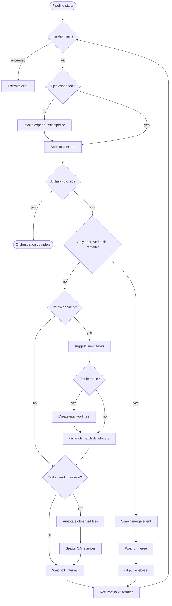
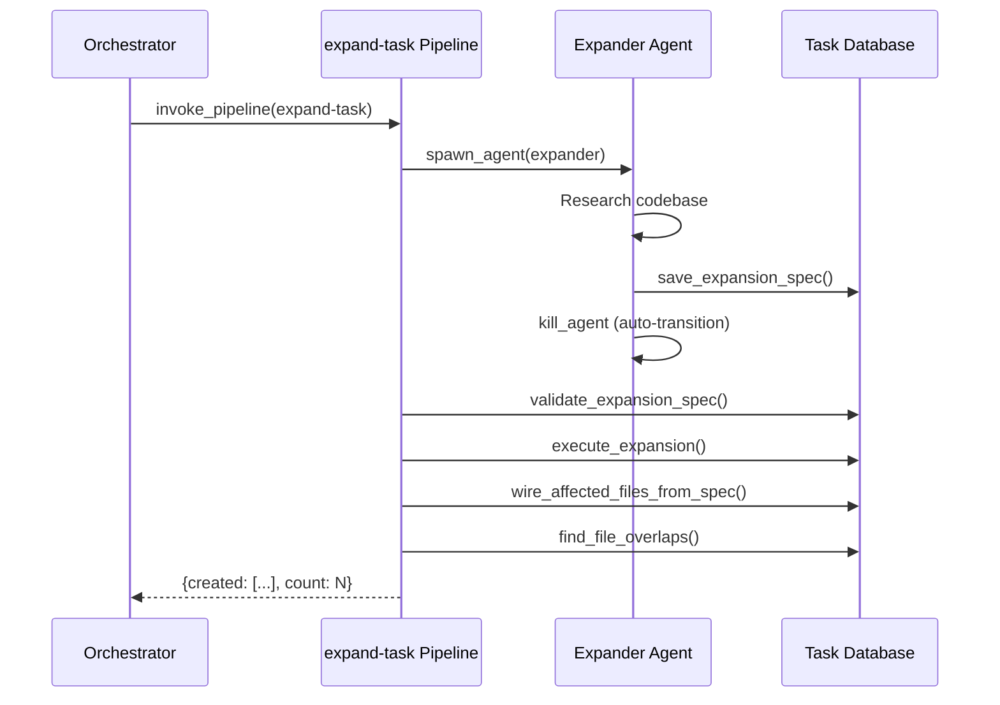
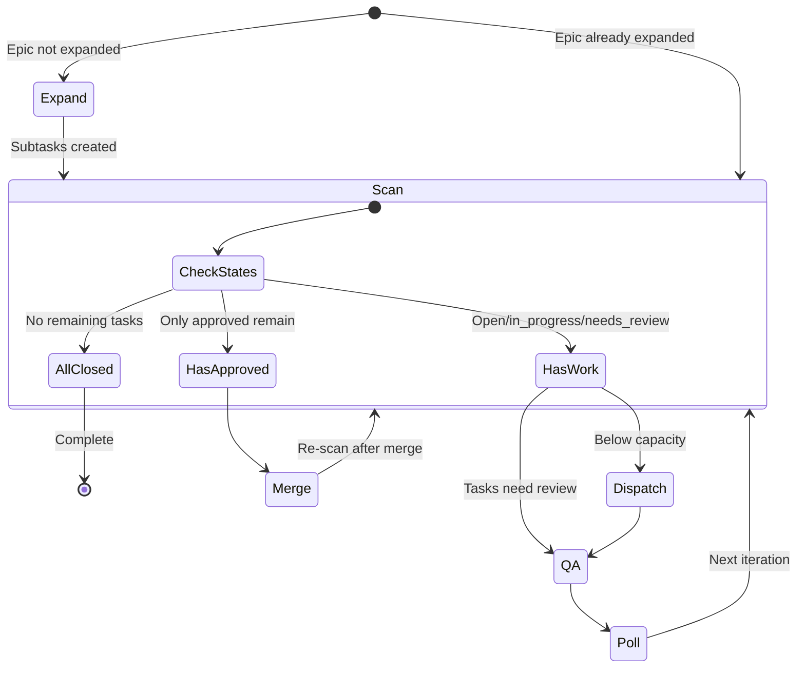

# Orchestrator Pattern

The orchestrator is a recursive pipeline that coordinates an entire epic: expand tasks, dispatch developers in parallel, run QA review, merge approved branches, and loop until all work is done. It's the canonical example of how pipelines, agents, and rules compose.

The orchestrator doesn't think — it dispatches. When it needs intelligence (coding, reviewing, merging), it spawns an agent. When it needs mechanical work (scanning tasks, creating worktrees), it calls MCP tools directly.

For the underlying systems, see: [Pipelines](./pipelines.md), [Agents](./agents.md), [Rules](./rules.md).

---

## The Loop



Each iteration of the loop:

1. **Guard** — Check iteration limit (default: 200)
2. **Expand** — If the epic hasn't been expanded yet, invoke the `expand-task` sub-pipeline
3. **Scan** — Query task states: open, in_progress, needs_review, review_approved
4. **Check completion** — If all tasks are closed, exit
5. **Merge** — If only approved tasks remain, spawn merge agent and wait
6. **Dispatch** — Find non-conflicting tasks, dispatch developers in parallel
7. **QA** — If tasks need review, spawn QA reviewer
8. **Recurse** — Invoke self with incremented iteration counter

---

## Key Design Decisions

### Single Worktree Per Epic

The orchestrator creates **one** worktree on the first iteration and reuses it for all subsequent tasks. This means:

- One branch per epic, not one branch per task
- All developers work in the same worktree (sequentially or in parallel)
- One merge operation at epic completion (epic branch → target), not N merges
- Reduces disk overhead and merge conflict risk

The worktree is created with an epic-level branch name: `epic-{seq_num}`.

```yaml
- id: create_worktree
  condition: "${{ not inputs._worktree_id }}"  # First iteration only
  mcp:
    server: gobby-worktrees
    tool: create_worktree
    arguments:
      branch_name: "epic-${{ get_epic.output.result.seq_num }}"
      base_branch: "${{ inputs.merge_target }}"
      use_local: true
```

The `_worktree_id` is passed through each recursive invocation, ensuring all iterations reuse the same worktree.

### Fire-and-Forget Dispatch

Developers and QA agents are spawned **fire-and-forget** — the orchestrator doesn't wait for them. Instead, it polls: sleep for `poll_interval` seconds, then recurse. On the next iteration, the scan step discovers what changed.

This is intentional:
- No blocking on slow agents
- New tasks can be dispatched while others are running
- The loop naturally adapts to completion pace

### Parallel Dispatch with File Contention Detection

The `suggest_next_tasks` tool finds tasks that can run in parallel by checking `affected_files` annotations. Tasks that touch the same files are not dispatched together.

```yaml
- id: find_next
  condition: "${{ scan_in_progress.output.tasks | length < inputs.max_concurrent }}"
  mcp:
    server: gobby-tasks
    tool: suggest_next_tasks
    arguments:
      max_count: "${{ inputs.max_concurrent - (scan_in_progress.output.tasks | length) }}"
```

The `max_concurrent` input (default: 5) caps how many developers can run simultaneously.

### Merge at Epic Completion

Merging happens only when all remaining tasks are `review_approved` — no open, in_progress, or needs_review tasks remain. This batches all approved work into a single merge operation.

```yaml
- id: spawn_merge
  condition: >-
    ${{ (scan_approved.output.tasks | length > 0)
    and (scan_open.output.tasks | length == 0)
    and (scan_in_progress.output.tasks | length == 0)
    and (scan_needs_review.output.tasks | length == 0) }}
```

The merge agent works in the main repo (`isolation: none`) and uses `gobby-merge:*` tools to resolve conflicts.

---

## The Agents

The orchestrator coordinates four agent types:

### Developer Agent

**Role**: Claim a task, implement it, submit for review.
**Step workflow**: `claim` → `implement` → `terminate`
**Isolation**: Uses the epic worktree (shared `worktree_id`)

The developer's `claim` step is locked down — only `claim_task` and `get_task` allowed. Once the task is claimed, it transitions to `implement` where most tools are available. After calling `mark_task_needs_review`, it transitions to `terminate`.

### QA Reviewer Agent

**Role**: Review code changes, approve or reject.
**Step workflow**: `review` → `terminate`
**Isolation**: Uses the epic worktree (can see code changes)

Both `mark_task_review_approved` and `reopen_task` trigger the same transition — the review is complete either way. The orchestrator reads the resulting task status on the next scan.

### Merge Agent

**Role**: Merge approved branches into the target.
**Step workflow**: `merge` → `terminate`
**Isolation**: `none` — works in the main repo

Write/Edit are blocked (read-only). The merge agent uses `gobby-merge:*` and `gobby-worktrees:merge_worktree` tools.

### Expander Agent

**Role**: Research the codebase and produce an expansion spec.
**Step workflow**: `research` → `terminate`
**Spawned by**: The `expand-task` sub-pipeline, not directly by the orchestrator.

The expander is blocked from `execute_expansion` and `create_task` — it only produces the spec. The pipeline validates and executes mechanically.

---

## Expansion Sub-Pipeline

When the epic hasn't been expanded yet, the orchestrator invokes the `expand-task` pipeline:



The hard boundary between research (creative) and execution (mechanical) is intentional. The expander agent explores the codebase and produces a structured spec. The pipeline then validates the spec's structure and dependencies before atomically creating all subtasks.

See [Task Expansion Guide](./task-expansion.md) for the full walkthrough.

---

## Pipeline Inputs

| Input | Default | Description |
|-------|---------|-------------|
| `session_task` | `null` | **Required.** Epic task ID to orchestrate |
| `developer_agent` | `"developer"` | Agent definition for developers |
| `qa_agent` | `"qa-reviewer"` | Agent definition for QA |
| `merge_agent` | `"merge"` | Agent definition for merge |
| `developer_provider` | `"claude"` | LLM provider for developers |
| `qa_provider` | `"claude"` | LLM provider for QA |
| `merge_provider` | `"claude"` | LLM provider for merge |
| `developer_model` | `null` | Model override for developers |
| `qa_model` | `null` | Model override for QA |
| `merge_model` | `null` | Model override for merge |
| `merge_target` | `null` | Branch to merge into (e.g., `main`) |
| `wait_timeout` | `600` | Timeout for blocking waits (seconds) |
| `max_concurrent` | `5` | Max parallel developers |
| `poll_interval` | `15` | Seconds between scan iterations |
| `max_iterations` | `200` | Safety limit on loop iterations |

### Internal State (Pipeline-Managed)

| Input | Description |
|-------|-------------|
| `_current_iteration` | Loop counter (starts at 0, incremented per recursion) |
| `_worktree_id` | Worktree ID (set on first iteration, reused thereafter) |

The `_` prefix convention marks inputs that are pipeline-managed — they're passed through recursive invocations but shouldn't be set by the caller.

---

## Running the Orchestrator

### Via CLI

```bash
gobby pipelines run orchestrator \
  -i session_task=#42 \
  -i merge_target=main
```

### Via MCP

```python
call_tool("gobby-pipelines", "run_pipeline", {
    "name": "orchestrator",
    "inputs": {
        "session_task": "#42",
        "merge_target": "main"
    },
    "wait": False  # Long-running — don't block
})
```

### Monitoring

```bash
# Check execution status
gobby pipelines status <execution_id>

# Watch task progress
gobby tasks list --parent #42 --json
```

---

## Lifecycle Diagram



---

## Rules During Orchestration

Rules run inside every agent spawned by the orchestrator. The orchestrator pipeline itself is not subject to rules — it's a deterministic pipeline execution.

Key rules active during orchestration:

| Rule Group | Effect |
|------------|--------|
| `worker-safety` | Blocks git push for all worker agents |
| `task-enforcement` | Requires task claim before editing, commit before close |
| `stop-gates` | Prevents premature agent exit |
| `progressive-discovery` | Enforces MCP discovery protocol |
| `context-handoff` | Injects session summaries on compact/clear |
| `error-recovery` | Guides agents after tool failures |

The developer, QA, and merge agents each have their own `rule_selectors` that control which rule groups are active for their sessions.

---

## Failure Modes

| Failure | Behavior |
|---------|----------|
| Agent crashes | Task stays `in_progress`. Next scan detects it. Orchestrator can re-dispatch. |
| Agent times out | Same as crash — stays `in_progress` for re-dispatch. |
| QA rejects task | Task reopened to `open`. Next scan picks it up for re-dispatch. |
| Merge conflicts | Merge agent uses `gobby-merge` tools to attempt resolution. If unresolvable, merge fails and pipeline can be retried. |
| Expansion fails | `expand-task` pipeline fails at validation step. Orchestrator halts. |
| Iteration limit | Safety exit after `max_iterations` (default: 200). |

---

## File Locations

| Path | Purpose |
|------|---------|
| `src/gobby/install/shared/workflows/orchestrator.yaml` | Orchestrator pipeline definition |
| `src/gobby/install/shared/workflows/expand-task.yaml` | Expansion sub-pipeline |
| `src/gobby/install/shared/agents/developer.yaml` | Developer agent definition |
| `src/gobby/install/shared/agents/qa-reviewer.yaml` | QA reviewer agent definition |
| `src/gobby/install/shared/agents/merge.yaml` | Merge agent definition |
| `src/gobby/install/shared/agents/expander.yaml` | Expander agent definition |
| `src/gobby/workflows/pipeline_executor.py` | Pipeline execution engine |
| `src/gobby/agents/spawn.py` | Agent spawning |

## See Also

- [Workflows Overview](./workflows-overview.md) — Mental model for rules, agents, pipelines
- [Pipelines](./pipelines.md) — Pipeline system reference
- [Agents](./agents.md) — Agent definitions and step workflows
- [Task Expansion](./task-expansion.md) — How expansion works end-to-end
- [TDD Enforcement](./tdd-enforcement.md) — TDD pattern applied during expansion
