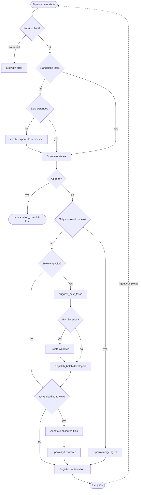
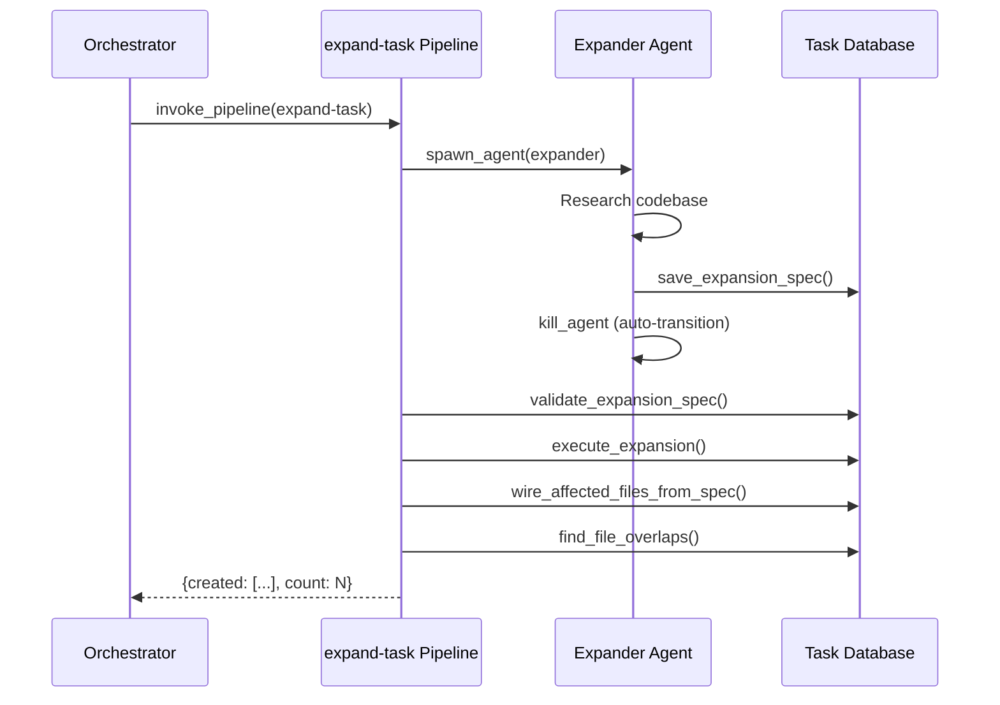
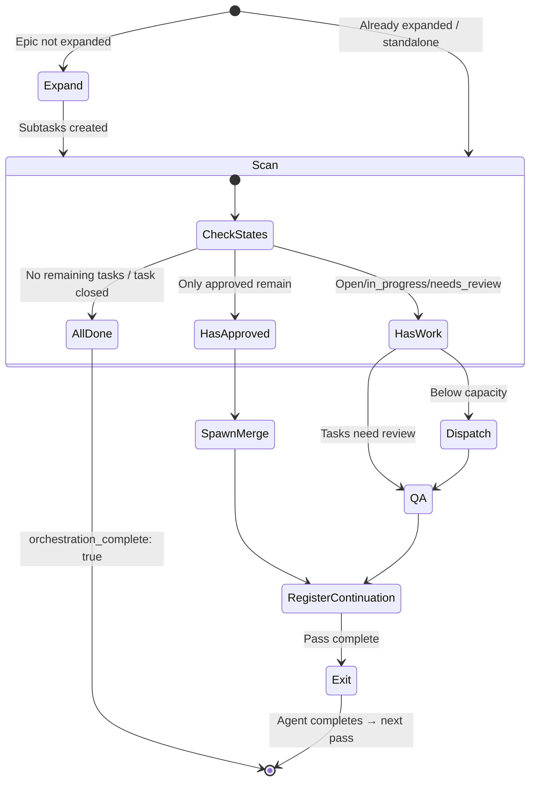

# Orchestrator Pattern

The orchestrator is a pipeline that coordinates an entire epic (or standalone task): expand tasks, dispatch developers in parallel, run QA review, merge approved branches, and exit. The conductor (a cron-ticked LLM agent) drives re-invocation between passes. It's the canonical example of how pipelines, agents, and rules compose.

The orchestrator doesn't think — it dispatches. When it needs intelligence (coding, reviewing, merging), it spawns an agent. When it needs mechanical work (scanning tasks, creating worktrees), it calls MCP tools directly.

For the underlying systems, see: [Pipelines](./pipelines.md), [Agents](./agents.md), [Rules](./rules.md).

---

## Event-Driven Passes



Each pass is a single-pass scan-and-dispatch:

1. **Guard** — Check iteration limit (default: 200)
2. **Detect** — Determine if this is a standalone task or an epic with children
3. **Expand** — If epic and not yet expanded, invoke the `expand-task` sub-pipeline
4. **Scan** — Query task states: open, in_progress, needs_review, review_approved
5. **Check completion** — If all work is done, return `orchestration_complete: true`
6. **Merge** — If only approved tasks remain, spawn merge agent
7. **Dispatch** — Find non-conflicting tasks, dispatch developers in parallel
8. **QA** — If tasks need review, spawn QA reviewer
9. **Register continuations** — Register callbacks so any agent completion triggers the next pass
10. **Exit** — Return `orchestration_complete: false`, await next trigger

No loops, no sleeps, no blocking waits. The pipeline exits after each pass. Agent completions fire continuation callbacks that re-invoke the pipeline with incremented state.

---

## Standalone Task Support

The orchestrator handles both epics (tasks with children) and standalone tasks (single non-epic tasks):

**For epics** (existing behavior):
- Scans children by status → dispatches developers for open tasks → QA for needs_review → merge when all approved

**For standalone tasks**:
- Same lifecycle, but checks the task itself instead of children
- Pass 1: task is open → dispatch developer → exit
- Pass 2: task is needs_review → dispatch QA → exit
- Pass 3: task is review_approved → dispatch merge → exit
- Pass 4: task is closed → `orchestration_complete: true`

Detection is automatic: if all child scans return empty, the task is standalone.

---

## Key Design Decisions

### Single Worktree Per Orchestration

The orchestrator creates **one** worktree on the first pass and reuses it for all subsequent passes. This means:

- One branch per orchestration, not one branch per task
- All developers work in the same worktree (sequentially or in parallel)
- One merge operation at completion, not N merges
- Reduces disk overhead and merge conflict risk

The worktree branch name reflects the task type: `epic-{seq_num}` for epics, `task-{seq_num}` for standalone tasks.

```yaml
- id: create_worktree
  condition: "${{ not inputs._worktree_id }}"  # First pass only
  mcp:
    server: gobby-worktrees
    tool: create_worktree
    arguments:
      branch_name: "${{ 'task-' + str(get_epic.output.seq_num) if get_epic.output.task_type != 'epic' else 'epic-' + str(get_epic.output.seq_num) }}"
      base_branch: "${{ inputs.merge_target }}"
      use_local: true
```

The `_worktree_id` is carried through each pass, ensuring all passes reuse the same worktree.

### Re-invocation via Conductor

The conductor (a cron-ticked LLM agent) drives orchestrator re-invocation:

1. Each pass dispatches agents (developers, QA, merge) as fire-and-forget
2. The pipeline exits
3. The conductor periodically checks for completed agents and stalled orchestrations
4. When it detects work to do, it re-invokes the orchestrator pipeline with incremented `_current_iteration`

This is safe for concurrent triggers — multiple passes may overlap, but:
- Scans are read-only
- `suggest_next_tasks` uses file annotations for conflict detection
- `dispatch_batch` checks task status to avoid double-dispatch (task must be `open`)
- A duplicate pass just finds nothing to dispatch and exits

### Parallel Dispatch with File Contention Detection

The `suggest_next_tasks` tool finds tasks that can run in parallel by checking `affected_files` annotations. Tasks that touch the same files are not dispatched together.

```yaml
- id: find_next
  condition: "${{ scan_in_progress.output.tasks | length < inputs.max_concurrent }}"
  mcp:
    server: gobby-tasks
    tool: suggest_next_tasks
    arguments:
      max_count: "${{ inputs.max_concurrent - (scan_in_progress.output.tasks | length) }}"
```

The `max_concurrent` input (default: 5) caps how many developers can run simultaneously.

### Merge at Completion

Merging happens only when all remaining tasks are `review_approved` — no open, in_progress, or needs_review tasks remain. This batches all approved work into a single merge operation.

For standalone tasks, merge triggers when the single task reaches `review_approved`.

---

## The Agents

The orchestrator coordinates four agent types:

### Developer Agent

**Role**: Claim a task, implement it, submit for review.
**Step workflow**: `claim` → `implement` → `terminate`
**Isolation**: Uses the orchestration worktree (shared `worktree_id`)

The developer's `claim` step is locked down — only `claim_task` and `get_task` allowed. Once the task is claimed, it transitions to `implement` where most tools are available. After calling `mark_task_needs_review`, it transitions to `terminate`.

### QA Reviewer Agent

**Role**: Review code changes, approve or reject.
**Step workflow**: `review` → `terminate`
**Isolation**: Uses the orchestration worktree (can see code changes)

Both `mark_task_review_approved` and `reopen_task` trigger the same transition — the review is complete either way. The orchestrator reads the resulting task status on the next pass.

### Merge Agent

**Role**: Merge approved branches into the target.
**Step workflow**: `merge` → `terminate`
**Isolation**: `none` — works in the main repo

Write/Edit are blocked (read-only). The merge agent uses `gobby-merge:*` and `gobby-worktrees:merge_worktree` tools.

### Expander Agent

**Role**: Research the codebase and produce an expansion spec.
**Step workflow**: `research` → `terminate`
**Spawned by**: The `expand-task` sub-pipeline, not directly by the orchestrator.

The expander is blocked from `execute_expansion` and `create_task` — it only produces the spec. The pipeline validates and executes mechanically.

---

## Expansion Sub-Pipeline

When the epic hasn't been expanded yet, the orchestrator invokes the `expand-task` pipeline:



The hard boundary between research (creative) and execution (mechanical) is intentional. The expander agent explores the codebase and produces a structured spec. The pipeline then validates the spec's structure and dependencies before atomically creating all subtasks.

Standalone tasks skip expansion entirely — the `expand_epic` step only runs when `task_type == 'epic'`.

See [Task Expansion Guide](./task-expansion.md) for the full walkthrough.

---

## Pipeline Inputs

| Input | Default | Description |
|-------|---------|-------------|
| `session_task` | `null` | **Required.** Task ID to orchestrate (epic or standalone) |
| `developer_agent` | `"developer"` | Agent definition for developers |
| `qa_agent` | `"qa-reviewer"` | Agent definition for QA |
| `merge_agent` | `"merge"` | Agent definition for merge |
| `developer_provider` | `"claude"` | LLM provider for developers |
| `qa_provider` | `"claude"` | LLM provider for QA |
| `merge_provider` | `"claude"` | LLM provider for merge |
| `developer_model` | `null` | Model override for developers |
| `qa_model` | `null` | Model override for QA |
| `merge_model` | `null` | Model override for merge |
| `merge_target` | `null` | Branch to merge into (e.g., `main`) |
| `wait_timeout` | `600` | Timeout for blocking waits (seconds) |
| `max_concurrent` | `5` | Max parallel developers |
| `max_iterations` | `200` | Safety limit on total passes |

### Internal State (Pipeline-Managed)

| Input | Description |
|-------|-------------|
| `_current_iteration` | Pass counter (starts at 0, incremented per continuation) |
| `_worktree_id` | Worktree ID (set on first pass, carried through continuations) |

The `_` prefix convention marks inputs that are pipeline-managed — they're carried through continuations but shouldn't be set by the caller.

### Execution Result

Each pass returns an execution result with:

| Field | Description |
|-------|-------------|
| `orchestration_complete` | `true` when all work is done, `false` if continuations registered |
| `iteration` | Current pass number |
| `session_task` | The orchestrated task ID |
| `is_standalone` | Whether this is a standalone task or epic |

---

## Running the Orchestrator

### Via CLI

```bash
gobby pipelines run orchestrator \
  -i session_task=#42 \
  -i merge_target=main
```

### Via MCP

```python
call_tool("gobby-workflows", "run_pipeline", {
    "name": "orchestrator",
    "inputs": {
        "session_task": "#42",
        "merge_target": "main"
    },
    "continuation_prompt": "Orchestrator completed. Review task states."
})
```

### Monitoring

Each pass is a separate pipeline execution. The orchestrator completes when a pass returns `orchestration_complete: true`.

```bash
# Check task progress directly
gobby tasks list --parent #42 --json

# See recent pipeline executions
gobby pipelines history orchestrator

# Check specific execution result
gobby pipelines status <execution_id>
```

---

## Lifecycle Diagram



---

## Rules During Orchestration

Rules run inside every agent spawned by the orchestrator. The orchestrator pipeline itself is not subject to rules — it's a deterministic pipeline execution.

Key rules active during orchestration:

| Rule Group | Effect |
|------------|--------|
| `worker-safety` | Blocks git push, force push, and bash sleep for all worker agents |
| `task-enforcement` | Requires task claim before editing, commit before close |
| `stop-gates` | Prevents premature agent exit |
| `progressive-discovery` | Enforces MCP discovery protocol |
| `context-handoff` | Injects session summaries on compact/clear |
| `error-recovery` | Guides agents after tool failures |

The developer, QA, and merge agents each have their own `rule_selectors` that control which rule groups are active for their sessions.

---

## Failure Modes

| Failure | Behavior |
|---------|----------|
| Agent crashes | Task stays `in_progress`. Next pass detects it. Orchestrator can re-dispatch. |
| Agent times out | Same as crash — stays `in_progress` for re-dispatch. |
| QA rejects task | Task reopened to `open`. Next pass picks it up for re-dispatch. |
| Merge conflicts | Merge agent uses `gobby-merge` tools to attempt resolution. If unresolvable, merge fails and pipeline can be retried. |
| Expansion fails | `expand-task` pipeline fails at validation step. Orchestrator halts. |
| Iteration limit | Safety exit after `max_iterations` (default: 200). |
| Concurrent passes | Safe — scans are read-only, dispatch checks task status, duplicate passes find nothing to do. |

---

## File Locations

| Path | Purpose |
|------|---------|
| `src/gobby/install/shared/workflows/orchestrator.yaml` | Orchestrator pipeline definition |
| `src/gobby/install/shared/workflows/expand-task.yaml` | Expansion sub-pipeline |
| `src/gobby/install/shared/agents/developer.yaml` | Developer agent definition |
| `src/gobby/install/shared/agents/qa-reviewer.yaml` | QA reviewer agent definition |
| `src/gobby/install/shared/agents/merge.yaml` | Merge agent definition |
| `src/gobby/install/shared/agents/expander.yaml` | Expander agent definition |
| `src/gobby/workflows/pipeline_executor.py` | Pipeline execution engine |
| `src/gobby/events/completion_registry.py` | Completion events + continuation callbacks |
| `src/gobby/agents/spawn.py` | Agent spawning |

## See Also

- [Workflows Overview](./workflows-overview.md) — Mental model for rules, agents, pipelines
- [Pipelines](./pipelines.md) — Pipeline system reference
- [Agents](./agents.md) — Agent definitions and step workflows
- [Task Expansion](./task-expansion.md) — How expansion works end-to-end
- [TDD Enforcement](./tdd-enforcement.md) — TDD pattern applied during expansion
