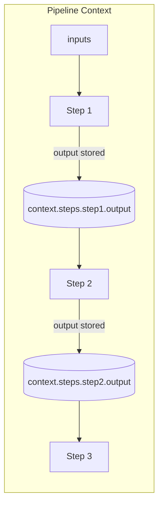
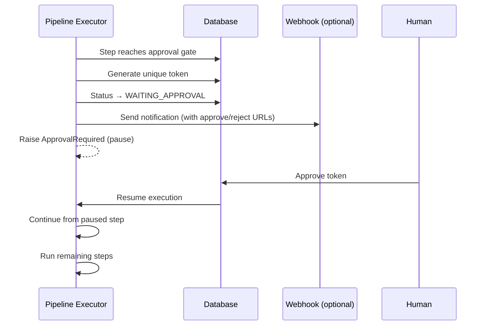
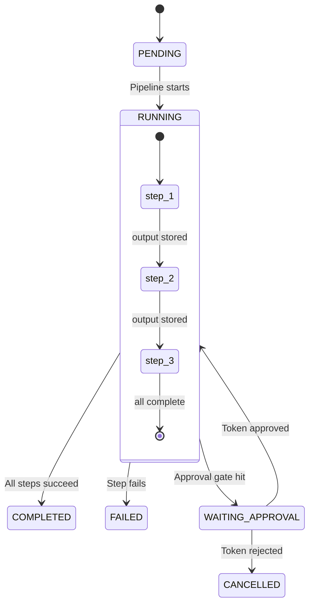

# Pipelines

Pipelines provide **deterministic, sequential execution** with typed data flow between steps. They run to completion or pause at approval gates — no event-driven state machine, no interactive agent guidance. Think CI/CD, not chatbot orchestration.

When a step needs intelligence, it spawns an agent. When it's mechanical, it runs a shell command or calls an MCP tool directly. Pipelines are the assembly line — they coordinate who does what and in what order.

For how pipelines fit into the broader workflow system, see [Workflows Overview](./workflows-overview.md).

---

## Quick Start

```yaml
name: deploy
type: pipeline
description: Build, test, and deploy

steps:
  - id: build
    exec: npm run build

  - id: test
    exec: npm test

  - id: deploy
    exec: deploy-to-prod
    approval:
      required: true
      message: "Approve production deployment?"
```

```bash
gobby pipelines import deploy.yaml
gobby pipelines run deploy
```

---

## Pipeline vs Agent vs Rule

| Feature | Pipeline | Agent (Step Workflow) | Rule |
|---------|----------|----------------------|------|
| Execution model | Sequential, runs to completion | Event-driven state machine | Single-pass event handler |
| Data flow | Explicit `${{ }}` templates | Workflow/session variables | `set_variable` effect |
| Approval gates | Built-in with resume tokens | N/A | N/A |
| State persistence | DB records (survives restarts) | Workflow instances | Stateless |
| Typical use | Automation, orchestration | Agent phase guidance | Enforcement, blocking |

---

## YAML Schema

### Pipeline Definition

```yaml
name: string              # Required. Unique pipeline name
type: pipeline            # Required. Must be "pipeline"
version: string           # Optional. Default: "1.0"
description: string       # Optional

inputs:                   # Optional. Default input values (overridden at runtime)
  timeout: 300
  environment: staging

outputs:                  # Optional. Output mapping using $step.output references
  result: $deploy.output
  version: $build.output.version

steps:                    # Required. At least one step
  - id: step1
    exec: echo hello

webhooks:                 # Optional. Event notifications
  on_approval_pending: ...
  on_complete: ...
  on_failure: ...

expose_as_tool: false     # Optional. Register as dynamic MCP tool
resume_on_restart: false  # Optional. Resume after daemon restart (steps must be idempotent)
```

**Source**: `src/gobby/workflows/definitions.py` — `PipelineDefinition`

### Step Fields

| Field | Type | Description |
|-------|------|-------------|
| `id` | string | **Required.** Unique identifier within the pipeline |
| `exec` | string | Shell command (mutually exclusive with other types) |
| `prompt` | string | LLM prompt template |
| `mcp` | object | MCP tool call: `{server, tool, arguments?}` |
| `invoke_pipeline` | string \| dict | Nested pipeline: name or `{name, arguments}` |
| `activate_workflow` | object | Activate step workflow: `{name, session_id, variables?}` |
| `wait` | object | Block until completion: `{completion_id, timeout?}` |
| `condition` | string | Expression; step skipped if false |
| `input` | string | Explicit input reference (Lobster compat) |
| `approval` | object | Approval gate: `{required, message?, timeout_seconds?}` |
| `tools` | list | Tool restrictions for prompt steps |

Each step must have **exactly one** execution type. Validation enforces this at parse time.

**Source**: `src/gobby/workflows/definitions.py` — `PipelineStep`

---

## Step Types

### exec — Shell Command

Runs a command via `asyncio.create_subprocess_exec` with `shlex.split`. No shell features (pipes, redirects, globs) — the command is executed directly. Use `bash -c '...'` for shell features.

```yaml
- id: build
  exec: npm run build
  condition: "${{ inputs.skip_build != 'true' }}"
```

**Output**: `{stdout: string, stderr: string, exit_code: int}`

Default timeout: 300 seconds.

**Source**: `src/gobby/workflows/pipeline/handlers.py` — `execute_exec_step`

### prompt — LLM Step

Sends a prompt to the default LLM provider. Requires `llm_service` to be configured (available when running via daemon).

```yaml
- id: analyze
  prompt: |
    Analyze the test results: ${{ steps.test.output.stdout }}
    Summarize failures and suggest fixes.
  tools:
    - Read
    - Grep
```

**Output**: `{response: string, error?: string}`

**Source**: `src/gobby/workflows/pipeline/handlers.py` — `execute_prompt_step`

### mcp — MCP Tool Call

Calls an MCP tool directly via the tool proxy. No LLM involved.

```yaml
- id: scan_open
  mcp:
    server: gobby-tasks
    tool: list_tasks
    arguments:
      parent_task_id: "${{ inputs.session_task }}"
      status: "open"
```

If the MCP tool returns `isError: true` or `success: false`, a `RuntimeError` is raised and the step fails.

**Output**: `{result: string}` for SDK responses, or the raw dict for internal tools.

**Source**: `src/gobby/workflows/pipeline/handlers.py` — `execute_mcp_step`

### invoke_pipeline — Nested Pipeline

Invokes another pipeline definition. Two forms:

```yaml
# Simple — inherits parent inputs
- id: run_tests
  invoke_pipeline: test-suite

# Dict — explicit arguments (replaces parent inputs entirely)
- id: expand
  invoke_pipeline:
    name: expand-task
    arguments:
      task_id: "${{ inputs.session_task }}"
      session_id: "${{ session_id }}"
```

**Output**: `{pipeline: string, execution_id?: string, status?: string, error?: string}`

**Limitation**: Nested pipeline outputs are not propagated to the parent context. Downstream steps can only see `execution_id` and `status`.

**Source**: `src/gobby/workflows/pipeline_executor.py` — `_execute_nested_pipeline`

### activate_workflow — Activate Step Workflow

Activates an on-demand step workflow on a specific session.

```yaml
- id: setup-workflow
  activate_workflow:
    name: developer
    session_id: "${{ steps.spawn.output.session_id }}"
    variables:
      session_task: "#123"
```

**Required fields**: `name`, `session_id`. Optional: `variables`.

**Source**: `src/gobby/workflows/pipeline/handlers.py` — `execute_activate_workflow_step`

### wait — Block Until Completion

Blocks execution until a completion event fires for the given ID. Used to wait for spawned agents or background processes to finish.

```yaml
- id: wait_researcher
  wait:
    completion_id: "${{ steps.spawn_researcher.output.run_id }}"
    timeout: 600
```

| Field | Type | Default | Description |
|-------|------|---------|-------------|
| `completion_id` | string | Required | ID to wait on (typically a `run_id` from `spawn_agent`) |
| `timeout` | number | `600` | Seconds before `TimeoutError` |

**Output**: The completion result dict (whatever the completing process published).

**Source**: `src/gobby/workflows/pipeline_executor.py` — `_execute_wait_step`

---

## Data Flow

Steps communicate through the execution context. Each completed step's output is stored at `context["steps"][step_id]["output"]`.



### Reference Syntax

Two reference mechanisms:

**Template expressions** (`${{ expr }}`) — Used in step fields (`exec`, `prompt`, `mcp.arguments`, `invoke_pipeline.arguments`, `wait`):

```yaml
- id: deploy
  exec: "deploy --env ${{ inputs.environment }} --version ${{ steps.build.output.version }}"
```

Converted to Jinja2 `{{ expr }}` internally and rendered with the full context.

**Output references** (`$step.output`) — Used in pipeline-level `outputs` mapping:

```yaml
outputs:
  result: $deploy.output
  version: $build.output.version
```

### Available Template Variables

| Variable | Description |
|----------|-------------|
| `inputs.<param>` | Pipeline input parameters (defaults + runtime overrides merged) |
| `steps.<step_id>.output` | Output from a completed step |
| `steps.<step_id>.output.<field>` | Nested field from step output (dict access) |
| `env.<VAR_NAME>` | Environment variables (sensitive values filtered) |
| `session_id` | Pipeline's own session (child of caller) |
| `parent_session_id` | Session that triggered the pipeline (the caller) |

**Source**: `src/gobby/workflows/pipeline/renderer.py` — `StepRenderer`

### Environment Variable Filtering

Environment variables are available via `${{ env.VAR_NAME }}` but sensitive values are stripped.

**Filtered by suffix** (case-insensitive): `_SECRET`, `_KEY`, `_TOKEN`, `_PASSWORD`, `_CREDENTIAL`, `_PRIVATE_KEY`, `_AUTH`, `_OAUTH`, `_API_KEY`

**Filtered by name**: `DATABASE_URL`, `AWS_SECRET_ACCESS_KEY`, `API_KEY`, `AUTH_TOKEN`, `OAUTH_TOKEN`

### Type Coercion in MCP Arguments

After Jinja2 rendering, all values are strings. For `mcp.arguments`, the renderer automatically coerces:

| String | Coerced To | Type |
|--------|-----------|------|
| `"true"` / `"false"` | `True` / `False` | bool |
| `"null"` / `"none"` | `None` | NoneType |
| `""` (empty) | `None` | NoneType |
| `"600"` | `600` | int |
| `"3.14"` | `3.14` | float |

Coercion applies recursively to nested dicts and lists within MCP arguments.

**Source**: `src/gobby/workflows/pipeline/renderer.py` — `_coerce_value`

---

## Conditions

Steps can be conditionally skipped:

```yaml
- id: deploy-prod
  exec: deploy --env production
  condition: "${{ inputs.environment == 'production' }}"
```

Conditions are evaluated by `SafeExpressionEvaluator` (AST-based, no `eval()`).

**Fail-open behavior**: If condition evaluation fails (syntax error, missing variable), the step **runs by default**. This is intentional — a broken condition shouldn't silently skip work.

Conditions can reference prior step outputs:

```yaml
# Only merge when all tasks are approved (no open/in_progress/needs_review remaining)
- id: spawn_merge
  condition: "${{ (scan_approved.output.tasks | length > 0) and (scan_open.output.tasks | length == 0) }}"
  mcp:
    server: gobby-agents
    tool: spawn_agent
    ...

# Only run on first iteration
- id: create_worktree
  condition: "${{ not inputs._worktree_id }}"
  mcp:
    server: gobby-worktrees
    tool: create_worktree
    ...
```

**Source**: `src/gobby/workflows/pipeline/renderer.py` — `should_run_step`

---

## Approval Gates

Approval gates pause execution until human approval via token.

```yaml
- id: deploy
  exec: deploy-to-prod
  approval:
    required: true
    message: "Approve production deployment?"
    timeout_seconds: 3600   # Field exists but not enforced at runtime
```

### Approval Flow



### Approve / Reject

**CLI**:
```bash
gobby pipelines approve <token>
gobby pipelines reject <token>
```

**HTTP API**:
```bash
curl -X POST http://localhost:60887/api/pipelines/approve/<token>
curl -X POST http://localhost:60887/api/pipelines/reject/<token>
```

**MCP**:
```python
call_tool("gobby-pipelines", "approve_pipeline", {"token": "<token>"})
call_tool("gobby-pipelines", "reject_pipeline", {"token": "<token>"})
```

On approval, the pipeline resumes. On rejection, the step is `FAILED` and execution is `CANCELLED`.

**Source**: `src/gobby/workflows/pipeline/gatekeeper.py` — `ApprovalManager`

---

## Execution Model

### State Machine



**Step-level states**: `PENDING → RUNNING → COMPLETED | FAILED | WAITING_APPROVAL | SKIPPED`

### Background Execution

When run via MCP tools (`run_pipeline`), pipelines execute as background `asyncio` tasks:

- `wait=False` (default): Returns `execution_id` immediately. Poll with `get_pipeline_status`.
- `wait=True`: Blocks up to `wait_timeout` seconds (default 300). If timeout, returns partial status and pipeline continues in background.

### Resume After Approval

When execution pauses at an approval gate, the full state is persisted to the database. On approval, the executor reloads the pipeline definition and replays from the beginning — but completed/skipped steps are detected from DB records and skipped automatically.

**Source**: `src/gobby/workflows/pipeline_executor.py` — `PipelineExecutor`

---

## Production Examples

### Orchestrator Pipeline

The orchestrator is a recursive pipeline that coordinates an entire epic: expansion, parallel developer dispatch, QA review, and merge.

```yaml
name: orchestrator
type: pipeline
version: "2.0"
description: Async, dependency-aware orchestration with parallel dispatch

inputs:
  session_task: null         # Epic task ID
  developer_agent: "developer"
  qa_agent: "qa-reviewer"
  merge_agent: "merge"
  max_concurrent: 5          # Max parallel developers
  max_iterations: 200
  _current_iteration: 0      # Internal loop counter
  _worktree_id: null          # Reused across iterations

steps:
  # Guard against infinite loops
  - id: check_limit
    condition: "${{ inputs._current_iteration >= inputs.max_iterations }}"
    exec: "echo 'ERROR: max iterations reached' && exit 1"

  # Expand epic if not yet expanded (first iteration only)
  - id: expand_epic
    condition: "${{ not inputs._worktree_id and not get_epic.output.result.is_expanded }}"
    invoke_pipeline:
      name: expand-task
      arguments:
        task_id: "${{ inputs.session_task }}"

  # Scan task states
  - id: scan_open
    mcp: { server: gobby-tasks, tool: list_tasks, arguments: { parent_task_id: "${{ inputs.session_task }}", status: "open" } }

  # Find next batch of non-conflicting tasks
  - id: find_next
    condition: "${{ scan_in_progress.output.tasks | length < inputs.max_concurrent }}"
    mcp: { server: gobby-tasks, tool: suggest_next_tasks, arguments: { ... } }

  # Dispatch developers (fire-and-forget, parallel batch)
  - id: spawn_developers
    mcp: { server: gobby-agents, tool: dispatch_batch, arguments: { suggestions: "${{ find_next.output.suggestions }}", ... } }

  # Dispatch QA reviewer
  - id: spawn_qa
    condition: "${{ scan_needs_review.output.tasks | length > 0 }}"
    mcp: { server: gobby-agents, tool: spawn_agent, arguments: { agent: "${{ inputs.qa_agent }}", ... } }

  # Merge when only approved tasks remain
  - id: spawn_merge
    condition: "${{ scan_approved.output.tasks | length > 0 and scan_open.output.tasks | length == 0 }}"
    mcp: { server: gobby-agents, tool: spawn_agent, arguments: { agent: "${{ inputs.merge_agent }}", ... } }

  - id: wait_merge
    wait: { completion_id: "${{ spawn_merge.output.run_id }}", timeout: 600 }

  # Recurse: next iteration
  - id: next_iteration
    condition: "${{ not all_closed.output.done }}"
    invoke_pipeline:
      name: orchestrator
      arguments:
        _current_iteration: "${{ inputs._current_iteration + 1 }}"
        _worktree_id: "${{ inputs._worktree_id or create_worktree.output.worktree_id }}"
        ...
```

**Key patterns**: recursive self-invocation for looping, `wait` steps for blocking on agents, conditions for branching, `_` prefix for internal state.

See [Orchestrator Guide](./orchestrator.md) for the full conceptual walkthrough.

### Expand-Task Pipeline

The expansion pipeline separates research (creative) from task creation (mechanical):

```yaml
name: expand-task
type: pipeline
description: Deterministic expansion sub-pipeline

inputs:
  task_id: null
  agent: "expander"
  provider: "claude"

steps:
  # 1. Spawn researcher agent
  - id: spawn_researcher
    mcp: { server: gobby-agents, tool: spawn_agent, arguments: { agent: "${{ inputs.agent }}", task_id: "${{ inputs.task_id }}" } }

  # 2. Wait for researcher
  - id: wait_researcher
    wait: { completion_id: "${{ steps.spawn_researcher.output.run_id }}", timeout: 600 }

  # 3. Validate the saved spec
  - id: validate
    mcp: { server: gobby-tasks, tool: validate_expansion_spec, arguments: { task_id: "${{ inputs.task_id }}" } }

  # 4. Fail if invalid
  - id: check_valid
    condition: "${{ not steps.validate.output.valid }}"
    exec: "echo 'Spec validation failed' && exit 1"

  # 5. Execute expansion atomically
  - id: execute
    mcp: { server: gobby-tasks, tool: execute_expansion, arguments: { parent_task_id: "${{ inputs.task_id }}" } }

  # 6. Wire affected files
  - id: wire_files
    mcp: { server: gobby-tasks, tool: wire_affected_files_from_spec, arguments: { parent_task_id: "${{ inputs.task_id }}" } }

outputs:
  created: "${{ steps.execute.output.created }}"
  count: "${{ steps.execute.output.count }}"
```

**Key pattern**: spawn agent → wait → validate → execute mechanically. The hard boundary between creative research and mechanical execution is intentional.

See [Task Expansion Guide](./task-expansion.md) for the full walkthrough.

---

## Webhooks

Pipelines can trigger HTTP notifications on events:

```yaml
webhooks:
  on_approval_pending:
    url: https://hooks.slack.com/services/xxx
    method: POST
    headers:
      Authorization: "Bearer ${SLACK_TOKEN}"

  on_complete:
    url: https://api.example.com/notify

  on_failure:
    url: https://api.example.com/alert
```

Headers support `${VAR_NAME}` expansion from environment variables.

### Event Payloads

| Event | Payload Fields |
|-------|---------------|
| `on_approval_pending` | `execution_id`, `pipeline_name`, `step_id`, `token`, `message`, `approve_url`, `reject_url`, `status` |
| `on_complete` | `execution_id`, `pipeline_name`, `status`, `outputs`, `completed_at` |
| `on_failure` | `execution_id`, `pipeline_name`, `status`, `error` |

Webhook failures are logged but do not fail the pipeline.

**Source**: `src/gobby/workflows/pipeline_webhooks.py` — `WebhookNotifier`

---

## MCP Tool Exposure

Pipelines with `expose_as_tool: true` become callable MCP tools:

```yaml
name: run-tests
type: pipeline
expose_as_tool: true
inputs:
  test_filter: ""
steps:
  - id: test
    exec: "pytest -k ${{ inputs.test_filter }}"
```

Agents can then invoke it:
```python
call_tool("gobby-pipelines", "pipeline:run-tests", {"test_filter": "test_api"})
```

---

## Storage

### Database Tables

**pipeline_executions**:

| Column | Type | Description |
|--------|------|-------------|
| `id` | TEXT PK | Format: `pe-{12hex}` |
| `pipeline_name` | TEXT | Pipeline definition name |
| `status` | TEXT | pending/running/waiting_approval/completed/failed/cancelled |
| `inputs_json` | TEXT | Serialized inputs |
| `outputs_json` | TEXT | Serialized outputs |
| `resume_token` | TEXT UNIQUE | Current approval token |
| `session_id` | TEXT | Session that triggered execution |
| `parent_execution_id` | TEXT | For nested pipeline invocations |

**step_executions**:

| Column | Type | Description |
|--------|------|-------------|
| `execution_id` | TEXT FK | Pipeline execution ID |
| `step_id` | TEXT | Step ID from definition |
| `status` | TEXT | pending/running/completed/failed/waiting_approval/skipped |
| `output_json` | TEXT | Step output |
| `approval_token` | TEXT UNIQUE | Per-step approval token |

**Source**: `src/gobby/storage/pipelines.py` — `LocalPipelineExecutionManager`

---

## Lobster Compatibility

The `LobsterImporter` converts Lobster-format pipeline YAML to Gobby format.

| Lobster | Gobby |
|---------|-------|
| `command` | `exec` |
| `stdin: $step.stdout` | `input: $step.output` |
| `approval: true` | `approval: {required: true}` |
| `args` | `inputs` |

```bash
gobby pipelines import ci.lobster       # Import and convert
gobby pipelines run --lobster ci.lobster  # Run directly
```

**Source**: `src/gobby/workflows/lobster_compat.py` — `LobsterImporter`

---

## CLI Reference

```bash
# List pipelines
gobby pipelines list [--json]

# Show pipeline details
gobby pipelines show <name> [--json]

# Run pipeline
gobby pipelines run <name>                    # Run by name
gobby pipelines run <name> -i key=value       # With inputs
gobby pipelines run --lobster <file>          # Run Lobster file
gobby pipelines run <name> --json             # JSON output

# Check execution status
gobby pipelines status <execution_id> [--json]

# Approve / reject
gobby pipelines approve <token>
gobby pipelines reject <token>

# Execution history
gobby pipelines history <name> [--limit N] [--json]

# Import Lobster file
gobby pipelines import <file> [-o output.yaml]
```

The CLI tries the daemon HTTP API first (full-featured). If daemon is unavailable, falls back to local executor (only `exec` steps).

**Source**: `src/gobby/cli/pipelines.py`

## HTTP API Reference

| Method | Endpoint | Description |
|--------|----------|-------------|
| POST | `/api/pipelines/run` | Run a pipeline: `{"name": "...", "inputs": {...}}` |
| GET | `/api/pipelines/{execution_id}` | Get execution status with step details |
| POST | `/api/pipelines/approve/{token}` | Approve waiting execution |
| POST | `/api/pipelines/reject/{token}` | Reject waiting execution |

**Source**: `src/gobby/servers/routes/pipelines.py`

## MCP Tool Reference

| Server | Tool | Description |
|--------|------|-------------|
| `gobby-pipelines` | `list_pipelines` | List available definitions |
| `gobby-pipelines` | `run_pipeline` | Run with inputs (`wait`, `wait_timeout` params) |
| `gobby-pipelines` | `approve_pipeline` | Approve by token |
| `gobby-pipelines` | `reject_pipeline` | Reject by token |
| `gobby-pipelines` | `get_pipeline_status` | Get execution status |
| `gobby-workflows` | `create_pipeline` | Create/update pipeline definition |
| `gobby-workflows` | `delete_pipeline` | Delete pipeline definition |
| `gobby-workflows` | `export_pipeline` | Export as YAML |

---

## File Locations

| Path | Purpose |
|------|---------|
| `src/gobby/workflows/pipeline_executor.py` | Pipeline execution engine |
| `src/gobby/workflows/pipeline/handlers.py` | Step type handlers (exec, prompt, mcp, activate_workflow) |
| `src/gobby/workflows/pipeline/renderer.py` | Template rendering and conditions |
| `src/gobby/workflows/pipeline/gatekeeper.py` | Approval gate management |
| `src/gobby/workflows/pipeline_webhooks.py` | Webhook notifications |
| `src/gobby/workflows/definitions.py` | Pipeline definition models |
| `src/gobby/workflows/lobster_compat.py` | Lobster format importer |
| `src/gobby/install/shared/workflows/` | Bundled pipeline templates |
| `src/gobby/cli/pipelines.py` | CLI commands |
| `src/gobby/servers/routes/pipelines.py` | HTTP API routes |
| `src/gobby/storage/pipelines.py` | Database storage |

## See Also

- [Workflows Overview](./workflows-overview.md) — How pipelines, agents, and rules compose
- [Orchestrator](./orchestrator.md) — The orchestrator pipeline pattern in depth
- [Task Expansion](./task-expansion.md) — The expand-task pipeline explained
- [Rules](./rules.md) — Rule enforcement (separate system, complements pipelines)
- [Lobster Migration](./lobster-migration.md) — Migrating from Lobster format
