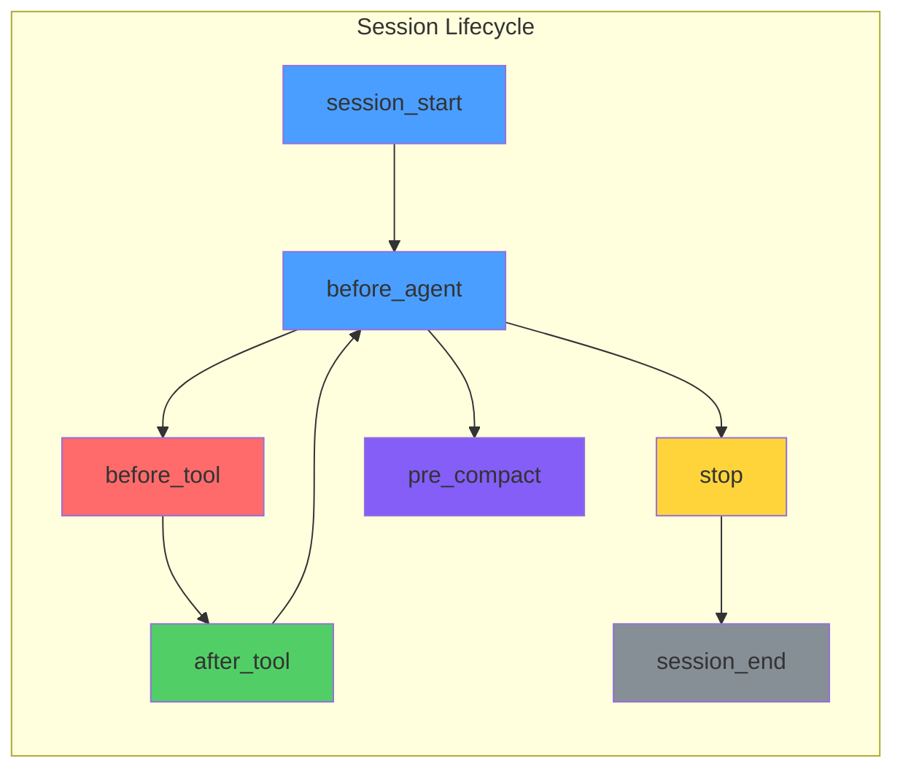
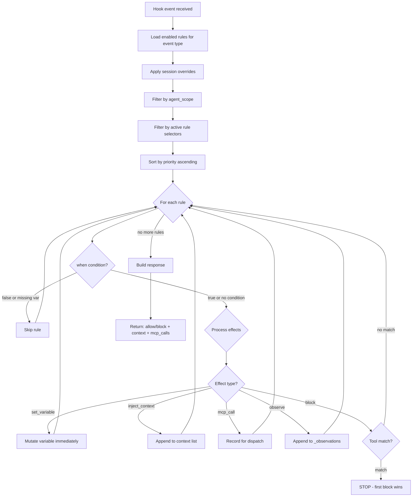

# Rules

Rules are Gobby's reactive enforcement layer. They fire on hook events (before a tool call, on session start, when the agent tries to stop) and apply effects: block the action, set a variable, inject context, call an MCP tool, or record an observation. Rules are stateless event handlers defined in YAML.

**Key insight**: The LLM doesn't need to remember constraints — the rule engine evaluates every event and enforces behavior through tool blocks, injected context, and state mutations. The LLM naturally follows because it sees blocked tools and guidance text.

For how rules fit into the broader workflow system, see [Workflows Overview](./workflows-overview.md).

---

## Quick Start: Writing Your First Rule

Create a YAML file with a group name and one or more rules:

```yaml
# my-rules.yaml
group: my-custom-rules
tags: [custom, safety]

rules:
  no-rm-rf:
    description: "Block rm -rf commands"
    event: before_tool
    effect:
      type: block
      tools: [Bash]
      command_pattern: "rm\\s+-rf"
      reason: "Destructive rm -rf is not allowed."
```

Import it:

```bash
gobby rules import my-rules.yaml
```

The rule is now active. Every `Bash` tool call is checked against the pattern.

---

## Rule YAML Format

Rules are organized in YAML files by **group**. Each file defines a group name, optional tags, and a `rules` map:

```yaml
group: worker-safety          # Required: group name
tags: [enforcement, safety]    # Optional: tags for discovery

rules:
  rule-name:                   # Unique rule name (within group)
    description: "..."         # Optional: human-readable description
    event: before_tool         # Required: when this rule fires
    enabled: false             # Optional: default enabled state (default: true)
    priority: 100              # Optional: evaluation order (default: 100)
    when: "condition"          # Optional: skip rule if false
    agent_scope: [developer]   # Optional: only for these agent types
    effect:                    # Required (or `effects`): what happens
      type: block
      ...
```

### File-Level Fields

| Field | Type | Required | Description |
|-------|------|----------|-------------|
| `group` | string | Yes | Group name for organization and filtering |
| `tags` | list[string] | No | Tags for discovery and categorization |

### Rule Fields

| Field | Type | Required | Default | Description |
|-------|------|----------|---------|-------------|
| `description` | string | No | — | Human-readable description |
| `event` | RuleEvent | Yes | — | Event that triggers this rule |
| `enabled` | bool | No | `true` | Whether the rule starts enabled |
| `priority` | int | No | `100` | Evaluation order (lower = first) |
| `when` | string | No | — | Condition expression (skip if false) |
| `agent_scope` | list[string] | No | — | Only active for these agent types |
| `effect` | RuleEffect | Mutex | — | Single effect (use `effect` or `effects`, not both) |
| `effects` | list[RuleEffect] | Mutex | — | Multiple effects per rule |

---

## Events

Rules respond to 7 event types that map to hooks in the session lifecycle:



| Event | When It Fires | Typical Effects |
|-------|--------------|-----------------|
| `before_tool` | Before any tool call (native or MCP) | block, set_variable |
| `after_tool` | After a tool call completes | set_variable, observe |
| `before_agent` | Before each agent turn/prompt | inject_context, mcp_call |
| `session_start` | When a session begins (new, clear, compact, resume) | set_variable, mcp_call, inject_context |
| `session_end` | When a session ends | mcp_call |
| `stop` | When the agent attempts to stop | block, set_variable |
| `pre_compact` | Before context compaction | mcp_call, set_variable |

### Event Data

Each event provides data accessible in `when` conditions:

```yaml
# before_tool / after_tool
event.data.tool_name       # "Edit", "Bash", "mcp__gobby__call_tool"
event.data.tool_input      # Tool arguments dict
event.data.mcp_tool        # MCP tool name (if MCP call)
event.data.mcp_server      # MCP server name (if MCP call)
event.data.command          # Bash command string (if Bash tool)

# after_tool additional
event.metadata.is_failure   # True if tool call failed
event.data.is_error         # True if tool returned an error

# session_start
event.data.source           # "new", "clear", "compact", "resume"

# stop
event.data                  # Stop context
```

---

## Effects

Rules fire one of five primitive effect types.

### `block` — Prevent an Action

Blocks a tool call, stop attempt, or other action. **First block wins** — evaluation stops immediately.

| Field | Type | Required | Description |
|-------|------|----------|-------------|
| `type` | `"block"` | Yes | — |
| `reason` | string | Yes | Message shown to the agent (supports `{{ }}` templates) |
| `tools` | list[string] | No | Native tools to match: `["Edit", "Write", "Bash"]` |
| `mcp_tools` | list[string] | No | MCP tools to match: `["gobby-tasks:close_task", "server:*"]` |
| `command_pattern` | string | No | Regex to match Bash command content |
| `command_not_pattern` | string | No | Negative regex — exclude commands matching this |

**Tool matching logic:**
- If `tools` is set, only those native tools are blocked
- If `mcp_tools` is set, only those MCP tools are blocked (supports `"server:*"` wildcards)
- If neither is set, the block applies to all tools for the event
- `command_pattern` / `command_not_pattern` only apply to `Bash` tool

```yaml
# Block git push
no-push:
  event: before_tool
  effect:
    type: block
    tools: [Bash]
    command_pattern: "git\\s+push"
    reason: "Do not push to remote. Let the parent session handle pushing."

# Block file edits without a task
require-task:
  event: before_tool
  when: "not task_claimed and not plan_mode"
  effect:
    type: block
    tools: [Edit, Write, NotebookEdit]
    reason: "Claim a task before editing files. Use claim_task() on gobby-tasks."

# Block stop when task is in progress (with template variables)
require-task-close:
  event: stop
  priority: 50
  when: "task_claimed and variables.get('stop_attempts', 0) < variables.get('max_stop_attempts', 8)"
  effect:
    type: block
    reason: |
      Tasks still in_progress: {{ claimed_tasks.values() | list | join(', ') }}. Commit and close_task().
```

### `set_variable` — Update Session State

Mutates a session variable in-place. Later rules in the same evaluation pass see the updated value immediately.

| Field | Type | Required | Description |
|-------|------|----------|-------------|
| `type` | `"set_variable"` | Yes | — |
| `variable` | string | Yes | Variable name to set |
| `value` | any | Yes | Value — literal or expression |

**Value types:**
- **Literals**: `true`, `false`, `42`, `"hello"`, `[]`, `{}`
- **Expressions**: Strings containing `variables.`, `.get(`, `+`, `and`, `or`, `len(`, etc. are evaluated by `SafeExpressionEvaluator`

```yaml
# Set a flag
track-task-claim:
  event: after_tool
  when: "event.data.get('mcp_tool') in ['claim_task', 'create_task']"
  effect:
    type: set_variable
    variable: task_claimed
    value: true

# Increment a counter
increment-stop:
  event: stop
  priority: 10
  effect:
    type: set_variable
    variable: stop_attempts
    value: "variables.get('stop_attempts', 0) + 1"

# Append to a list
track-nudged-files:
  event: before_tool
  effect:
    type: set_variable
    variable: tdd_nudged_files
    value: "variables.get('tdd_nudged_files', []) + [tool_input.get('file_path', '')]"
```

### `inject_context` — Add Text to System Message

Appends text to the hook response context, which is injected into the agent's system message. Multiple `inject_context` effects accumulate (separated by `\n\n`).

| Field | Type | Required | Description |
|-------|------|----------|-------------|
| `type` | `"inject_context"` | Yes | — |
| `template` | string | Yes | Text to inject (supports `{{ }}` Jinja2 templates) |

```yaml
# Inject session summary on context clear
inject-previous-session:
  event: session_start
  priority: 10
  when: "event.data.get('source') == 'clear'"
  effect:
    type: inject_context
    template: |
      ## Previous Session Context
      *Injected by Gobby session handoff*

      {{ full_session_summary }}

# Inject error recovery guidance after tool failure
inject-error-recovery:
  event: after_tool
  when: "event.metadata.get('is_failure', False)"
  effect:
    type: inject_context
    template: |
      The previous tool call failed. Do NOT retry with identical arguments.
      Read the error message and try a different approach.
```

### `mcp_call` — Trigger MCP Tool Execution

Records an MCP tool call for dispatch after rule evaluation completes. Can run in the background (async, zero latency) or synchronously.

| Field | Type | Required | Description |
|-------|------|----------|-------------|
| `type` | `"mcp_call"` | Yes | — |
| `server` | string | Yes | MCP server name |
| `tool` | string | Yes | Tool name on the server |
| `arguments` | dict | No | Arguments (supports `{{ }}` templates in string values) |
| `background` | bool | No | If `true`, run async with zero latency (default: `false`) |

```yaml
# Import memories on session start
memory-sync-import:
  event: session_start
  priority: 30
  effect:
    type: mcp_call
    server: gobby-memory
    tool: sync_import

# Background digest (zero latency)
digest-on-response:
  event: stop
  priority: 11
  effect:
    type: mcp_call
    server: gobby-memory
    tool: build_turn_and_digest
    background: true

# Auto-run assigned pipeline
pipeline-auto-run:
  event: session_start
  when: "variables.get('_assigned_pipeline')"
  effect:
    type: mcp_call
    server: gobby-workflows
    tool: run_pipeline
    arguments:
      name: "{{ _assigned_pipeline }}"
    background: true
```

### `observe` — Record a Structured Observation

Appends a structured entry to the `_observations` session variable. Observations are timestamped and categorized — useful for analytics, debugging, and audit trails.

| Field | Type | Required | Description |
|-------|------|----------|-------------|
| `type` | `"observe"` | Yes | — |
| `category` | string | No | Observation category (default: `"general"`) |
| `message` | string | No | Message text (supports `{{ }}` templates) |

Each observation produces:
```json
{
  "category": "general",
  "message": "rendered message",
  "timestamp": "2025-01-15T10:30:00Z",
  "rule": "rule-name"
}
```

```yaml
# Track tool usage patterns
observe-tool-usage:
  event: after_tool
  effect:
    type: observe
    category: "tool_usage"
    message: "Tool {{ event.data.tool_name }} completed"
```

---

## Multi-Effect Rules

A single rule can fire multiple effects using the `effects` list (instead of singular `effect`). This is powerful for rules that need to set state, inject context, and block — all in one rule.

**Constraints:**
- Use `effect` (singular) or `effects` (list), not both
- At most **one** `block` effect per rule
- Non-block effects always run before the block effect (block is deferred)
- Each effect can have its own `when` condition (per-effect gating)

```yaml
# TDD enforcement: set variable, call MCP, then block — all in one rule
enforce-tdd-block:
  event: before_tool
  priority: 32
  when: >-
    variables.get('enforce_tdd')
    and event.data.get('tool_name') == 'Write'
    and '/tests/' not in tool_input.get('file_path', '')
  effects:
    - type: set_variable
      variable: tdd_nudged_files
      value: "variables.get('tdd_nudged_files', []) + [tool_input.get('file_path', '')]"

    - type: mcp_call
      when: "variables.get('task_claimed')"       # per-effect condition
      server: gobby-tasks
      tool: update_task
      arguments:
        task_id: "{{ variables.get('claimed_tasks', {}).values() | list | first }}"
        validation_criteria: "TDD: Tests required for: {{ tdd_nudged_files | join(', ') }}"

    - type: block
      tools: [Write]
      reason: |
        TDD enforcement: Write a test first before creating {{ tool_input.get('file_path', '').split('/')[-1] }}.

# Pipeline auto-run: inject context AND start pipeline
pipeline-auto-run:
  event: session_start
  when: "variables.get('_assigned_pipeline')"
  effects:
    - type: inject_context
      template: |
        ## Pipeline Execution Mode
        You are a pipeline execution agent. Your pipeline ({{ _assigned_pipeline }}) is starting automatically.
    - type: mcp_call
      server: gobby-workflows
      tool: run_pipeline
      arguments:
        name: "{{ _assigned_pipeline }}"
      background: true
```

---

## Evaluation Flow

When a hook event fires, the rule engine evaluates all matching rules:



### Key Behaviors

1. **First block wins** — Evaluation stops at the first matching block. No further rules run.
2. **Variables mutate in-place** — `set_variable` effects are visible to later rules in the same pass.
3. **Context accumulates** — Multiple `inject_context` effects combine, separated by `\n\n`.
4. **MCP calls collect** — All `mcp_call` effects dispatch after evaluation completes.
5. **Conditions skip, not stop** — A `when: false` skips the rule but evaluation continues.
6. **Block effects fail closed** — If condition evaluation errors, block effects default to `true` (conservative). Other effects default to `false` (safe).

---

## Condition Expressions

The `when` field uses `SafeExpressionEvaluator` — an AST-based evaluator (no `eval()`).

### Available Context

| Variable | Description |
|----------|-------------|
| `variables` | Session variables dict (supports `.get('key', default)`) |
| Top-level vars | All session variables flattened (e.g., `task_claimed` directly) |
| `event` | Hook event object (`event.data`, `event.source`, `event.metadata`) |
| `tool_input` | Tool input parameters (`before_tool` / `after_tool` only) |
| `source` | Event source string |

### Supported Operations

```yaml
# Boolean logic
when: "not task_claimed and not plan_mode"
when: "task_claimed or plan_mode"

# Comparisons
when: "variables.get('stop_attempts', 0) < 3"
when: "variables.get('mode_level', 2) >= 1"

# Membership
when: "event.data.get('source') in ['clear', 'compact']"
when: "event.data.get('mcp_tool') in ['claim_task', 'create_task']"

# Functions
when: "len(variables.get('pending_messages', [])) > 0"
when: "bool(variables.get('task_ref'))"

# Nested access
when: "event.data.get('tool_name') == 'claim_task'"

# String methods
when: "tool_input.get('file_path', '').endswith('.py')"
when: "'/tests/' not in tool_input.get('file_path', '')"

# Ternary
when: "variables.get('enforce_tdd') if variables.get('tdd_enabled') else False"

# Arithmetic
when: "variables.get('stop_attempts', 0) + 1 > variables.get('max_stop_attempts', 3)"
```

### Built-in Helper Functions

These functions are available in `when` conditions via `build_condition_helpers`:

| Function | Description |
|----------|-------------|
| `len()`, `bool()`, `str()`, `int()`, `list()`, `dict()` | Standard Python builtins |
| `isinstance()` | Type checking |
| `task_tree_complete(task_id)` | Check if a task and all subtasks are complete |
| `task_needs_user_review(task_id)` | Check if task is awaiting human review |
| `has_stop_signal(session_id)` | Check if a stop signal is pending |
| `mcp_called(server, tool?)` | Check if an MCP tool was called successfully |
| `mcp_result_is_null(server, tool)` | Check if MCP result is null/missing |
| `mcp_failed(server, tool)` | Check if an MCP call failed |
| `mcp_result_has(server, tool, field, value)` | Check MCP result field value |
| `is_server_listed(tool_input)` | Progressive discovery: server was listed |
| `is_tool_unlocked(tool_input)` | Progressive discovery: schema was fetched |
| `is_discovery_tool(tool_name)` | Is this a discovery tool (list_servers, etc.) |
| `is_plan_file(tool_input)` | Is this a plan file operation |
| `is_message_delivery_tool(tool_input)` | Is this a message delivery tool |

### Safe Method Calls

The evaluator allows these methods on specific types:

| Type | Allowed Methods |
|------|----------------|
| `dict` | `get`, `keys`, `values`, `items` |
| `str` | `strip`, `lstrip`, `rstrip`, `startswith`, `endswith`, `lower`, `upper`, `split` |
| `list` | `count`, `index` |

---

## Priority Ordering

Rules evaluate in priority order (lowest number first). Default priority is `100`.

```yaml
rules:
  first-rule:
    priority: 10    # Evaluates first
    ...
  second-rule:
    priority: 20    # Evaluates second
    ...
  default-rule:     # priority: 100 (default)
    ...
```

### Priority Layout Convention

| Range | Purpose | Examples |
|-------|---------|---------|
| 5–10 | State initialization | Reset counters, clear flags, baseline capture |
| 10–20 | Primary blocking gates | Stop gates, tool-block-pending recovery |
| 20–30 | Secondary blocking gates | Progressive discovery, schema enforcement |
| 30–50 | Tracking and enforcement | Task tracking, TDD, memory review |
| 50+ | Context injection and MCP calls | Session summaries, memory recall |
| 100 | Default | Most custom rules |

---

## agent_scope

Rules can be scoped to specific agent types:

```yaml
no-push-for-workers:
  event: before_tool
  agent_scope: [developer, expander, qa-reviewer]
  effect:
    type: block
    tools: [Bash]
    command_pattern: "git\\s+push"
    reason: "Worker agents do not push. The merge agent handles pushing."
```

- Rules with no `agent_scope` are **global** — they run for all agents
- Rules with `agent_scope` only run when `_agent_type` is in the list
- Use `"*"` in the scope list to match all agent types (equivalent to no scope)
- If no `_agent_type` is set on the session, only global rules run

---

## Session Overrides

Rules can be enabled or disabled per-session without modifying the rule definition:

```bash
# Disable a rule for the current session
gobby rules disable require-task-before-edit

# Re-enable it
gobby rules enable require-task-before-edit
```

Overrides are stored in the `rule_overrides` table:
- **Session-scoped** — only affects the specified session
- **Default**: If no override exists, the rule is enabled (if the definition is enabled)
- **Independent**: Different sessions can override the same rule differently

---

## Auto-Management

The rule engine has built-in behaviors that run before declarative rules. These are universal safety mechanisms — not configurable, not disable-able.

### Consecutive Tool Block Tracking

When a tool is blocked and the agent retries the **same tool** immediately, the engine counts consecutive attempts. After 2 retries of the same blocked tool:

```
Rule enforced by Gobby: [consecutive-tool-block]
You have attempted <tool> N times consecutively without addressing the error.
STOP retrying the same action. Take a DIFFERENT action to resolve the issue.
```

Using a **different** tool resets the counter. This prevents infinite retry loops.

### Tool Block Pending

When a tool call fails (`is_failure` or `is_error`), the engine sets `tool_block_pending = true`. If the agent tries to stop while `tool_block_pending` is set:

```
Rule enforced by Gobby: [tool-failure-recovery]
A tool just failed. Read the error and recover — do not stop.
```

A successful tool call clears the flag.

### Catastrophic Failure Bypass

If a tool failure contains patterns like "out of usage", "rate limit", "quota exceeded", or "billing", the engine sets `force_allow_stop = true`, allowing the agent to stop immediately regardless of other rules.

### Auto Stop Attempt Counting

Every `stop` event increments `stop_attempts` automatically. The `before_agent` event resets `stop_attempts` to 0 (new prompt from user = fresh start).

---

## Bundled Rule Groups

Gobby ships with 14 rule groups (plus deprecated). All bundled rules have `enabled: false` by default — they are templates synced to the database on daemon start.

| Group | Rules | Purpose |
|-------|-------|---------|
| `worker-safety` | 6 | Block git push (all agents + worker-specific), force push, destructive git, agent spawn from merge agents, external GitHub issues |
| `tool-hygiene` | 2 | Require `uv` for Python, track pending memory review |
| `progressive-discovery` | 7 | Enforce MCP discovery order: list_servers → list_tools → get_schema → call_tool |
| `task-enforcement` | 6 | Block native task tools, require task before edit, track claims, require commits before close, block validation skip with commit |
| `stop-gates` | 2 | Require task close before stop, require error triage before stop |
| `plan-mode` | 3 | Detect enter/exit plan mode, reset on session start |
| `memory-lifecycle` | 9 | Memory sync, recall, digest, capture, title generation, tracking reset |
| `context-handoff` | 10 | Session summary injection (clear/compact/resume), error triage policy, task context, baseline dirty files, task sync import |
| `auto-task` | 3 | Autonomous task execution context, guide task continuation, notify task tree complete |
| `messaging` | 4 | P2P agent messaging: deliver pending messages, activate commands, tool restrictions, exit conditions |
| `pipeline-enforcement` | 1 | Auto-run assigned pipeline on session start |
| `error-recovery` | 1 | Inject recovery guidance after tool failures |
| `tdd-enforcement` | 2 | TDD nudge block on Write to code files, track test file writes |
| `session-defaults` | — | Variable initialization only (not rules — just default values) |

Rule template files live in `src/gobby/install/shared/rules/<group>/`. Custom rules can be imported via `gobby rules import <file.yaml>`.

---

## Template Variables in Effects

Both `reason` (in block effects) and `template` (in inject_context effects) support Jinja2-style template rendering:

```yaml
effect:
  type: block
  reason: |
    Tasks still in_progress: {{ claimed_tasks.values() | list | join(', ') }}.
    Commit and close_task().
```

Templates have access to the full evaluation context:
- All session variables (flattened to top level)
- `variables` dict
- `event` object
- `tool_input` dict
- All built-in helper functions

Jinja2 filters work: `| list`, `| join(', ')`, `| first`, `| default('')`, `| length`, `| lower`, etc.

---

## CLI Reference

```bash
# List rules
gobby rules list                          # All enabled rules
gobby rules list --event before_tool      # Filter by event
gobby rules list --group worker-safety    # Filter by group
gobby rules list --disabled               # Show disabled rules
gobby rules list --json                   # JSON output

# Show rule details
gobby rules show require-task-close       # Full definition
gobby rules show require-task-close --json

# Enable/disable rules (session-scoped)
gobby rules enable <name>
gobby rules disable <name>

# Import rules from YAML
gobby rules import my-rules.yaml

# Export rules as YAML
gobby rules export                        # All rules
gobby rules export --group worker-safety  # Specific group

# View audit log
gobby rules audit                         # Recent events
gobby rules audit --session <ID>          # Session-specific
gobby rules audit --limit 20             # Control output
gobby rules audit --json                  # JSON output
```

## MCP Tool Reference

Rules are managed via the `gobby-workflows` MCP server:

| Tool | Description |
|------|-------------|
| `list_rules` | List rules with optional event/group filter |
| `list_rule_groups` | List available rule groups |
| `get_rule_detail` | Get full rule definition |
| `toggle_rule` | Enable/disable a rule for the session |
| `set_variable` | Set a session variable |
| `get_variable` | Get a session variable value |
| `list_variables` | List all session variables |

---

## Troubleshooting

### Tool Unexpectedly Blocked

```bash
# Check which rules are active
gobby rules list --enabled --event before_tool

# Check audit log for the block
gobby rules audit --session <ID> --limit 10

# Temporarily disable the rule
gobby rules disable <rule-name>
```

### Agent Can't Stop

The stop-gates group controls stop behavior. The escape hatch allows stopping after `max_stop_attempts` (default: 8) consecutive attempts.

```bash
# Reset stop attempts
gobby workflows set-var stop_attempts 0 --session <ID>

# Or disable the stop gate
gobby rules disable require-task-close
```

### Variables Not Taking Effect

```bash
# Check current values
gobby workflows status --session <ID> --json

# Override a variable
gobby workflows set-var <name> <value> --session <ID>
```

### Rule Not Firing

1. **Check enabled**: `gobby rules show <name>` — is it enabled?
2. **Check event**: Does the rule's `event` match the hook event type?
3. **Check condition**: Test with simpler `when` conditions first
4. **Check priority**: A higher-priority block may stop evaluation before your rule
5. **Check agent_scope**: Is the rule scoped to a different agent type?
6. **Check selectors**: Is the rule included in the agent's `rule_selectors`?

---

## File Locations

| Path | Purpose |
|------|---------|
| `src/gobby/install/shared/rules/` | Bundled rule templates (14 groups) |
| `src/gobby/workflows/rule_engine.py` | Rule evaluation engine |
| `src/gobby/workflows/definitions.py` | Rule models (`RuleEvent`, `RuleEffect`, `RuleDefinitionBody`) |
| `src/gobby/workflows/safe_evaluator.py` | Safe expression evaluator |
| `src/gobby/workflows/condition_helpers.py` | Built-in condition helper functions |
| `src/gobby/workflows/enforcement/blocking.py` | Progressive discovery enforcement helpers |
| `src/gobby/cli/rules.py` | Rules CLI commands |
| `src/gobby/servers/routes/rules.py` | Rules HTTP API |
| `~/.gobby/gobby-hub.db` | SQLite database (rules in `workflow_definitions`) |

## See Also

- [Workflows Overview](./workflows-overview.md) — How rules, agents, and pipelines compose
- [Variables](./variables.md) — Session variables, initialization, condition helpers
- [Agents](./agents.md) — Agent selectors that control which rules are active
