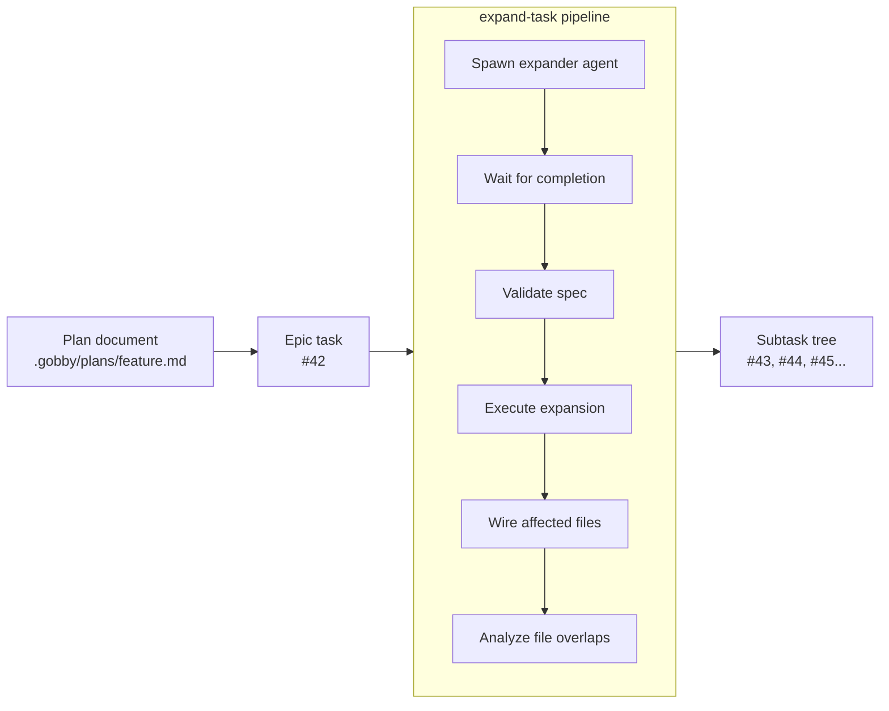
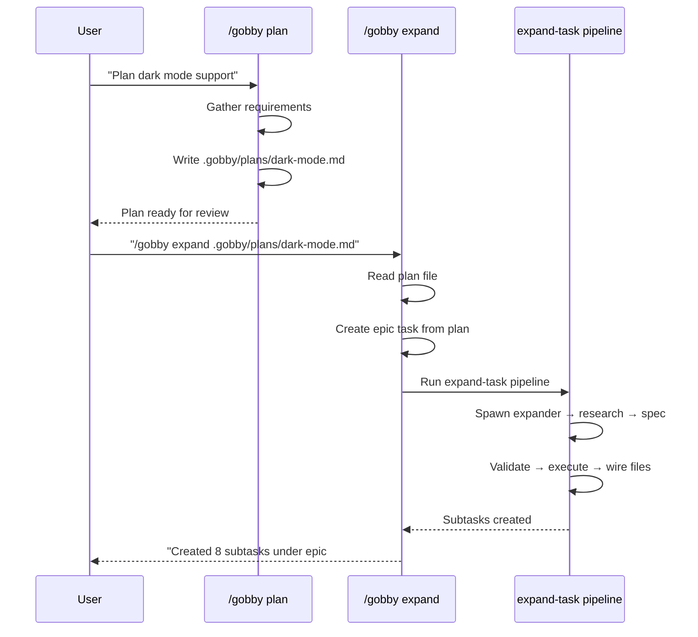

# Task Expansion

Task expansion breaks a high-level epic into concrete, atomic subtasks with dependencies, validation criteria, and file annotations. It enforces a hard boundary between **research** (creative codebase analysis) and **execution** (mechanical task creation).

This guide covers the expansion pipeline end-to-end: how plans feed into expansion, how the expander agent produces a spec, how validation works, and how TDD gets applied.

For the orchestrator that invokes expansion, see [Orchestrator Pattern](./orchestrator.md).

---

## Overview



The expansion flow:

1. **Input**: An epic task (from a plan document or created manually)
2. **Research**: Expander agent explores the codebase and produces a structured JSON spec
3. **Validate**: Pipeline validates spec structure, dependencies, and coverage
4. **Execute**: Pipeline atomically creates all subtasks with dependencies
5. **Wire**: File annotations from the spec are attached to each subtask
6. **Overlap detection**: Identifies subtasks that touch the same files (contention risk)

---

## The Expand-Task Pipeline

```yaml
name: expand-task
type: pipeline

inputs:
  task_id: null        # Epic to expand
  agent: "expander"    # Researcher agent
  provider: "claude"   # LLM provider

steps:
  - id: spawn_researcher    # 1. Spawn expander agent
    mcp: { server: gobby-agents, tool: spawn_agent }

  - id: wait_researcher     # 2. Wait for agent to finish
    wait: { completion_id: "${{ steps.spawn_researcher.output.run_id }}" }

  - id: validate            # 3. Validate the saved spec
    mcp: { server: gobby-tasks, tool: validate_expansion_spec }

  - id: check_valid         # 4. Fail if invalid
    condition: "${{ not steps.validate.output.valid }}"
    exec: "exit 1"

  - id: execute             # 5. Create subtasks atomically
    mcp: { server: gobby-tasks, tool: execute_expansion }

  - id: wire_files          # 6. Attach file annotations
    mcp: { server: gobby-tasks, tool: wire_affected_files_from_spec }

  - id: analyze_deps        # 7. Detect file contention
    mcp: { server: gobby-tasks, tool: find_file_overlaps }
```

The hard boundary: the expander agent only researches and saves a spec. It cannot call `execute_expansion` or `create_task` — those tools are blocked in the expander's step workflow. The pipeline validates and executes mechanically.

**Source**: `src/gobby/install/shared/workflows/expand-task.yaml`

---

## The Expander Agent

The expander agent has a two-step workflow: `research` → `terminate`.

During `research`, most tools are available for codebase exploration — Read, Grep, Glob, Bash, MCP tools. But these MCP tools are blocked:

- `gobby-tasks:execute_expansion` — Pipeline's job, not the agent's
- `gobby-tasks:create_task` — No manual task creation
- `gobby-tasks:close_task` — Can't close tasks
- `gobby-agents:kill_agent` — Can't terminate prematurely

When the agent calls `save_expansion_spec`, the `on_mcp_success` handler sets `spec_saved = true`, which triggers the automatic transition to `terminate`. The agent then calls `kill_agent` to exit cleanly.

**Source**: `src/gobby/install/shared/agents/expander.yaml`

---

## The Expansion Spec

The expander agent produces a JSON spec with a `subtasks` array. Each subtask has:

| Field | Type | Required | Description |
|-------|------|----------|-------------|
| `title` | string | Yes | Short, actionable title |
| `description` | string | No | Implementation details |
| `priority` | int | No | 1=High, 2=Medium (default), 3=Low |
| `task_type` | string | No | `"task"` (default), `"bug"`, `"feature"`, `"epic"` |
| `category` | string | No | `"code"`, `"config"`, `"docs"`, `"refactor"`, `"test"`, `"research"`, `"planning"`, `"manual"` |
| `validation_criteria` | string | No | How to verify completion |
| `depends_on` | list[int] | No | 0-based indices of dependencies |
| `affected_files` | list[string] | No | File paths this task will create or modify |
| `parallel_group` | string | No | Group label for safe parallel dispatch |

### Example Spec

```json
{
  "subtasks": [
    {
      "title": "Create database schema",
      "description": "Define tables for users and sessions",
      "priority": 1,
      "category": "code",
      "affected_files": ["src/storage/migrations.py", "src/storage/schema.sql"],
      "validation_criteria": "Run migrations and verify tables exist"
    },
    {
      "title": "Implement data access layer",
      "description": "CRUD operations for users and sessions",
      "depends_on": [0],
      "category": "code",
      "affected_files": ["src/storage/users.py", "src/storage/sessions.py"],
      "parallel_group": "data-layer",
      "validation_criteria": "Unit tests for all repository methods pass"
    },
    {
      "title": "Add API endpoints",
      "description": "REST endpoints for user management",
      "depends_on": [1],
      "category": "code",
      "affected_files": ["src/api/users.py"],
      "validation_criteria": "Integration tests pass"
    }
  ]
}
```

### Spec Storage

The spec is saved to the task via `save_expansion_spec`, which stores it in the database as JSON attached to the parent task. This survives session compaction — if the expansion is interrupted, the spec persists and can be resumed.

---

## Validation

Before execution, the pipeline validates the spec via `validate_expansion_spec`:

1. **Structure** — Valid JSON with `subtasks` array, each subtask has required `title` field
2. **Dependencies** — `depends_on` indices reference valid subtask positions, no circular dependencies
3. **Categories** — Valid category values from the allowed set
4. **Affected files** — File paths are strings (not validated against filesystem)

If validation fails, the pipeline halts with the error messages. The spec can be fixed by the user or by re-running the expander agent.

---

## Execution

`execute_expansion` atomically creates all subtasks:

1. Creates each subtask as a child of the parent epic
2. Wires `depends_on` relationships as task dependencies
3. Sets `category`, `priority`, `validation_criteria` from the spec
4. Returns the list of created task IDs

This is mechanical — no LLM involved. The spec fully determines the output.

### Post-Execution: File Wiring

`wire_affected_files_from_spec` reads the spec's `affected_files` for each subtask and attaches them to the corresponding task. These annotations are used by `suggest_next_tasks` to detect file contention and avoid dispatching conflicting tasks in parallel.

### Post-Execution: Overlap Detection

`find_file_overlaps` analyzes the file annotations across all subtasks and returns pairs of tasks that share files. This helps the orchestrator and human reviewers understand which tasks cannot safely run in parallel.

---

## Plans → Expansion

The `/gobby plan` skill creates structured plan documents. The `/gobby expand` skill creates tasks from those plans. Here's how they connect:



### Plan Document Format

Plans use `### N.N` headings for tasks with metadata in the heading:

```markdown
## Phase 1: Foundation

### 1.1 Create user model [category: code]

Target: `src/models/user.py`

Full implementation details here...

### 1.2 Add authentication [category: code] (depends: 1.1)

Target: `src/auth/handler.py`

Full implementation details here...
```

Each `### N.N` section becomes a subtask description during expansion. The implementing agent only sees its own subtask — not the full plan.

### What Plans Should NOT Contain

Plans should NOT include explicit test tasks. When TDD is enabled, the expansion system wraps `code` and `config` tasks in a TDD sandwich automatically. Including test tasks manually creates duplicates.

**Forbidden patterns in plans:**
- `"Write tests for..."` or `"Test..."` as task titles
- `"[TDD]"`, `"[IMPL]"`, `"[REF]"` prefixes
- Separate test tasks alongside implementation tasks

See [TDD Enforcement](./tdd-enforcement.md) for how TDD is applied during expansion.

---

## TDD Integration

When TDD is enabled (`enforce_tdd = true`), the expansion system applies the **TDD sandwich pattern** to `code` and `config` category tasks, grouped per phase:

```
Epic #42 "User Authentication"
├── Phase 1: Core Infrastructure [subepic]
│   ├── [TEST] Phase 1: Write failing tests
│   ├── [IMPL] Create database schema          (category: code)
│   ├── [IMPL] Implement data access layer     (category: code)
│   └── [REF] Phase 1: Refactor with green tests
├── Phase 2: API Layer [subepic]
│   ├── [TEST] Phase 2: Write failing tests
│   ├── [IMPL] Add API endpoints               (category: code)
│   └── [REF] Phase 2: Refactor with green tests
└── Document the API                            (category: docs, no TDD)
```

### Phase Subepics

When a plan has multiple `## Phase N: Title` headings, the expansion system creates **subepic tasks** for each phase. Subtasks are parented under their phase's subepic instead of directly under the root epic. Phase titles are extracted from the plan document headings.

Single-phase plans (or plans without `## Phase` headings) produce a flat structure under the root epic — this is backwards compatible with the previous behavior.

### TDD Sandwich

The TDD sandwich is applied **per phase**:
- **One [TEST] task** at the start of each phase — covers that phase's `code`/`config` subtasks
- **One [REF] task** at the end of each phase — cleanup while keeping tests green
- Phase N's `[REF]` blocks Phase N+1's `[TEST]` (cross-phase sequencing)
- `docs`, `refactor`, `test`, `research`, `planning`, `manual` categories are not wrapped

The TDD tasks are created by the expansion system, not by the expander agent. The agent outputs plain feature tasks; the system adds the sandwich.

See [TDD Enforcement Guide](./tdd-enforcement.md) for the full pattern.

---

## Invoking Expansion

### Via `/gobby expand` Skill

```
/gobby expand #42                          # Expand an existing epic
/gobby expand .gobby/plans/dark-mode.md    # Create epic from plan, then expand
```

The skill handles:
- Checking for pending specs (resume after compaction)
- Creating the epic from a plan file
- Invoking the `expand-task` pipeline
- Reporting results

### Via Pipeline Directly

```python
result = call_tool("gobby-workflows", "run_pipeline", {
    "name": "expand-task",
    "inputs": {
        "task_id": "#42",
        "session_id": "#350"
    }
})
# Block until expansion finishes
call_tool("gobby-workflows", "wait_for_completion", {
    "execution_id": result["execution_id"],
    "timeout": 600
})
```

### Via Orchestrator

The orchestrator automatically invokes expansion on the first iteration if the epic hasn't been expanded:

```yaml
- id: expand_epic
  condition: "${{ not inputs._worktree_id and not get_epic.output.is_expanded }}"
  invoke_pipeline:
    name: expand-task
    arguments:
      task_id: "${{ inputs.session_task }}"
```

---

## Resume After Interruption

If expansion is interrupted (session compaction, crash), the spec persists in the database. The `/gobby expand` skill checks for pending specs on startup:

```python
result = call_tool("gobby-tasks", "get_expansion_spec", {"task_id": "#42"})
if result.get("pending"):
    # Skip research — go straight to validate + execute
```

This means the expensive research phase doesn't need to be repeated.

---

## File Locations

| Path | Purpose |
|------|---------|
| `src/gobby/install/shared/workflows/expand-task.yaml` | Expansion pipeline definition |
| `src/gobby/install/shared/agents/expander.yaml` | Expander agent definition |
| `src/gobby/tasks/prompts/expand-task.md` | Expansion prompt (spec format, rules) |
| `src/gobby/tasks/prompts/expand-task-tdd.md` | TDD mode instructions |
| `src/gobby/mcp_proxy/tools/tasks/_expansion.py` | Expansion MCP tools (save, validate, execute) |
| `src/gobby/install/shared/skills/expand/SKILL.md` | `/gobby expand` skill |
| `src/gobby/install/shared/skills/plan/SKILL.md` | `/gobby plan` skill |

## See Also

- [Orchestrator Pattern](./orchestrator.md) — How orchestration invokes expansion
- [TDD Enforcement](./tdd-enforcement.md) — TDD sandwich pattern details
- [Pipelines](./pipelines.md) — Pipeline system reference
- [Agents](./agents.md) — Agent definitions and step workflows
