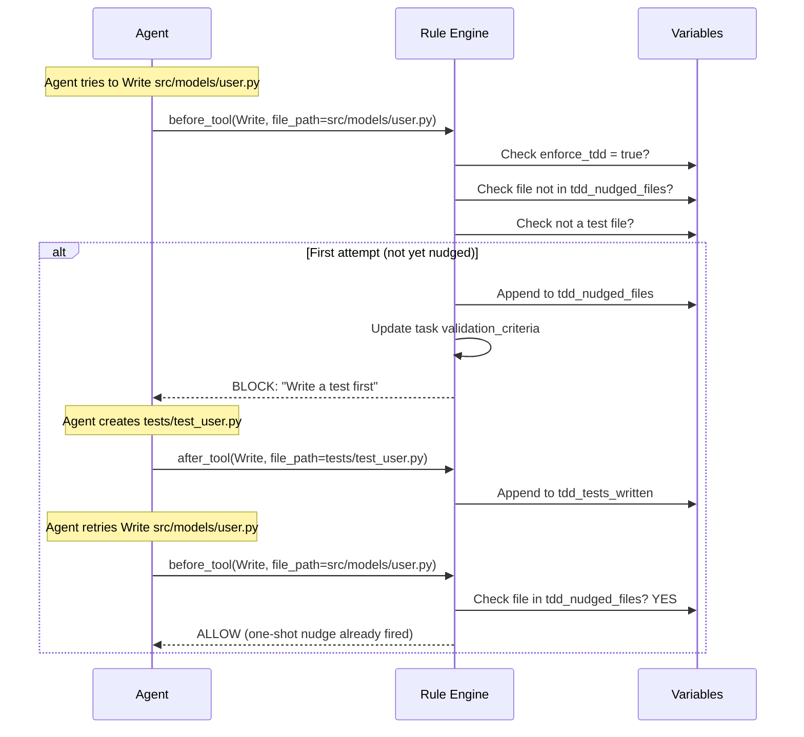

# TDD Enforcement

Gobby enforces Test-Driven Development through two mechanisms: the **TDD sandwich** applied during task expansion, and **runtime rules** that block implementation code until tests are written. Together, they create a workflow where tests come first — structurally during planning, and behaviorally during execution.

---

## The TDD Sandwich

When TDD is enabled (`enforce_tdd = true`), the expansion system wraps `code` and `config` category tasks in a sandwich pattern:

```
Epic: "User Authentication"
│
├── Phase 1: Core Infrastructure [subepic]
│   ├── [TEST] Phase 1: Write failing tests               ← Added by system
│   ├── [IMPL] Create database schema                     ← From expansion spec (prefix added by system)
│   ├── [IMPL] Implement data access layer                ← From expansion spec (prefix added by system)
│   └── [REF] Phase 1: Refactor with green tests          ← Added by system
├── Phase 2: API Layer [subepic]
│   ├── [TEST] Phase 2: Write failing tests               ← Added by system
│   ├── [IMPL] Add API endpoints                          ← From expansion spec
│   └── [REF] Phase 2: Refactor with green tests          ← Added by system
└── Document the API                                      ← docs category, no TDD
```

### How It Works

1. The expander agent outputs plain feature tasks with categories (`code`, `config`, `docs`, etc.)
2. The expansion system identifies tasks with `code` or `config` categories
3. For multi-phase plans, it creates **subepic tasks** for each phase (from `## Phase N: Title` headings)
4. It wraps each phase's TDD-eligible tasks with:
   - **One [TEST] task** at the start — covers that phase's implementation tasks
   - **One [REF] task** at the end — cleanup while keeping tests green
5. Cross-phase sequencing: Phase N+1's `[TEST]` depends on Phase N's `[REF]` (must complete before starting)
6. Non-TDD categories (`docs`, `refactor`, `test`, `research`, `planning`, `manual`) pass through unchanged
7. Single-phase plans remain flat under the root epic (backwards compatible)

### Category → TDD Treatment

| Category | TDD Sandwich? | Description |
|----------|--------------|-------------|
| `code` | Yes | Source code implementation |
| `config` | Yes | Configuration file changes |
| `docs` | No | Documentation tasks |
| `refactor` | No | Refactoring tasks |
| `test` | No | Test infrastructure (fixtures, helpers) |
| `research` | No | Investigation tasks |
| `planning` | No | Architecture/design work |
| `manual` | No | Manual verification |

### What the Expander Agent Should NOT Do

The expander agent outputs plain feature tasks. It should NOT:

- Create `[TDD]`, `[IMPL]`, or `[REF]` prefixed tasks
- Create separate "Write tests for..." tasks
- Create "Ensure tests pass" tasks
- Include test tasks alongside implementation tasks

The system adds the TDD structure automatically. Including test tasks manually creates duplicates.

**Source**: `src/gobby/tasks/prompts/expand-task-tdd.md`

---

## Runtime Enforcement Rules

Two rules enforce TDD behavior during agent execution:

### `enforce-tdd-block` — One-Shot Write Nudge

**Event**: `before_tool` | **Priority**: 32

When an agent tries to `Write` a new Python code file (not a test file, not `__init__.py`, not `conftest.py`), this rule:

1. **Tracks** the file in `tdd_nudged_files` (so it only blocks once per file)
2. **Updates** the task's validation criteria to include TDD requirements
3. **Blocks** the Write with guidance to create a test first

```yaml
enforce-tdd-block:
  event: before_tool
  priority: 32
  when: >-
    variables.get('enforce_tdd')
    and event.data.get('tool_name') == 'Write'
    and tool_input.get('file_path', '').endswith('.py')
    and not tool_input.get('file_path', '').endswith('__init__.py')
    and not tool_input.get('file_path', '').endswith('conftest.py')
    and '/tests/' not in tool_input.get('file_path', '')
    and not tool_input.get('file_path', '').split('/')[-1].startswith('test_')
    and not tool_input.get('file_path', '').endswith('_test.py')
    and tool_input.get('file_path', '') not in variables.get('tdd_nudged_files', [])
  effects:
    - type: set_variable
      variable: tdd_nudged_files
      value: "variables.get('tdd_nudged_files', []) + [tool_input.get('file_path', '')]"

    - type: mcp_call
      when: "variables.get('task_claimed')"
      server: gobby-tasks
      tool: update_task
      arguments:
        task_id: "{{ variables.get('claimed_tasks', {}).values() | list | first }}"
        validation_criteria: "TDD: Test files required for: {{ tdd_nudged_files | join(', ') }}"

    - type: block
      tools: [Write]
      reason: |
        TDD enforcement: Write a test first before creating {{ tool_input.get('file_path', '').split('/')[-1] }}.
        Create a test file (in tests/ directory or with test_ prefix) then retry.
```

**Key design: one-shot.** The file is added to `tdd_nudged_files` on the first attempt. On the second attempt, the condition `file not in tdd_nudged_files` is false, so the rule doesn't fire. The agent gets nudged once, then can proceed.

This is a multi-effect rule:
1. `set_variable` — Track the nudged file (always runs)
2. `mcp_call` — Update task validation criteria (only if a task is claimed)
3. `block` — Block the Write with guidance

### `enforce-tdd-track-tests` — Track Test Writes

**Event**: `after_tool` | **Priority**: 30

Tracks test files written during the session for observability:

```yaml
enforce-tdd-track-tests:
  event: after_tool
  priority: 30
  when: >-
    variables.get('enforce_tdd')
    and event.data.get('tool_name') in ('Write', 'Edit')
    and not event.data.get('error')
    and (tool_input.get('file_path', '').split('/')[-1].startswith('test_')
    or '/tests/' in tool_input.get('file_path', '')
    or tool_input.get('file_path', '').endswith('_test.py'))
  effect:
    type: set_variable
    variable: tdd_tests_written
    value: "variables.get('tdd_tests_written', []) + [tool_input.get('file_path', '')]"
```

This appends to `tdd_tests_written` whenever a test file is successfully written or edited. Validation can check this list to verify tests were actually created.

---

## Test File Detection

Both rules use the same heuristics to identify test files:

| Pattern | Example | Is Test? |
|---------|---------|----------|
| `test_` prefix | `test_users.py` | Yes |
| `/tests/` in path | `tests/storage/test_db.py` | Yes |
| `_test.py` suffix | `users_test.py` | Yes |
| `conftest.py` | `tests/conftest.py` | Excluded from block (test infrastructure) |
| `__init__.py` | `src/module/__init__.py` | Excluded from block |

Non-`.py` files are not affected by TDD enforcement.

---

## Variables

| Variable | Type | Default | Description |
|----------|------|---------|-------------|
| `enforce_tdd` | bool | `false` | Master switch for TDD enforcement |
| `tdd_nudged_files` | list | `[]` | Files that have been nudged (one-shot tracking) |
| `tdd_tests_written` | list | `[]` | Test files written during the session |

### Enabling TDD

TDD can be enabled at multiple levels:

**Per-session (variable override):**
```python
call_tool("gobby-workflows", "set_variable", {
    "name": "enforce_tdd", "value": true, "session_id": "#350"
})
```

**Per-agent (definition override):**
```yaml
# In agent definition
workflows:
  variables:
    enforce_tdd: true
```

**Via CLI:**
```bash
gobby workflows set-var enforce_tdd true --session <ID>
```

---

## Enforcement Flow



---

## Plan Verification

The `/gobby plan` skill includes a verification step that checks for TDD anti-patterns before the plan is approved:

### Forbidden Patterns in Plans

- `"Write tests for..."` or `"Add tests for..."` as task titles
- `"Test..."` as a task title prefix
- `"[TDD]..."`, `"[IMPL]..."`, `"[REF]..."` prefixes
- `"Ensure tests pass"` or `"Run tests"` as tasks
- `"Add unit tests"` or `"Add integration tests"` as tasks
- Any task with `test` as the primary verb

### Allowed Patterns

- `"Add TestClient fixture"` — Test infrastructure, not a test-writing task
- `"Configure pytest settings"` — Configuration, not test writing

The plan skill auto-removes forbidden patterns and reports what was cleaned:

```
Plan Verification:
✗ Found 2 explicit test tasks (removed):
  - "Add tests for user authentication" → REMOVED
  - "Ensure all tests pass" → REMOVED
✓ Dependency tree is valid
✓ Categories assigned correctly

Plan updated. Ready for user approval.
```

**Source**: `src/gobby/install/shared/skills/plan/SKILL.md` — Step 4: Plan Verification

---

## File Locations

| Path | Purpose |
|------|---------|
| `src/gobby/install/shared/rules/tdd-enforcement/enforce-tdd-block.yaml` | One-shot Write nudge rule |
| `src/gobby/install/shared/rules/tdd-enforcement/enforce-tdd-track-tests.yaml` | Test file tracking rule |
| `src/gobby/tasks/prompts/expand-task-tdd.md` | TDD instructions for expansion |
| `src/gobby/install/shared/skills/plan/SKILL.md` | Plan verification (TDD anti-patterns) |
| `src/gobby/install/shared/variables/gobby-default-variables.yaml` | Default variable values |

## See Also

- [Task Expansion](./task-expansion.md) — How expansion creates the TDD sandwich
- [Rules](./rules.md) — Rule system reference
- [Variables](./variables.md) — Session variables and enforcement
- [Orchestrator](./orchestrator.md) — How orchestration coordinates TDD-expanded tasks
