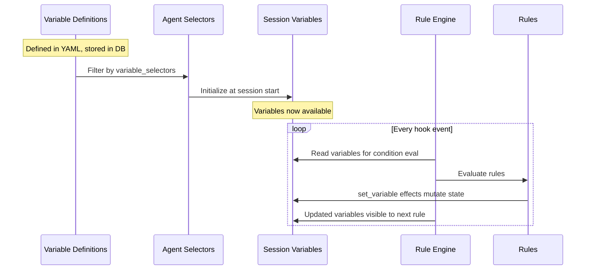

# Variables

Session variables are mutable state that persists across a session's lifetime. Rules read and write variables to coordinate behavior — they're the shared memory that connects enforcement, context injection, and state tracking.

Variables are initialized from variable definitions at session start, mutated by `set_variable` rule effects as events fire, and read by `when` conditions to gate rule execution.

For how variables fit into the broader workflow system, see [Workflows Overview](./workflows-overview.md).

---

## Variable Lifecycle



---

## Initialization

Variables are defined in YAML files and stored in the database as `workflow_definitions` where `workflow_type = 'variable'`:

```yaml
# src/gobby/install/shared/variables/gobby-default-variables.yaml
tags: [session-defaults, initialization]

variables:
  task_claimed:
    value: false
    description: Default task_claimed to false
  stop_attempts:
    value: 0
    description: Default stop_attempts to 0
  max_stop_attempts:
    value: 8
    description: Default max_stop_attempts to 8
```

Each variable entry becomes a `VariableDefinitionBody` in the database:

```yaml
variable: "task_claimed"      # Variable name
value: false                  # Default value
description: "..."            # Optional description
```

### Initialization Flow

1. Session starts (new, clear, compact, resume)
2. The active agent definition's `variable_selectors` determines which variables load
3. Matching variable definitions are applied to `session_variables`
4. Agent-level `workflows.variables` overrides are applied on top
5. Rules with `session_start` event can further mutate via `set_variable`

### Variable Selectors

Agent definitions control which variables are loaded:

```yaml
# default.yaml — loads everything (null = permissive)
workflows:
  # variable_selectors: null  (all enabled variables apply)

# A restricted agent might narrow scope:
workflows:
  variable_selectors:
    include: ["tag:session-defaults"]
    exclude: ["name:enforce_tdd"]
```

**Source**: `src/gobby/workflows/definitions.py` — `VariableDefinitionBody`

---

## Mutation

Variables are mutated by `set_variable` rule effects during rule evaluation:

```yaml
# Literal value
effect:
  type: set_variable
  variable: task_claimed
  value: true

# Expression (evaluated by SafeExpressionEvaluator)
effect:
  type: set_variable
  variable: stop_attempts
  value: "variables.get('stop_attempts', 0) + 1"

# List append
effect:
  type: set_variable
  variable: tdd_nudged_files
  value: "variables.get('tdd_nudged_files', []) + [tool_input.get('file_path', '')]"
```

### Expression Detection

The engine detects expressions by looking for these indicators in string values:
- `variables.`, `event.`, `tool_input.`
- `.get(`, `len(`, `str(`, `int(`, `bool(`, `any(`, `all(`
- ` + `, ` - `, ` and `, ` or `, ` not `

If none of these appear, the value is treated as a literal.

### Mutation Visibility

`set_variable` effects are **immediately visible** to later rules in the same evaluation pass. This enables rule chaining:

```yaml
# Rule 1 (priority 10): increment counter
increment-stop:
  priority: 10
  effect:
    type: set_variable
    variable: stop_attempts
    value: "variables.get('stop_attempts', 0) + 1"

# Rule 2 (priority 50): block based on counter (sees updated value)
require-task-close:
  priority: 50
  when: "variables.get('stop_attempts', 0) < variables.get('max_stop_attempts', 8)"
  effect:
    type: block
    reason: "Close your task before stopping."
```

### Auto-Managed Variables

Some variables are managed by the rule engine itself, not by declarative rules:

| Variable | Auto-behavior |
|----------|--------------|
| `stop_attempts` | Incremented on every `stop` event, reset to 0 on `before_agent` |
| `consecutive_tool_blocks` | Incremented when same blocked tool is retried, reset on different tool |
| `tool_block_pending` | Set `true` on tool failure, cleared on tool success |
| `_last_blocked_tool` | Tracks which tool was last blocked |
| `force_allow_stop` | Set `true` on catastrophic failures (rate limit, billing) |
| `errors_resolved` | Reset to `false` on `before_agent` |

---

## Using Variables in Conditions

Variables are available in rule `when` conditions via two access patterns:

```yaml
# Direct access (flattened to top level)
when: "task_claimed and not plan_mode"

# Dict access (with defaults)
when: "variables.get('stop_attempts', 0) < 3"
```

Both are equivalent — session variables are flattened into the evaluation context for convenience.

### Condition Evaluation

Conditions are evaluated by `SafeExpressionEvaluator`, an AST-based evaluator that provides safe expression evaluation without `eval()`.

**Supported operations**: boolean logic (`and`, `or`, `not`), comparisons (`==`, `!=`, `<`, `>`, `in`), arithmetic (`+`, `-`, `*`, `//`, `%`), attribute/subscript access, method calls on safe types, ternary expressions.

**Fail behavior**: Block effects fail **closed** (condition error → condition is `true` → block fires). Other effects fail **open** (condition error → condition is `false` → effect skipped). This is conservative: better to block wrongly than to corrupt state.

See [Rules Guide — Condition Expressions](./rules.md#condition-expressions) for the full reference.

---

## Using Variables in Templates

Variables are available in `inject_context` templates and `block` reason strings via Jinja2 syntax:

```yaml
effect:
  type: inject_context
  template: |
    You are working on task {{ task_ref }}: {{ task_title }}
    Stop attempts: {{ stop_attempts }}/{{ max_stop_attempts }}

effect:
  type: block
  reason: |
    Tasks in progress: {{ claimed_tasks.values() | list | join(', ') }}.
    Commit and close_task().
```

Jinja2 filters work: `| list`, `| join(', ')`, `| first`, `| default('')`, `| length`, `| lower`.

---

## LazyBool Pattern

For expensive computations (git status, DB queries), Gobby uses `LazyBool` — a deferred boolean that computes its value only when accessed:

```python
class LazyBool:
    def __init__(self, thunk: Callable[[], bool]):
        self._thunk = thunk
        self._computed = False
        self._value = False

    def __bool__(self) -> bool:
        if not self._computed:
            self._value = self._thunk()
            self._computed = True
        return self._value
```

LazyBool values are passed in the `eval_context` parameter to the rule engine. They look like regular booleans in `when` conditions but only evaluate when referenced:

```yaml
# This condition won't trigger the expensive git check
# unless the first part (task_claimed) is true
when: "task_claimed and has_uncommitted_changes"
```

If `task_claimed` is `false`, Python's short-circuit evaluation prevents `has_uncommitted_changes` from computing.

**Source**: `src/gobby/workflows/safe_evaluator.py` — `LazyBool`

---

## Built-in Condition Helpers

These functions are available in `when` conditions and provide higher-level checks:

### Task Helpers

| Function | Description |
|----------|-------------|
| `task_tree_complete(task_id)` | Check if a task and all subtasks are recursively complete. A task is complete if `closed` or `needs_review` (without `requires_user_review`). |
| `task_needs_human_review(task_id)` | Check if task is in `needs_review` status AND has the `requires_user_review` flag set. |

```yaml
when: "task_tree_complete(variables.get('session_task'))"
when: "task_needs_human_review(variables.get('auto_task_ref'))"
```

### Stop Signal Helper

| Function | Description |
|----------|-------------|
| `has_stop_signal(session_id)` | Check if a stop signal is pending for the session. |

### MCP Tracking Helpers

| Function | Description |
|----------|-------------|
| `mcp_called(server, tool?)` | Was this MCP tool called successfully? |
| `mcp_result_is_null(server, tool)` | Is the MCP result null/missing? |
| `mcp_failed(server, tool)` | Did the MCP call fail? |
| `mcp_result_has(server, tool, field, value)` | Does the MCP result have a specific field value? |

```yaml
when: "mcp_called('gobby-memory', 'recall_with_synthesis')"
when: "not mcp_failed('gobby-tasks', 'validate_task')"
```

### Progressive Discovery Helpers

| Function | Description |
|----------|-------------|
| `is_server_listed(tool_input)` | Was this server discovered via `list_mcp_servers`? |
| `is_tool_unlocked(tool_input)` | Was this tool's schema fetched via `get_tool_schema`? |
| `is_discovery_tool(tool_name)` | Is this a discovery tool (list_servers, list_tools, etc.)? |

**Source**: `src/gobby/workflows/safe_evaluator.py` — `build_condition_helpers`, `src/gobby/workflows/condition_helpers.py`

---

## Default Variables Reference

These are the bundled default variables (from `gobby-default-variables.yaml`):

| Variable | Default | Type | Purpose |
|----------|---------|------|---------|
| `task_claimed` | `false` | bool | Whether a task is claimed in this session |
| `claimed_tasks` | `{}` | dict | Map of claimed task UUIDs to refs (`{uuid: '#N'}`) |
| `require_task_before_edit` | `true` | bool | Enforce task-before-edit gate |
| `require_commit_before_close` | `true` | bool | Enforce commit-before-close gate |
| `stop_attempts` | `0` | int | Consecutive stop attempts (auto-managed) |
| `max_stop_attempts` | `8` | int | Threshold before escape hatch allows stop |
| `mode_level` | `2` | int | Autonomy level (0=plan, 1=accept_edits, 2=full auto) |
| `chat_mode` | `"bypass"` | string | Chat mode setting |
| `require_uv` | `true` | bool | Enforce `uv` for Python operations |
| `enforce_tdd` | `false` | bool | Enable TDD enforcement |
| `tdd_nudged_files` | `[]` | list | Files TDD-nudged this session (internal) |
| `tdd_tests_written` | `[]` | list | Test files written during TDD (internal) |
| `enforce_tool_schema_check` | `true` | bool | Enforce progressive discovery |
| `auto_inject_handoff` | `true` | bool | Populate session summary template vars |
| `servers_listed` | `false` | bool | Whether `list_mcp_servers` has been called |
| `listed_servers` | `[]` | list | Servers discovered via `list_mcp_servers` |
| `unlocked_tools` | `[]` | list | Tools unlocked via `get_tool_schema` |
| `errors_resolved` | `false` | bool | Whether all discovered errors have been fixed |

### Internal Variables (Set by Rules/Engine)

These are set during execution, not initialized from definitions:

| Variable | Type | Purpose |
|----------|------|---------|
| `task_ref` | string | Current task reference (e.g., `#1234`) |
| `plan_mode` | bool | Whether the agent is in plan mode |
| `tool_block_pending` | bool | A tool was just blocked/failed |
| `consecutive_tool_blocks` | int | Same-tool retry counter |
| `_last_blocked_tool` | string | Which tool was last blocked |
| `force_allow_stop` | bool | Catastrophic failure bypass |
| `_agent_type` | string | Current agent type (for agent_scope filtering) |
| `_active_rule_names` | list | Rules active for this session (from selectors) |
| `_active_skill_names` | list | Skills active for this session |
| `_observations` | list | Accumulated observe effect entries |
| `_assigned_pipeline` | string | Pipeline to auto-run on start |
| `full_session_summary` | string | Previous session summary (for handoff) |
| `compact_session_summary` | string | Compact session summary |

---

## Managing Variables

### CLI

```bash
# View all variables for a session
gobby workflows status --session <ID> --json

# Set a variable
gobby workflows set-var <name> <value> --session <ID>
```

### MCP Tools

| Tool | Description |
|------|-------------|
| `set_variable` | Set a session variable (on `gobby-workflows`) |
| `get_variable` | Get a session variable value |
| `list_variables` | List all session variables |

---

## File Locations

| Path | Purpose |
|------|---------|
| `src/gobby/install/shared/variables/` | Bundled variable definitions |
| `src/gobby/workflows/state_manager.py` | Session variable persistence |
| `src/gobby/workflows/safe_evaluator.py` | SafeExpressionEvaluator + LazyBool |
| `src/gobby/workflows/condition_helpers.py` | Built-in condition helper functions |
| `src/gobby/workflows/definitions.py` | VariableDefinitionBody model |

## See Also

- [Workflows Overview](./workflows-overview.md) — How variables connect rules, agents, and pipelines
- [Rules](./rules.md) — Rules that read and write variables
- [Agents](./agents.md) — Agent selectors that control variable loading
