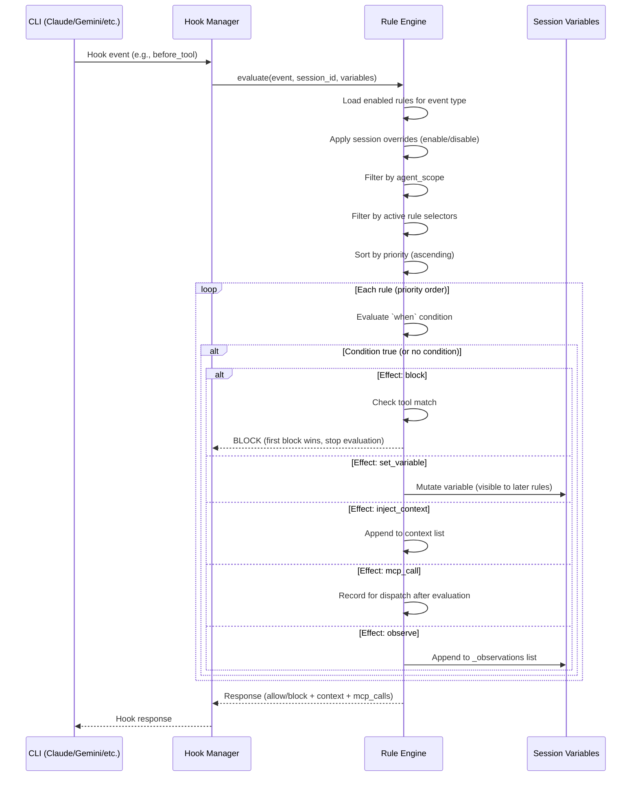
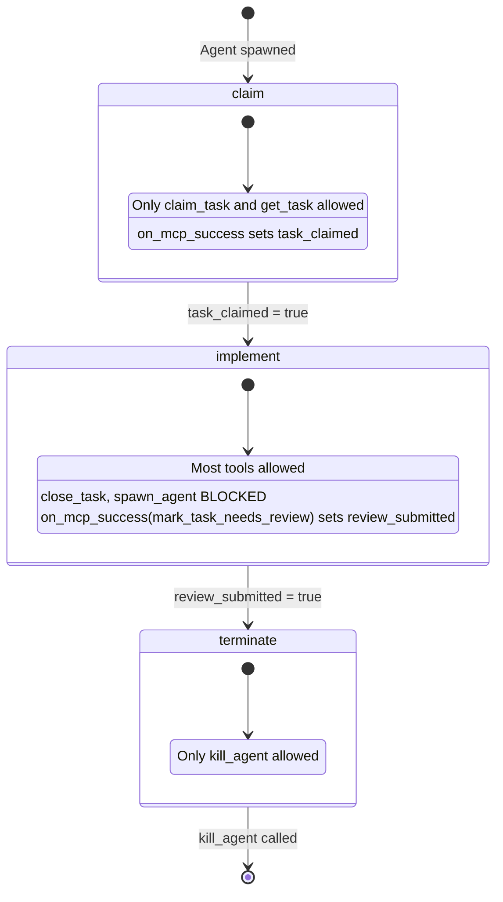
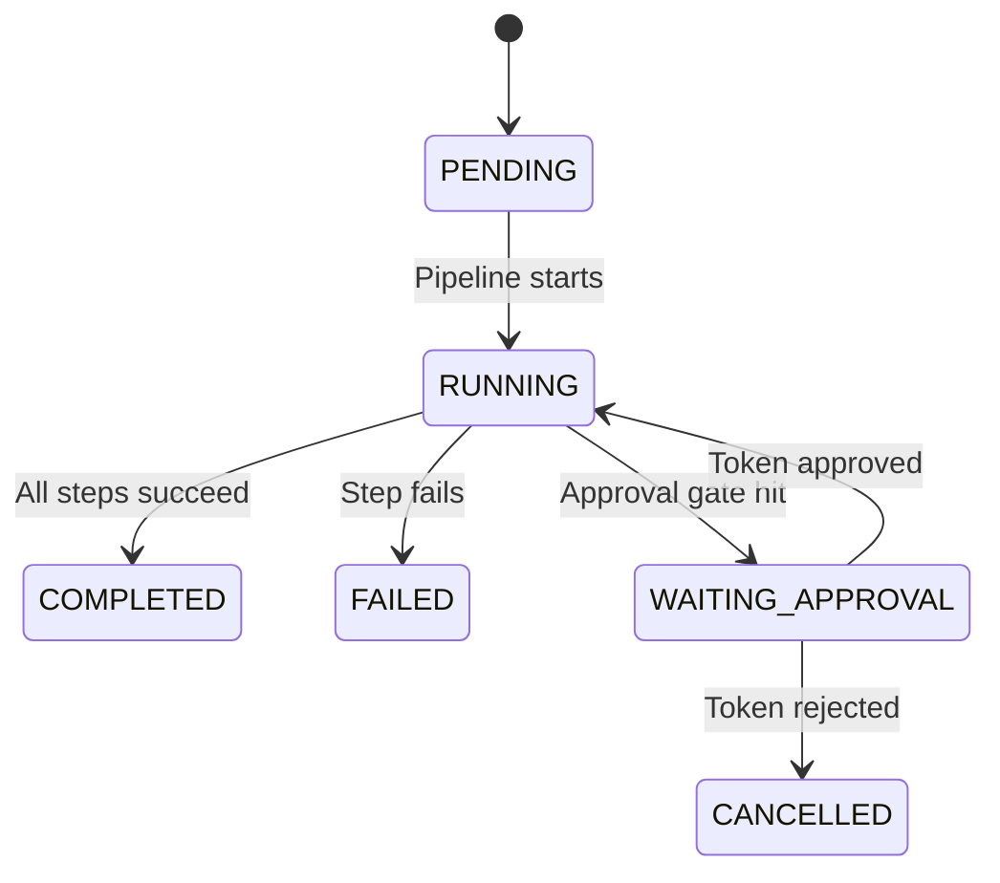

# Workflows Overview

Gobby's workflow system gives AI coding agents **enforced behavior** through three composable layers: rules, agents, and pipelines. Instead of hoping the LLM follows instructions, the workflow system blocks disallowed actions, injects context at the right time, and coordinates multi-agent orchestration deterministically.

This guide is the starting point. It explains the mental model, shows how the layers compose, and points to the detailed reference for each.

## Mental Model

```
┌─────────────────────────────────────────────────────┐
│                    PIPELINES                        │
│            Deterministic orchestration              │
│        "The assembly line — coordinates who         │
│         does what and in what order"                │
│                                                     │
│  ┌─────────────┐  ┌─────────────┐  ┌────────────┐  │
│  │  MCP step   │→ │ Spawn agent │→ │  MCP step  │  │
│  │ (scan tasks)│  │ (developer) │  │  (merge)   │  │
│  └─────────────┘  └──────┬──────┘  └────────────┘  │
│                          │                          │
└──────────────────────────┼──────────────────────────┘
                           │
┌──────────────────────────┼──────────────────────────┐
│                     AGENTS                          │
│              Intelligent workers                    │
│        "LLMs with a playbook — phased              │
│         behavior with tool constraints"            │
│                                                     │
│  ┌──────────┐   ┌─────────────┐   ┌─────────────┐  │
│  │  claim   │ → │  implement  │ → │  terminate  │  │
│  │(locked)  │   │ (creative)  │   │  (locked)   │  │
│  └──────────┘   └─────────────┘   └─────────────┘  │
│                                                     │
└──────────────────────────┬──────────────────────────┘
                           │ (rules enforce throughout)
┌──────────────────────────┼──────────────────────────┐
│                      RULES                          │
│             Reactive enforcement                    │
│        "Guardrails — react to events and           │
│         enforce invariants everywhere"              │
│                                                     │
│  before_tool → condition? → block / set_variable    │
│  session_start → inject_context / mcp_call          │
│  stop → require task close                          │
│                                                     │
└─────────────────────────────────────────────────────┘
```

**Rules** are reactive enforcement. They fire on hook events (before a tool call, on session start, when the agent tries to stop) and apply effects: block the action, set a variable, inject context into the system message, or call an MCP tool. Rules are stateless — they read session variables but don't own state. They define what you *can't* do.

**Agents** are intelligent workers with phased behavior. An agent definition combines identity (prompts) with a step workflow (phases with tool constraints, goals, and automatic transitions). The developer agent claims a task, implements it, submits for review, then terminates — each phase enforced, each transition automatic.

**Pipelines** are deterministic orchestration. They sequence operations: MCP calls, shell commands, agent spawning, nested pipelines. When they need intelligence, they spawn an agent. When they need mechanical work, they run an MCP step directly. Typed data flows between steps via `${{ }}` templates.

**Variables** are the shared state that ties it all together. Rules read and write variables to coordinate behavior across the session. Variables are initialized at session start and mutated by `set_variable` effects as events fire.

## How They Compose

The orchestrator pipeline is the canonical composition example:

```yaml
# Pipeline dispatches agents, constrained by rules
Pipeline: orchestrator
  ├── mcp step: scan open tasks          # mechanical
  ├── mcp step: suggest_next_tasks       # mechanical
  ├── spawn agent: developer             # intelligent work
  │     ├── step: claim                  # tool-locked: only claim_task, get_task
  │     ├── step: implement              # creative freedom (most tools allowed)
  │     │     └── rules enforce: no git push, require uv, task before edit
  │     └── step: terminate              # tool-locked: only kill_agent
  ├── spawn agent: qa-reviewer           # review + approve/reject
  ├── spawn agent: merge                 # merge approved branches
  └── register continuations, exit        # re-invoked on agent completion
```

Each layer does what it's good at:
- The **pipeline** decides *what happens next* (deterministic control flow)
- The **agent** decides *how to do it* (LLM reasoning within phased constraints)
- The **rules** ensure *invariants hold* (no git push, require task, etc.)

## Decision Matrix

| You want to... | Use | Why |
|----------------|-----|-----|
| Block a tool or action | **Rule** | Stateless, event-driven, fires on every hook |
| Inject context into the system message | **Rule** | `inject_context` effect accumulates text |
| Track state across events | **Rule** (`set_variable`) | Variables persist across the session |
| Guide an LLM through phased work | **Agent** (step workflow) | Tool restrictions + automatic transitions |
| Run a deterministic sequence of operations | **Pipeline** | Sequential steps with typed data flow |
| Coordinate multiple agents | **Pipeline** | Spawn, wait, dispatch in defined order |
| Gate an action on human approval | **Pipeline** (approval gate) | Built-in approval tokens with resume |
| Call MCP tools mechanically | **Pipeline** (`mcp` step) | No LLM needed, direct tool invocation |
| Initialize session state | **Variable definition** | Loaded at session start, used in conditions |

## Event Flow

When a CLI hook fires, here's what happens:



Key behaviors:
- **First block wins** — evaluation stops at the first matching block effect
- **Variables mutate in-place** — `set_variable` effects are visible to later rules in the same pass
- **Context accumulates** — multiple `inject_context` effects combine (separated by `\n\n`)
- **MCP calls collect** — all `mcp_call` effects dispatch after evaluation completes
- **Conditions skip, not stop** — a `when: false` skips the rule but evaluation continues

## Step Workflow Lifecycle

Agents with step workflows move through phases automatically:



Transitions fire automatically when an MCP tool succeeds and sets a step variable via `on_mcp_success`. The agent doesn't decide when to transition — the rule engine does.

## Pipeline Execution

Pipelines execute steps sequentially with typed data flow:



Each step produces output accessible to later steps via `${{ steps.<id>.output }}`. Six step types:

| Type | What it does |
|------|-------------|
| `exec` | Runs a shell command |
| `prompt` | Sends a prompt to the LLM |
| `mcp` | Calls an MCP tool directly |
| `invoke_pipeline` | Runs a nested pipeline |
| `activate_workflow` | Activates a step workflow on a session |
| `wait` | Blocks until a completion event fires |

## Templates vs Active Enforcement

Files in `src/gobby/install/shared/` (rules, agents, pipelines) are **templates**. They ship with Gobby but are **not automatically active**. Templates have `enabled: false` by design.

For a rule, pipeline, or agent to be active:
1. It must be synced to the `workflow_definitions` DB table (happens automatically on daemon start)
2. It must be **enabled** in the database
3. For rules: it must match the session's active rule selectors (set by the agent definition)

The database is the source of truth for what's active, not the YAML template files.

## Agent Selectors

Agent definitions control which rules, skills, and variables are active for their sessions using **selectors**:

```yaml
# default.yaml — the baseline interactive agent
workflows:
  rule_selectors:
    include: ["tag:gobby"]     # All gobby-tagged rules
  # skill_selectors: null      # All enabled skills (permissive default)
  # variable_selectors: null   # All enabled variables (permissive default)
```

Selector syntax:
- `*` — match everything
- `<name>` — exact name match
- `tag:<tag>` — match by tag
- `group:<group>` — match by group
- `source:<source>` — match by origin (bundled, installed, user)

`exclude` always beats `include`. If a rule matches both, it's excluded.

## File Locations

| Path | What it is |
|------|-----------|
| `src/gobby/workflows/rule_engine.py` | Rule evaluation engine |
| `src/gobby/workflows/pipeline_executor.py` | Pipeline execution engine |
| `src/gobby/workflows/definitions.py` | All definition models (rules, agents, pipelines, steps) |
| `src/gobby/workflows/safe_evaluator.py` | AST-based condition evaluator |
| `src/gobby/agents/spawn.py` | Agent spawning |
| `src/gobby/agents/runner.py` | Agent process management |
| `src/gobby/install/shared/rules/` | Bundled rule templates (14 groups) |
| `src/gobby/install/shared/agents/` | Bundled agent templates |
| `src/gobby/install/shared/workflows/` | Bundled pipeline templates |
| `~/.gobby/gobby-hub.db` | SQLite database (source of truth for active definitions) |

## Detailed Guides

- **[Rules](./rules.md)** — Rule YAML format, event types, effect types, conditions, bundled groups
- **[Pipelines](./pipelines.md)** — Pipeline schema, step types, data flow, approval gates, webhooks
- **[Agents](./agents.md)** — Agent definitions, step workflows, spawning, isolation, selectors
- **[Variables](./variables.md)** — Session variables, initialization, mutation, condition helpers
- **[Orchestrator](./orchestrator.md)** — The orchestrator pattern: expansion, dispatch, QA, merge
- **[Task Expansion](./task-expansion.md)** — How task expansion works end-to-end
- **[TDD Enforcement](./tdd-enforcement.md)** — TDD sandwich pattern and enforcement rules
