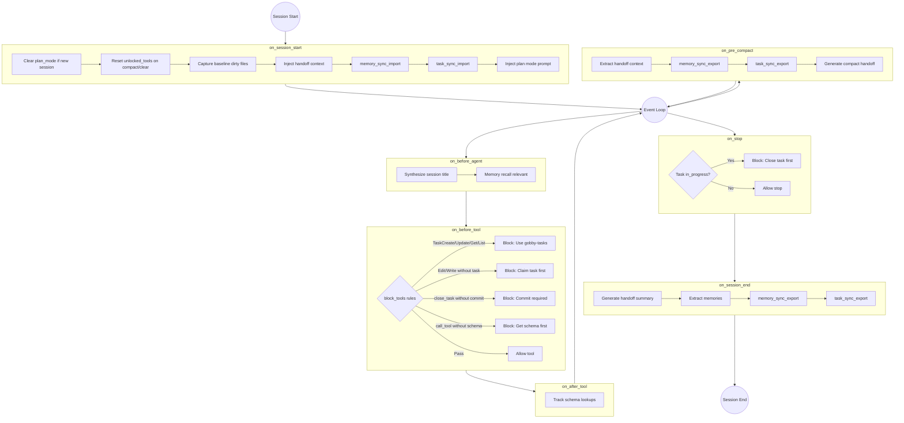

# Gobby Workflows

Workflows transform Gobby from a passive session tracker into an **enforcement layer** for AI agent behavior. Instead of relying on prompts to guide LLM behavior, workflows use hooks to enforce steps, tool restrictions, and transitions.

**Key insight**: The LLM doesn't need to remember what step it's in - the workflow engine tracks state and hooks enforce it. The LLM sees tool blocks and injected context that guide it naturally.

## Workflow Types

Gobby supports three types of workflows:

### Lifecycle Workflows

Event-driven workflows that respond to session events without enforcing steps or tool restrictions.

**Characteristics:**

- `type: lifecycle`
- No `steps` section
- Only `triggers` section
- Actions execute in sequence per event
- **Multiple lifecycle workflows can be active simultaneously**

**Use cases:**

- Session handoff (enabled by default)
- Auto-save and backup
- Logging and analytics
- Notifications

### Step-Based Workflows

State machine workflows that enforce steps with tool restrictions, transition conditions, and exit criteria.

**Characteristics:**

- `type: step` (default)
- Has `steps` section with allowed/blocked tools
- Has `transitions` and `exit_conditions`
- **Only one step-based workflow active at a time per session**
- Can coexist with lifecycle workflows

**Use cases:**

- Plan-and-Execute
- ReAct (Reason-Act-Observe)
- Plan-Act-Reflect
- TDD (Test-Driven Development)

### Pipeline Workflows

Sequential execution workflows with typed data flow between steps, approval gates, and deterministic execution.

**Characteristics:**

- `type: pipeline`
- Sequential step execution with `$step.output` data flow
- Approval gates with resume tokens
- Runs to completion or pauses at approval
- Can be triggered from lifecycle/step workflows via `run_pipeline` action

**Use cases:**

- CI/CD automation
- Deployment with approval gates
- Data processing pipelines
- Multi-agent orchestration

See [Pipelines Guide](./pipelines.md) for complete documentation.

### Coexistence

Lifecycle, step-based, and pipeline workflows work together:

- The `session-handoff` lifecycle workflow is always active (by default)
- You can activate ONE step-based workflow (like `plan-execute`) on top
- Multiple concurrent sessions can each have their own active workflow

## YAML Schema Reference

### Complete Workflow Definition

```yaml
# Required: Workflow identifier
name: plan-act-reflect

# Optional: Human-readable description
description: "Structured development with planning and reflection steps"

# Optional: Semantic version string (default: "1.0")
version: "1.0"

# Optional: Workflow type - "step" (default) or "lifecycle"
type: step

# Optional: Inherit from another workflow
extends: base-workflow

# Optional: Workflow-level settings
settings:
  reflect_after_actions: 5        # Trigger reflection after N actions
  max_actions_per_phase: 20       # Safety limit
  require_plan_approval: true     # User must approve plan

# Optional: Variable definitions (can be overridden per-project)
variables:
  plan_file_pattern: "**/*.plan.md"
  allowed_test_commands: ["pytest", "npm test"]

# Required for step-based: Step definitions
steps:
  - name: plan
    description: "Analyze requirements and create implementation plan"

    # Actions executed when entering this step
    on_enter:
      - action: inject_message
        content: "You are in PLANNING mode."

    # Tool restrictions
    allowed_tools:             # List of tools OR "all"
      - Read
      - Glob
      - Grep
      - WebSearch

    blocked_tools:             # Tools explicitly blocked
      - Edit
      - Write
      - Bash

    # Inline rules evaluated on each tool call
    rules:
      - when: "tool == 'Edit' and file not in session.files_read"
        action: block
        message: "Read the file before editing"

    # Automatic transition triggers
    transitions:
      - to: reflect
        when: "step_action_count >= 5"

    # Conditions that must be met to exit step
    exit_conditions:
      - type: artifact_exists
        pattern: "{{ plan_file_pattern }}"
      - type: user_approval
        prompt: "Plan complete. Ready to implement?"

    # Actions executed when exiting this step
    on_exit:
      - action: capture_artifact
        pattern: "{{ plan_file_pattern }}"
        as: current_plan

# Required for lifecycle: Trigger definitions
triggers:
  on_session_start:
    - action: load_workflow_state
    - action: enter_step
      step: plan
      when: "not workflow_state.step"

  on_session_end:
    - action: save_workflow_state
    - action: generate_handoff

# Optional: Error handling
on_error:
  - action: enter_step
    step: reflect
  - action: inject_message
    content: "An error occurred. Entering reflection."
```

### Workflow Inheritance

Use `extends` to inherit from another workflow:

```yaml
name: my-custom-workflow
extends: plan-act-reflect

# Override or extend any field
settings:
  reflect_after_actions: 10  # Override parent value

# Add new steps or override existing ones
steps:
  - name: review
    description: "Additional code review step"
    allowed_tools: [Read, Glob, Grep]
```

**Inheritance rules:**

- Child values override parent values
- Arrays are replaced, not merged
- Deep merge for objects/dicts
- Inheritance chains are supported (grandparent -> parent -> child)
- Circular inheritance is detected and rejected

### Step Configuration

```yaml
steps:
  - name: step-name            # Required: Unique step identifier
    description: string        # Optional: Human description

    on_enter:                  # Actions when entering step
      - action: action_name
        when: "condition"      # Optional: skip action if false
        ...action_kwargs

    allowed_tools:             # "all" OR list of tool names
      - ToolName

    blocked_tools:             # Tools to block (checked first)
      - ToolName

    rules:                     # Per-tool-call rules
      - when: "condition"
        action: block|allow|warn|require_approval
        message: "User message"

    transitions:               # Auto-transition triggers
      - to: step-name
        when: "condition"
        on_transition:
          - action: ...

    exit_conditions:           # All must be met (AND logic)
      - type: artifact_exists
        pattern: "*.plan.md"
      - type: user_approval
        prompt: "Ready to proceed?"
      - type: variable_set
        variable: task_list

    on_exit:                   # Actions when exiting step
      - action: action_name
```

### Exit Condition Types

| Type | Description | Parameters |
|------|-------------|------------|
| `artifact_exists` | File matching pattern exists | `pattern` |
| `user_approval` | User must approve | `prompt`, `timeout` (optional) |
| `variable_set` | Variable has a value | `variable` |
| `action_count` | Min actions taken | `min_count` |

### Available Actions

| Action | Description |
|--------|-------------|
| `inject_message` | Inject text into next prompt |
| `inject_context` | Inject context from source |
| `switch_mode` | Switch Claude Code mode (plan/normal) |
| `capture_artifact` | Save file content to artifact |
| `read_artifact` | Load artifact into variable |
| `set_variable` | Set workflow variable |
| `increment_variable` | Increment numeric variable |
| `enter_step` | Transition to a step |
| `load_workflow_state` | Load state from storage |
| `save_workflow_state` | Save state to storage |
| `generate_handoff` | Generate session summary |
| `call_llm` | Call LLM with prompt |
| `write_todos` | Populate TodoWrite list |
| `mark_todo_complete` | Mark todo item done |
| `persist_tasks` | Create persistent tasks |
| `call_mcp_tool` | Call any MCP tool |
| `webhook` | Send HTTP request to external service |
| `plugin:<name>:<action>` | Execute custom plugin action |

See [Workflow Actions Reference](../architecture/workflow-actions.md) for full details.
See [Webhooks and Plugins Guide](webhooks-and-plugins.md) for webhook examples and plugin development.

## Built-in Templates

Gobby ships with these workflow templates in `~/.gobby/workflows/templates/`:

### session-handoff (lifecycle)

**Enabled by default.** Handles session summary generation and context handoff.

```yaml
type: lifecycle
triggers:
  on_session_end:
    - action: generate_handoff
  on_session_start:
    - action: inject_context
      source: previous_session_summary
```

### plan-execute (step)

Basic planning enforcement. Restricts to read-only tools until user approves.

**Steps:** `plan` -> `execute`

### react (step)

ReAct loop with observation capture. Each action's result is captured and injected into reasoning context.

**Steps:** `reason` -> `act` -> `observe` (loop)

### plan-act-reflect (step)

Full reflection workflow. Automatically enters reflection step after N actions or on errors.

**Steps:** `plan` -> `act` -> `reflect` (loop)

### plan-to-tasks (step)

Task decomposition workflow. Breaks a plan into atomic tasks and executes sequentially with verification gates.

**Steps:** `decompose` -> `execute` -> `verify` (loop) -> `complete`

### architect (step)

BMAD-inspired development workflow.

**Steps:** `requirements` -> `design` -> `implementation` -> `review`

### test-driven (step)

TDD workflow. Blocks implementation until test exists.

**Steps:** `write-test` -> `implement` -> `refactor` (loop)

## CLI Commands

### List Workflows

```bash
gobby workflows list [--all] [--json]
```

| Option | Description |
|--------|-------------|
| `--all` | Show all workflows including step-based |
| `--json` | Output as JSON |

### Show Workflow Details

```bash
gobby workflows show <name> [--json]
```

### Activate Workflow

```bash
gobby workflows set <name> [--session ID] [--step INITIAL_STEP]
```

**Note:** Only for step-based workflows. Lifecycle workflows auto-run.

### Check Workflow Status

```bash
gobby workflows status [--session ID] [--json]
```

Shows current step, action counts, artifacts, and pending tasks.

### Clear/Deactivate Workflow

```bash
gobby workflows clear [--session ID] [--force]
```

### Manual Step Transition (Escape Hatch)

```bash
gobby workflows step <step-name> [--session ID] [--force]
```

Skips normal exit conditions. Use when stuck.

### Mark Artifact Complete

```bash
gobby workflows artifact <type> <file-path> [--session ID]
```

### Import Workflow

```bash
gobby workflows import <source> [--name NAME] [--global]
```

Import from a local file (URL import coming soon).

## MCP Tools

Workflow tools are available through the Gobby MCP server. Use progressive disclosure:

```python
# 1. Discover workflow tools
list_tools()  # Look for workflow-related tools

# 2. Get full schema
get_tool_schema("gobby", "activate_workflow")

# 3. Execute
call_tool("gobby", "activate_workflow", {"name": "plan-act-reflect"})
```

### Available Workflow Tools

| Tool | Description |
|------|-------------|
| `list_workflows` | List available workflow definitions |
| `activate_workflow` | Start a step-based workflow |
| `end_workflow` | Complete/terminate active workflow |
| `get_workflow_status` | Get current step and state |
| `request_step_transition` | Request transition to different step |
| `create_handoff` | Create handoff for next session |
| `mark_artifact_complete` | Register artifact as complete |

### Tool Filtering

When a step-based workflow is active, tools are filtered:

- `allowed_tools: all` + `blocked_tools: [X, Y]` -> All tools except X, Y
- `allowed_tools: [A, B, C]` -> Only A, B, C available
- `blocked_tools` is always checked first

Blocked tools are **hidden** (not grayed out) from the tool list.

## Conditional Actions

Actions in `on_enter` (and `on_exit`) support an optional `when` field. When present, the condition is evaluated before executing the action. If the condition is false, the action is skipped.

The `when` field uses the same expression syntax as transition conditions, with access to `variables` (via `DotDict` for both dot-notation and `.get()` access) and all flattened workflow variables.

```yaml
on_enter:
  # Always runs
  - action: set_variable
    name: result
    value: null

  # Only runs when session_task is set
  - action: call_mcp_tool
    when: "variables.get('session_task')"
    server_name: gobby-tasks
    tool_name: get_task
    arguments:
      task_id: "{{ variables.session_task }}"
    output_as: result

  # Conditional based on previous action results
  - action: set_variable
    when: "not variables.get('current_task_id') and variables.get('result')"
    name: current_task_id
    value: "{{ variables.result.id }}"
```

This is useful for:
- **Fallback logic**: Try one approach, fall back to another if it returns nothing
- **Conditional MCP calls**: Skip expensive API calls when prerequisites aren't met
- **Guard clauses**: Only execute cleanup actions when there's something to clean up

## Common Patterns

### Plan-and-Execute

```yaml
name: plan-execute
steps:
  - name: plan
    allowed_tools: [Read, Glob, Grep, WebSearch, AskUserQuestion]
    blocked_tools: [Edit, Write, Bash]
    exit_conditions:
      - type: user_approval
        prompt: "Ready to implement?"

  - name: execute
    allowed_tools: all
```

### Forced Reflection

```yaml
steps:
  - name: act
    transitions:
      - to: reflect
        when: "step_action_count >= 5"  # Force reflection every 5 actions
      - to: reflect
        when: "tool_result.is_error"      # Or on any error
```

### Read-Before-Edit Rule

```yaml
steps:
  - name: implement
    rules:
      - when: "tool == 'Edit' and file not in session.files_read"
        action: block
        message: "Read the file before editing: {{ file }}"
```

### Task Decomposition

```yaml
steps:
  - name: decompose
    on_enter:
      - action: call_llm
        prompt: "Break this into atomic tasks..."
        output_as: task_list
      - action: persist_tasks
        source: task_list.tasks
```

## Workflow Variables

Workflow variables control session behavior. They're defined in workflow YAML files and can be overridden at runtime.

### Behavior Variables

These variables control how Gobby behaves during a session:

| Variable | Default | Description |
|----------|---------|-------------|
| `require_task_before_edit` | `false` | Block Edit/Write tools unless a task is `in_progress` |
| `require_commit_before_stop` | `true` | Block session stop if task has uncommitted changes |
| `tdd_mode` | `true` | Generate test→implement task pairs during expansion |
| `memory_injection_enabled` | `true` | Enable memory injection (controls `memory_inject` action) |
| `memory_injection_limit` | `10` | Default limit for memory injection per query |
| `memory_injection_min_importance` | `0.3` | Minimum importance threshold (0.0-1.0) for memory filtering |
| `session_task` | `null` | Task(s) that must complete before stopping. Values: task ID, list of IDs, or `"*"` for all ready tasks |

### Defining Variables in Workflow YAML

```yaml
name: my-workflow
type: lifecycle

variables:
  require_task_before_edit: true
  tdd_mode: false
  session_task: "gt-abc123"
```

### Changing Variables at Runtime

Use the `set_variable` MCP tool to override defaults for the current session:

```python
call_tool("gobby-workflows", "set_variable", {
    "name": "tdd_mode",
    "value": false
})
```

### Precedence Order

1. **Explicit parameter** (highest) - passed directly to a tool
2. **Runtime override** - set via `set_variable` during session
3. **Workflow YAML default** - defined in workflow file
4. **System default** (lowest) - hardcoded fallback

### Configuration Split

- **config.yaml**: Infrastructure settings (daemon_port, database_path, log_level, LLM providers, MCP servers)
- **Workflow YAML**: Behavior settings (the variables above)

This separation means you can have different behavior per workflow without modifying global config.

## State and Persistence

### What Persists

- **Workflow state** is stored in SQLite per session
- **Tasks** persist across sessions in the task system
- **Artifacts** are captured file paths/content

### What Resets

- **Workflow state resets when session ends**
- A new session starts fresh with no active step-based workflow
- Lifecycle workflows restart automatically

### Cross-Session Continuity

For work that must survive session boundaries:

1. Use the **task system** (`gobby-tasks`) for persistent work items
2. Use **generate_handoff** action to summarize context
3. Use **inject_context** on session start to restore context

## Platform Limitations

### Codex

Codex uses a notify-only hook. It cannot:

- Block tool calls
- Inject context
- Enforce step transitions

Codex sessions can **track** workflow state but cannot **enforce** it. Full enforcement requires Claude Code or Gemini CLI.

## Troubleshooting

### Workflow Not Loading

```bash
# Check workflow exists
gobby workflows list

# Verify YAML is valid
gobby workflows show <name>
```

### Stuck in a Step

```bash
# Force transition to another step
gobby workflows step <target-step> --force

# Or clear the workflow entirely
gobby workflows clear --force
```

### Tool Blocked Unexpectedly

Check current step restrictions:

```bash
gobby workflows status --json
```

Look at `allowed_tools` and `blocked_tools` for the current step.

## File Locations

| Location | Purpose |
|----------|---------|
| `~/.gobby/workflows/` | Global workflow definitions |
| `.gobby/workflows/` | Project-specific workflows |
| `~/.gobby/workflows/templates/` | Built-in templates |
| Session record (SQLite) | Workflow state |

## Lifecycle Workflows Deep Dive

This section covers advanced lifecycle workflow concepts including blocking rules, condition evaluation, and hook payloads.

### Session Lifecycle Flow

The default `session-lifecycle.yaml` workflow orchestrates session events:



### Blocking Rule Syntax

The `block_tools` action supports two matching patterns:

#### `tools:` - Match upstream tool names

Matches the tool name as seen by the AI agent (before MCP translation):

```yaml
- action: block_tools
  rules:
    # Block Claude Code's native task tools
    - tools: [TaskCreate, TaskUpdate, TaskGet, TaskList]
      reason: "Use gobby-tasks instead"

    # Block file editing tools
    - tools: [Edit, Write, NotebookEdit]
      when: "not task_claimed"
      reason: "Claim a task first"

    # Block the MCP call_tool wrapper (for progressive disclosure)
    - tools: ["mcp__gobby__call_tool"]
      when: "not is_tool_unlocked(tool_input)"
      reason: "Get schema first"
```

#### `mcp_tools:` - Match downstream server:tool targets

Matches the `server_name:tool_name` combination for MCP tools after translation:

```yaml
- action: block_tools
  rules:
    # Block close_task specifically
    - mcp_tools: ["gobby-tasks:close_task"]
      when: "not task_has_commits"
      reason: "Commit your changes first"

    # Block multiple tools from a server
    - mcp_tools: ["gobby-memory:delete_memory", "gobby-memory:clear_all"]
      reason: "Memory deletion disabled"
```

#### When to use each

| Pattern | Use when... | Example |
|---------|-------------|---------|
| `tools:` | Blocking native CLI tools | `[Edit, Write, Bash]` |
| `tools:` | Blocking the MCP wrapper | `[mcp__gobby__call_tool]` |
| `mcp_tools:` | Blocking specific MCP tool calls | `[gobby-tasks:close_task]` |

### Condition Evaluation Context

The `when` expressions in blocking rules have access to these variables:

#### Built-in Variables

| Variable | Type | Description |
|----------|------|-------------|
| `tool_input` | `dict` | Arguments passed to the tool |
| `variables` | `dict` | All workflow variables |
| `task_claimed` | `bool` | Shortcut for `variables.get('task_claimed')` |
| `plan_mode` | `bool` | Shortcut for `variables.get('plan_mode')` |
| `task_has_commits` | `bool` | Whether claimed task has linked commits |
| `source` | `str` | CLI source (`claude`, `gemini`, `codex`) |

#### Built-in Functions

| Function | Description |
|----------|-------------|
| `is_plan_file(path, source)` | Returns True if path is a plan file (e.g., `.claude/plans/*.md`) |
| `is_discovery_tool(tool_name)` | Returns True for discovery tools (`list_tools`, `get_tool_schema`, etc.) |
| `is_tool_unlocked(tool_input)` | Returns True if schema was fetched for this server:tool |

#### Example Conditions

```yaml
# Block unless task is claimed OR in plan mode OR editing a plan file
when: "not task_claimed and not plan_mode and not is_plan_file(tool_input.get('file_path', ''), source)"

# Block close_task unless commit linked or using special close reasons
when: "not task_has_commits and not tool_input.get('commit_sha') and tool_input.get('reason') not in ['already_implemented', 'obsolete', 'duplicate', 'wont_fix']"

# Block call_tool unless it's a discovery tool or schema was fetched
when: "not is_discovery_tool(tool_input.get('tool_name')) and not is_tool_unlocked(tool_input)"
```

### Session-Lifecycle Variables Reference

These variables are defined in `session-lifecycle.yaml`:

| Variable | Default | Description |
|----------|---------|-------------|
| `require_task_before_edit` | `true` | Block Edit/Write without active task |
| `require_commit_before_close` | `true` | Block close_task without linked commit |
| `clear_task_on_close` | `true` | Reset task_claimed on successful close |
| `enforce_tool_schema_check` | `true` | Require get_tool_schema before call_tool |
| `unlocked_tools` | `[]` | Server:tool combos unlocked via get_tool_schema |
| `task_claimed` | `false` | Set automatically when task is claimed |
| `plan_mode` | `false` | Set when entering plan mode |

### Hook Payload Reference

Each CLI sends different data with hook events. The `event.data` dict contains CLI-specific payload:

#### session-start (`on_session_start`)

| Field | Claude | Gemini | Codex |
|-------|--------|--------|-------|
| `source` | `"startup"`, `"clear"`, `"compact"` | `"startup"` | `"startup"` |
| `cwd` | Current directory | Current directory | Current directory |
| `session_id` | External session ID | Thread ID | Thread ID |
| `machine_id` | Machine identifier | - | - |

#### pre-tool-use (`on_before_tool`)

| Field | Claude | Gemini | Codex |
|-------|--------|--------|-------|
| `tool_name` | Tool name | Tool name | Tool name |
| `tool_input` | Tool arguments | Tool arguments | Tool arguments |

#### post-tool-use (`on_after_tool`)

| Field | Claude | Gemini | Codex |
|-------|--------|--------|-------|
| `tool_name` | Tool name | Tool name | Tool name |
| `tool_input` | Tool arguments | Tool arguments | - |
| `tool_result` | Tool output | Tool output | - |
| `tool_error` | Error if failed | Error if failed | - |

#### pre-compact (`on_pre_compact`)

| Field | Claude | Gemini | Codex |
|-------|--------|--------|-------|
| `trigger` | - | `"auto"` or `"manual"` | - |
| `summary_so_far` | Previous summary | - | - |

#### stop (`on_stop`)

| Field | Claude | Gemini | Codex |
|-------|--------|--------|-------|
| `reason` | Stop reason | - | - |

### Hook Event Type Mapping

| Gobby Event | Claude Code | Gemini CLI | Codex CLI |
|-------------|-------------|------------|-----------|
| `session_start` | SessionStart | SessionStart | thread/started |
| `session_end` | SessionEnd | SessionEnd | thread/archive |
| `before_agent` | UserPromptSubmit | BeforeAgent | turn/started |
| `after_agent` | Stop | AfterAgent | turn/completed |
| `stop` | Stop | - | - |
| `before_tool` | PreToolUse | BeforeTool | requestApproval |
| `after_tool` | PostToolUse | AfterTool | item/completed |
| `pre_compact` | PreCompact | PreCompress | - |
| `subagent_start` | SubagentStart | - | - |
| `subagent_stop` | SubagentStop | - | - |

### Available Lifecycle Actions

| Action | Triggers | Description |
|--------|----------|-------------|
| `set_variable` | Any | Set a workflow variable |
| `capture_baseline_dirty_files` | session_start | Record uncommitted files for commit detection |
| `inject_context` | session_start, before_agent | Inject text into agent context (see sources below) |
| `memory_sync_import` | session_start | Import memories from .gobby/memories.jsonl |
| `memory_sync_export` | session_end, pre_compact | Export memories to .gobby/memories.jsonl |
| `task_sync_import` | session_start | Import tasks from .gobby/tasks.jsonl |
| `task_sync_export` | session_end, pre_compact | Export tasks to .gobby/tasks.jsonl |
| `memory_recall_relevant` | before_agent | Inject relevant memories for user prompt |
| `synthesize_title` | before_agent | Generate session title from first prompt |
| `block_tools` | before_tool | Evaluate blocking rules |
| `track_schema_lookup` | after_tool | Track get_tool_schema calls for progressive disclosure |
| `require_task_review_or_close_before_stop` | stop | Block stop if task still in_progress |
| `generate_handoff` | session_end, pre_compact | Generate LLM summary for handoff |
| `extract_handoff_context` | pre_compact | Extract structured context before compaction |

### inject_context Sources

The `inject_context` action supports multiple sources for injecting context into agent prompts:

| Source | Description | Parameters |
|--------|-------------|------------|
| `previous_session_summary` | Summary from parent session handoff | `require: true` to block if missing |
| `compact_handoff` | Context from pre-compact handoff | `require: true` to block if missing |
| `skills` | Inject skill list with descriptions | `filter: always_apply` for alwaysApply skills only |
| `task_context` | Active task details if session has claimed task | - |
| `memories` | Relevant memories for current context | `limit`, `min_importance` |
| (none) | Use inline `template` with Jinja2 syntax | - |

#### Examples

**Inject alwaysApply skills on session start:**

```yaml
- action: inject_context
  source: skills
  filter: always_apply
  template: |
    The following skills are available:
    {{ skills_list }}
```

**Inject active task context:**

```yaml
- action: inject_context
  source: task_context
  template: |
    {{ task_context }}
```

**Inject relevant memories:**

```yaml
- action: inject_context
  source: memories
  limit: 5
  min_importance: 0.7
  template: |
    ## Relevant Memories
    {{ memories_list }}
```

**Multi-source injection (array syntax):**

```yaml
- action: inject_context
  source: [skills, task_context]
  filter: always_apply
  template: |
    {{ skills_list }}
    {{ task_context }}
```

## See Also

- [Workflow Actions Reference](../architecture/workflow-actions.md)
- [Webhooks and Plugins Guide](webhooks-and-plugins.md)
- [MCP Tools Reference](../architecture/mcp-tools.md)
- [CLI Commands Reference](../architecture/cli-commands.md)
- [Task Management Guide](tasks.md)
