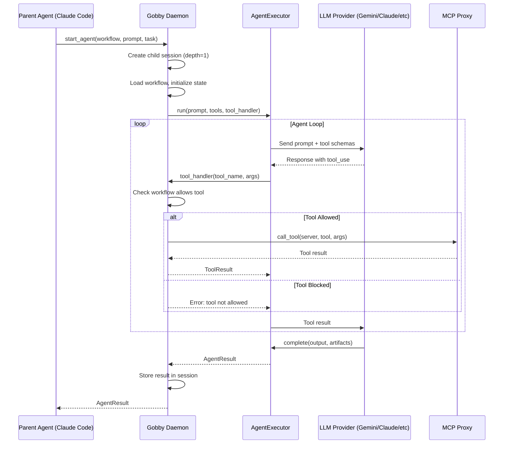
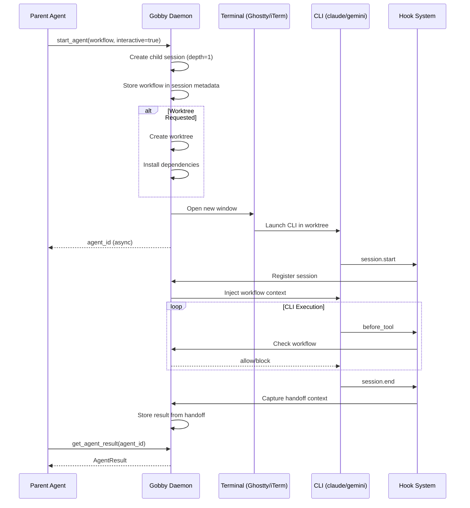
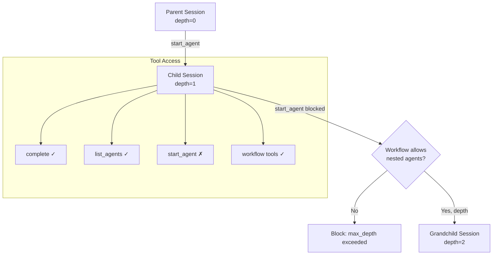
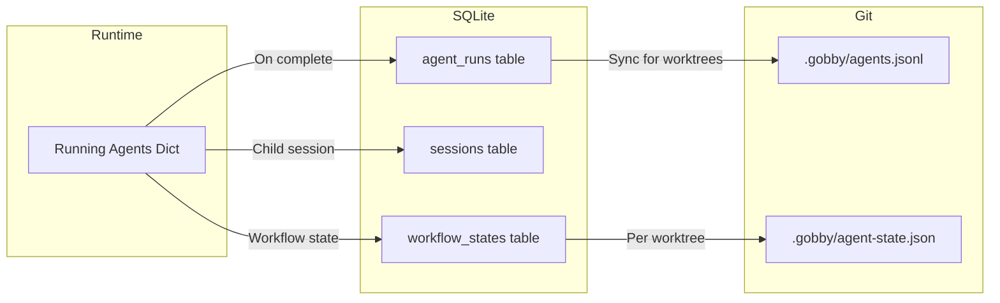

# Subagent Spawning System Plan

## Vision

Enable agents to spawn independent subagents from within a session. Subagents can use any LLM provider (Claude SDK, Gemini SDK, Codex SDK, LiteLLM) and follow deterministic step workflows. This transforms Gobby from a session tracker into an **agent orchestration layer**.

Key insight: **The parent agent doesn't need to implement subtasks itself** - it can delegate to specialized subagents that follow workflows, use different providers, and report results back.

Inspired by:
- Claude Code's Task tool (subagent spawning)
- Worktree parallelization patterns
- Multi-agent orchestration systems

---

## Use Cases

### Provider Diversity
Use the best model for each task:
- Gemini for research and web search
- Claude for code generation
- Codex for backend implementation
- OpenRouter for cost-effective subtasks

### Parallel Development
Spawn agents in separate worktrees:
- Frontend agent (Gemini) → `feature/ui`
- Backend agent (Codex) → `feature/api`
- Test agent (Claude) → `feature/tests`

### Workflow Enforcement
Subagent follows a workflow definition:
- Tool restrictions per step
- Exit conditions with validation
- Structured completion via `complete()` tool

### Cost Optimization
Delegate routine tasks to cheaper models while the orchestrator uses a more capable model.

---

## CLI Interface

```bash
# Start an agent (human-initiated)
uv run gobby agent start \
  --workflow workflow.yaml \
  --task gt-abc123 | next \
  --timeout 120 \
  --prompt "Implement the feature" \
  --session-context summary_markdown \
  --interactive \
  --provider claude \
  --cli claude

# List running agents
uv run gobby agent list

# Get agent status/result
uv run gobby agent status <agent-id>

# Cancel an agent
uv run gobby agent cancel <agent-id>
```

---

## MCP Interface (gobby-agents)

```python
# Start agent from within a session (parent agent calling)
start_agent(
    workflow="code-review.yaml",
    task="gt-abc123",  # or "next"
    timeout=120,  # 0 = infinite
    prompt="Review auth changes",
    session_context="summary_markdown",  # or session_id, transcript:10, file:path
    interactive=False,
    provider=None,  # use workflow default
    cli=None,
)
```

### Parameters

| Parameter | Type | Description |
|-----------|------|-------------|
| `workflow` | string | Path to workflow YAML (required) |
| `task` | string | Task ID or "next" for auto-select |
| `timeout` | float | Seconds (0 = infinite) |
| `prompt` | string | The prompt to give the agent |
| `session_context` | string | How to pass context (see below) |
| `interactive` | bool | Terminal mode vs in-process |
| `provider` | string | Override: claude, gemini, codex, litellm |
| `model` | string | Override model ID |

### Session Context Options

- `summary_markdown` - Use parent session's summary
- `session_id:<id>` - Load context from specific session
- `transcript:<n>` - Last N turns from parent
- `file:<path>` - Load markdown file as context

### MCP Tools

| Tool | Description |
|------|-------------|
| `start_agent` | Start a subagent with workflow |
| `complete` | Signal completion with structured result |
| `list_agents` | List running async agents |
| `get_agent_result` | Get result from async agent |
| `cancel_agent` | Cancel a running agent |

---

## Flow Diagrams

### In-Process Agent Execution



### Terminal Mode (Interactive) Agent Execution



### Agent Depth & Tool Filtering



### State Management Flow



---

## Architecture

### Components

```text
┌─────────────────────────────────────────────────────────────┐
│                      MCP Tool Call                           │
│  start_agent | complete | list_agents | get_agent_result    │
└─────────────────────────┬───────────────────────────────────┘
                          │
                          ▼
┌─────────────────────────────────────────────────────────────┐
│                     Agent Runner                             │
│  ┌─────────────┐  ┌─────────────┐  ┌─────────────────────┐  │
│  │   Session   │  │   Workflow  │  │   AgentExecutor     │  │
│  │   Manager   │  │   Engine    │  │   (per provider)    │  │
│  └─────────────┘  └─────────────┘  └─────────────────────┘  │
└─────────────────────────┬───────────────────────────────────┘
                          │
                          ▼
┌─────────────────────────────────────────────────────────────┐
│                   LLM Providers                              │
│  Claude SDK | Gemini SDK | Codex SDK | LiteLLM              │
└─────────────────────────────────────────────────────────────┘
```

### New Modules

```
src/gobby/
├── llm/
│   └── executor.py           # AgentExecutor ABC + per-provider implementations
├── agents/
│   ├── __init__.py
│   ├── registry.py           # gobby-agents MCP tool definitions
│   ├── runner.py             # AgentRunner - orchestrates execution
│   ├── session.py            # Child session creation/linking
│   └── terminal.py           # Terminal spawning (from worktree skill)
└── mcp_proxy/tools/
    └── agents.py             # MCP tool implementations
```

### AgentExecutor Interface

```python
class AgentExecutor(ABC):
    """Execute an agentic loop with tool calling."""

    @abstractmethod
    async def run(
        self,
        prompt: str,
        system_prompt: str | None,
        model: str | None,
        tools: list[ToolSchema],
        tool_handler: Callable[[str, dict], Awaitable[ToolResult]],
        max_turns: int = 10,
        timeout: float = 120.0,
    ) -> AgentResult:
        pass
```

Provider implementations:
- **ClaudeExecutor**: Refactor from `ClaudeLLMProvider.generate_with_mcp_tools()` (src/gobby/llm/claude.py:453-615)
- **GeminiExecutor**: Use Gemini function calling API
- **CodexExecutor**: Use Codex tool use API
- **LiteLLMExecutor**: OpenAI-compatible function calling

### The `complete` Tool

Subagents call this to explicitly return structured output:

```python
async def complete(
    output: str,                      # Summary/final message
    status: Literal["success", "partial", "blocked"] = "success",
    artifacts: dict[str, Any] = {},   # Structured outputs
    files_modified: list[str] = [],   # What changed
    next_steps: list[str] = [],       # Suggestions for parent
) -> NoReturn:
```

Workflow can define expected completion schema:

```yaml
exit_conditions:
  - type: tool_call
    tool: complete
    schema:
      output: string
      issues_found: integer
```

---

## Execution Modes

### In-Process (default)

1. Create child session linked to parent
2. Initialize workflow state for child session
3. Create AgentExecutor for provider
4. Run agent loop with workflow tool filtering via tool_handler
5. On `complete()` call or timeout, return AgentResult

### Terminal (`--interactive`)

1. Create child session linked to parent
2. Set workflow in session metadata
3. Auto-create worktree if specified and doesn't exist
4. Spawn terminal with CLI (claude/gemini/codex)
5. CLI connects via hooks, picks up workflow
6. On session end, result captured via handoff

---

## State Management

### In-Memory
- Running agents dict (keyed by agent_id)
- Real-time status updates

### SQLite

**agent_runs table:**
```sql
CREATE TABLE agent_runs (
    id TEXT PRIMARY KEY,              -- agent_id
    parent_session_id TEXT,
    child_session_id TEXT,
    workflow_name TEXT,
    provider TEXT,
    model TEXT,
    status TEXT,                      -- running, completed, timeout, error, cancelled
    prompt TEXT,
    result JSON,                      -- AgentResult on completion
    started_at TIMESTAMP,
    completed_at TIMESTAMP,
    FOREIGN KEY (parent_session_id) REFERENCES sessions(session_id),
    FOREIGN KEY (child_session_id) REFERENCES sessions(session_id)
);
```

**sessions table additions:**
```sql
ALTER TABLE sessions ADD COLUMN agent_depth INTEGER DEFAULT 0;
ALTER TABLE sessions ADD COLUMN spawned_by_agent_id TEXT;
```

### Git Sync (for worktrees)

- `.gobby/agents.jsonl` in main repo - central view of all agents
- `.gobby/agent-state.json` per worktree - current agent status

```jsonl
{"agent_id":"wt-frontend","worktree":"feature/ui","provider":"gemini","status":"running","step":"execute","updated_at":"..."}
{"agent_id":"wt-backend","worktree":"feature/api","provider":"codex","status":"completed","result":{...},"updated_at":"..."}
```

---

## Configuration

### Provider Config (~/.gobby/config.yaml)

```yaml
llm_providers:
  claude:
    enabled: true
    # subscription-based auth via CLI
  gemini:
    enabled: true
    auth_mode: api_key  # or adc
  codex:
    enabled: true
    auth_mode: subscription
  litellm:
    enabled: true
    api_base: https://openrouter.ai/api/v1
```

### Workflow-Level Provider Override

```yaml
name: code-review
type: step
settings:
  provider: gemini
  model: gemini-2.0-flash
  timeout: 120
  allow_provider_override: false  # Lock to workflow provider
```

### Override Hierarchy

1. CLI args (`uv run gobby agent start --provider`) - highest priority
2. MCP tool args (if `allow_provider_override: true` in workflow)
3. Workflow settings
4. config.yaml defaults - lowest priority

---

## Safety & Guardrails

### Agent Depth Tracking

```python
class Session:
    agent_depth: int = 0  # 0 = human-initiated, 1+ = spawned
    parent_session_id: str | None = None
    spawned_by_agent_id: str | None = None
```

### Default Depth Limit

- `max_agent_depth: 1` by default
- Subagents cannot start further subagents
- Workflow can opt-in with explicit config:

```yaml
name: orchestrator-workflow
settings:
  allow_nested_agents: true
  max_agent_depth: 2  # Allow one level of nesting
```

### Tool Filtering for Subagents

Subagents automatically have `start_agent` blocked unless workflow explicitly allows. They always have access to:
- `complete` - signal completion
- `list_agents` - see sibling agents (read-only)
- Workflow-allowed tools

### Timeout Enforcement

- In-process: `asyncio.wait_for` with timeout
- Terminal: Workflow can define `max_duration`, hooks enforce

---

## Implementation Checklist

### Phase 1: Core Infrastructure

- [ ] **AGENT-1**: Create `src/gobby/llm/executor.py` with `AgentExecutor` ABC
- [ ] **AGENT-2**: Create `ClaudeExecutor` by refactoring from `ClaudeLLMProvider.generate_with_mcp_tools()`
- [ ] **AGENT-3**: Create `src/gobby/agents/__init__.py` module
- [ ] **AGENT-4**: Create `src/gobby/agents/session.py` for child session creation
- [ ] **AGENT-5**: Add `agent_depth`, `spawned_by_agent_id` columns to sessions table (migration)
- [ ] **AGENT-6**: Create `agent_runs` table (migration)
- [ ] **AGENT-7**: Create `src/gobby/storage/agents.py` for agent_runs CRUD
- [ ] **AGENT-8**: Create `src/gobby/agents/runner.py` with `AgentRunner` class
- [ ] **AGENT-9**: Create `src/gobby/mcp_proxy/tools/agents.py` with MCP tool definitions
- [ ] **AGENT-10**: Register gobby-agents in `InternalRegistryManager`
- [ ] **AGENT-11**: Implement `start_agent` MCP tool (in-process mode)
- [ ] **AGENT-12**: Implement `complete` MCP tool
- [ ] **AGENT-13**: Implement `list_agents` MCP tool
- [ ] **AGENT-14**: Implement `get_agent_result` MCP tool
- [ ] **AGENT-15**: Implement `cancel_agent` MCP tool

### Phase 2: Workflow Integration

- [ ] **AGENT-16**: Load workflow definition for subagent
- [ ] **AGENT-17**: Initialize workflow state for child session
- [ ] **AGENT-18**: Implement tool_handler with workflow filtering
- [ ] **AGENT-19**: Handle `complete` tool as workflow exit condition
- [ ] **AGENT-20**: Integrate agent depth checking in workflow engine

### Phase 3: Multi-Provider

- [ ] **AGENT-21**: Create `GeminiExecutor` using Gemini function calling
- [ ] **AGENT-22**: Create `LiteLLMExecutor` using OpenAI-compatible API
- [ ] **AGENT-23**: Create `CodexExecutor` (if Codex supports tool use)
- [ ] **AGENT-24**: Implement provider resolution (workflow → config → default)

### Phase 4: Terminal Mode

- [ ] **AGENT-25**: Extract terminal spawning from worktree-manager skill
- [ ] **AGENT-26**: Create `src/gobby/agents/terminal.py`
- [ ] **AGENT-27**: Implement worktree auto-creation
- [ ] **AGENT-28**: Store workflow in session metadata for hook pickup
- [ ] **AGENT-29**: Capture result from session handoff
- [ ] **AGENT-30**: Implement `--interactive` flag in `start_agent`

### Phase 5: CLI Commands

- [ ] **AGENT-31**: Add `gobby agent` command group to cli.py
- [ ] **AGENT-32**: Implement `gobby agent start`
- [ ] **AGENT-33**: Implement `gobby agent list`
- [ ] **AGENT-34**: Implement `gobby agent status`
- [ ] **AGENT-35**: Implement `gobby agent cancel`

### Phase 6: State & Git Sync

- [ ] **AGENT-36**: Implement in-memory running agents dict
- [ ] **AGENT-37**: Persist completed agents to agent_runs table
- [ ] **AGENT-38**: Implement `.gobby/agents.jsonl` sync for worktrees
- [ ] **AGENT-39**: Implement `.gobby/agent-state.json` per worktree

### Phase 7: Testing

- [ ] **AGENT-40**: Unit tests for AgentExecutor implementations
- [ ] **AGENT-41**: Unit tests for AgentRunner
- [ ] **AGENT-42**: Unit tests for child session creation
- [ ] **AGENT-43**: Integration tests for in-process agent execution
- [ ] **AGENT-44**: Integration tests for workflow tool filtering
- [ ] **AGENT-45**: Integration tests for terminal mode

### Phase 8: Documentation

- [ ] **AGENT-46**: Update CLAUDE.md with gobby-agents section
- [ ] **AGENT-47**: Create agent workflow examples
- [ ] **AGENT-48**: Document provider configuration
- [ ] **AGENT-49**: Document safety guardrails

---

## Decisions

| # | Question | Decision | Rationale |
|---|----------|----------|-----------|
| 1 | **Worktree auto-creation** | Yes - auto-create if doesn't exist | Reduces friction for parallel development |
| 2 | **Provider override hierarchy** | CLI > MCP args (if allowed) > workflow > config | Flexibility for ad-hoc use, control for strict workflows |
| 3 | **CLI selection for terminal mode** | Always configurable via `cli` param | Terminal mode uses native CLIs; in-process mode uses SDK providers |
| 4 | **Default agent depth** | max_depth=1 (no nesting by default) | Prevent recursive spawning; workflows can opt-in |
| 5 | **Completion mechanism** | Explicit `complete()` tool call | Structured output, workflow can define schema |
| 6 | **Naming** | `start_agent` not `spawn_agent` | Matches CLI `gobby agent start` |
| 7 | **State persistence** | Memory + SQLite + optional Git sync | Fast runtime access, durable history, worktree coordination |
| 8 | **Tool availability in subagents** | `complete` always, `start_agent` blocked by default | Safety first, opt-in for orchestration workflows |

---

## Future Enhancements

- **Cross-agent dependencies**: `start_agent(depends_on=[agent_a, agent_b])`
- **Agent pools**: Pre-warmed agents for faster spawning
- **Fleet management**: Remote agent spawning via "mothership"
- **Agent templates**: Pre-configured agent definitions for common patterns
- **Cost tracking**: Track LLM costs per agent run
- **Visual orchestration**: UI for agent workflow visualization
