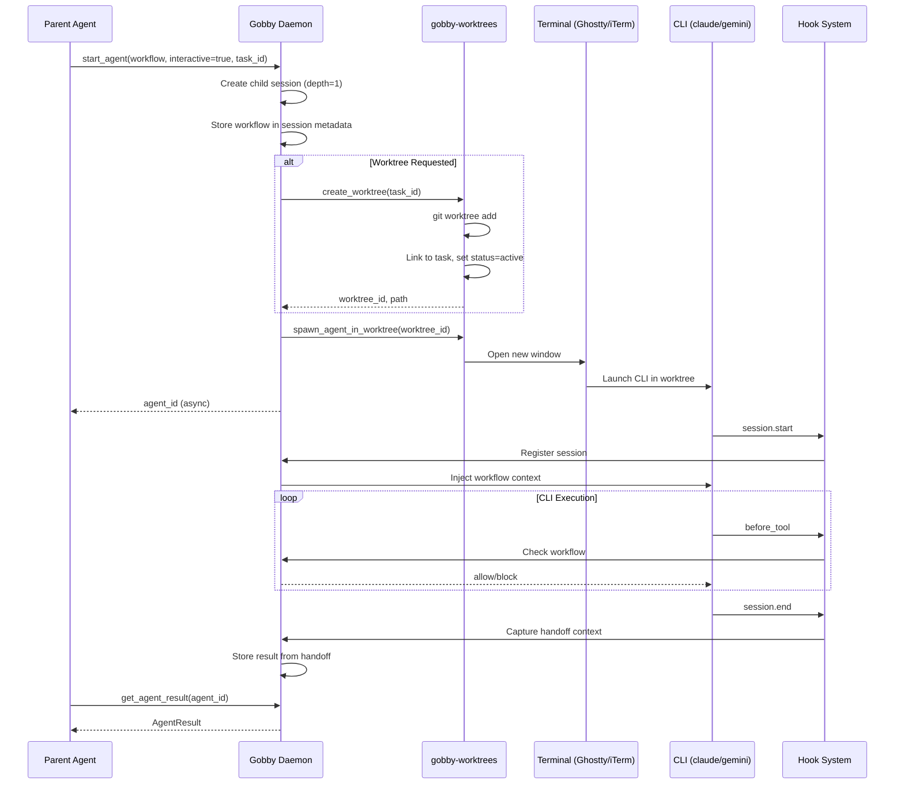

# Subagent Spawning System Plan

## Vision

Enable agents to spawn independent subagents from within a session. Subagents can use any LLM provider (Claude SDK, Gemini SDK, Codex SDK, LiteLLM) and follow deterministic step workflows. This transforms Gobby from a session tracker into an **agent orchestration layer**.

Key insight: **The parent agent doesn't need to implement subtasks itself** - it can delegate to specialized subagents that follow workflows, use different providers, and report results back.

Inspired by:
- Claude Code's Task tool (subagent spawning)
- Worktree parallelization patterns
- Multi-agent orchestration systems

---

## Use Cases

### Provider Diversity
Use the best model for each task:
- Gemini for research and web search
- Claude for code generation
- Codex for backend implementation
- OpenRouter for cost-effective subtasks

### Parallel Development
Spawn agents in separate worktrees:
- Frontend agent (Gemini) → `feature/ui`
- Backend agent (Codex) → `feature/api`
- Test agent (Claude) → `feature/tests`

### Workflow Enforcement
Subagent follows a workflow definition:
- Tool restrictions per step
- Exit conditions with validation
- Structured completion via `complete()` tool

### Cost Optimization
Delegate routine tasks to cheaper models while the orchestrator uses a more capable model.

---

## CLI Interface

```bash
# Start an agent (human-initiated)
uv run gobby agent start \
  --workflow workflow.yaml \
  --task gt-abc123 | next \
  --timeout 120 \
  --prompt "Implement the feature" \
  --session-context summary_markdown \
  --interactive \
  --provider claude \
  --cli claude

# List running agents
uv run gobby agent list

# Get agent status/result
uv run gobby agent status <agent-id>

# Cancel an agent
uv run gobby agent cancel <agent-id>

# Worktree management
uv run gobby worktree create [--task TASK_ID] [--branch NAME] [--base BRANCH]
uv run gobby worktree list [--status STATUS] [--project PROJECT]
uv run gobby worktree show WORKTREE_ID
uv run gobby worktree delete WORKTREE_ID [--force]
uv run gobby worktree spawn WORKTREE_ID [--prompt "..."] [--terminal ghostty|iterm]
uv run gobby worktree claim WORKTREE_ID
uv run gobby worktree release WORKTREE_ID
uv run gobby worktree sync WORKTREE_ID
uv run gobby worktree stale [--hours N]
uv run gobby worktree cleanup [--hours N] [--dry-run]
```

---

## MCP Interface

### gobby-agents

```python
# Start agent from within a session (parent agent calling)
start_agent(
    workflow="code-review.yaml",
    task="gt-abc123",  # or "next"
    timeout=120,  # 0 = infinite
    prompt="Review auth changes",
    session_context="summary_markdown",  # or session_id, transcript:10, file:path
    interactive=False,
    provider=None,  # use workflow default
    cli=None,
    worktree_id=None,  # use existing worktree
)
```

#### Parameters

| Parameter | Type | Description |
|-----------|------|-------------|
| `workflow` | string | Path to workflow YAML (required) |
| `task` | string | Task ID or "next" for auto-select |
| `timeout` | float | Seconds (0 = infinite) |
| `prompt` | string | The prompt to give the agent |
| `session_context` | string | How to pass context (see below) |
| `interactive` | bool | Terminal mode vs in-process |
| `provider` | string | Override: claude, gemini, codex, litellm |
| `model` | string | Override model ID |
| `worktree_id` | string | Use existing worktree (terminal mode) |

#### Session Context Options

- `summary_markdown` - Use parent session's summary
- `session_id:<id>` - Load context from specific session
- `transcript:<n>` - Last N turns from parent
- `file:<path>` - Load markdown file as context

#### MCP Tools (gobby-agents)

| Tool | Description |
|------|-------------|
| `start_agent` | Start a subagent with workflow |
| `complete` | Signal completion with structured result |
| `list_agents` | List running async agents |
| `get_agent_result` | Get result from async agent |
| `cancel_agent` | Cancel a running agent |

### gobby-worktrees

Daemon-managed worktree registry for parallel agent development.

#### MCP Tools (gobby-worktrees)

| Tool | Description |
|------|-------------|
| `create_worktree` | Create worktree, optionally linked to task |
| `list_worktrees` | List all worktrees with status and owning agents |
| `get_worktree` | Get worktree details including linked task |
| `claim_worktree` | Claim ownership for current session |
| `release_worktree` | Release ownership without deleting |
| `delete_worktree` | Delete worktree and its branch |
| `spawn_agent_in_worktree` | Launch Claude Code agent in worktree |
| `sync_worktree_from_main` | Rebase/merge from base branch |
| `detect_stale_worktrees` | Find inactive worktrees |
| `cleanup_stale_worktrees` | Delete stale worktrees |

```python
@mcp.tool()
def create_worktree(
    task_id: str | None = None,
    branch_name: str | None = None,  # Auto-generated from task if not provided
    base_branch: str = "main",
) -> dict:
    """
    Create a new worktree for isolated development.

    If task_id provided:
    - Branch name derived from task title (kebab-case)
    - Worktree linked to task for tracking
    - Task marked as in_progress

    Returns worktree path and branch name.
    """

@mcp.tool()
def spawn_agent_in_worktree(
    worktree_id: str,
    prompt: str | None = None,
    terminal: str = "ghostty",  # ghostty, iterm, terminal
    workflow: str | None = None,
) -> dict:
    """
    Launch a new Claude Code agent in the specified worktree.

    Opens a new terminal window with Claude Code started in the worktree directory.
    Agent session is linked to the worktree for tracking.
    """
```

---

## Flow Diagrams

### In-Process Agent Execution


### Terminal Mode (Interactive) Agent Execution



### Agent Depth & Tool Filtering


### State Management Flow


---

## Architecture

### Components

```text
┌─────────────────────────────────────────────────────────────┐
│                      MCP Tool Call                           │
│  start_agent | complete | list_agents | get_agent_result    │
│  create_worktree | spawn_agent_in_worktree | ...            │
└─────────────────────────┬───────────────────────────────────┘
                          │
                          ▼
┌─────────────────────────────────────────────────────────────┐
│                     Agent Runner                             │
│  ┌─────────────┐  ┌─────────────┐  ┌─────────────────────┐  │
│  │   Session   │  │   Workflow  │  │   AgentExecutor     │  │
│  │   Manager   │  │   Engine    │  │   (per provider)    │  │
│  └─────────────┘  └─────────────┘  └─────────────────────┘  │
│                                                              │
│  ┌─────────────────────────────────────────────────────────┐│
│  │                  Worktree Manager                        ││
│  │   LocalWorktreeManager | WorktreeGitManager | Spawner   ││
│  └─────────────────────────────────────────────────────────┘│
└─────────────────────────┬───────────────────────────────────┘
                          │
                          ▼
┌─────────────────────────────────────────────────────────────┐
│                   LLM Providers                              │
│  Claude SDK | Gemini SDK | Codex SDK | LiteLLM              │
└─────────────────────────────────────────────────────────────┘
```

### Module Structure

```
src/gobby/
├── llm/
│   └── executor.py           # AgentExecutor ABC + per-provider implementations
├── agents/
│   ├── __init__.py
│   ├── registry.py           # gobby-agents MCP tool definitions
│   ├── runner.py             # AgentRunner - orchestrates execution
│   └── session.py            # Child session creation/linking
├── worktrees/
│   ├── __init__.py
│   ├── manager.py            # WorktreeManager - coordinates worktree lifecycle
│   ├── git.py                # WorktreeGitManager - git operations
│   └── spawn.py              # Terminal spawning logic
├── storage/
│   └── worktrees.py          # LocalWorktreeManager - SQLite CRUD
└── mcp_proxy/tools/
    ├── agents.py             # gobby-agents MCP tool implementations
    └── worktrees.py          # gobby-worktrees MCP tool implementations
```

### Data Models

#### agent_runs table

```sql
CREATE TABLE agent_runs (
    id TEXT PRIMARY KEY,              -- agent_id
    parent_session_id TEXT,
    child_session_id TEXT,
    workflow_name TEXT,
    provider TEXT,
    model TEXT,
    status TEXT,                      -- running, completed, timeout, error, cancelled
    prompt TEXT,
    result JSON,                      -- AgentResult on completion
    worktree_id TEXT,                 -- Link to worktree (if terminal mode)
    started_at TIMESTAMP,
    completed_at TIMESTAMP,
    FOREIGN KEY (parent_session_id) REFERENCES sessions(session_id),
    FOREIGN KEY (child_session_id) REFERENCES sessions(session_id),
    FOREIGN KEY (worktree_id) REFERENCES worktrees(id)
);
```

#### worktrees table

```sql
CREATE TABLE worktrees (
    id TEXT PRIMARY KEY,                    -- wt-{6 chars}
    project_id TEXT NOT NULL,
    task_id TEXT,                           -- Optional: linked gobby-task
    branch_name TEXT NOT NULL,
    worktree_path TEXT NOT NULL,            -- Absolute path
    base_branch TEXT DEFAULT 'main',
    agent_session_id TEXT,                  -- Current owning session
    status TEXT DEFAULT 'active',           -- active, stale, merged, abandoned
    created_at TEXT NOT NULL,
    updated_at TEXT NOT NULL,
    merged_at TEXT,
    FOREIGN KEY (project_id) REFERENCES projects(id),
    FOREIGN KEY (task_id) REFERENCES tasks(id),
    FOREIGN KEY (agent_session_id) REFERENCES sessions(id)
);

CREATE INDEX idx_worktrees_project ON worktrees(project_id);
CREATE INDEX idx_worktrees_status ON worktrees(status);
CREATE INDEX idx_worktrees_task ON worktrees(task_id);
```

#### sessions table additions

```sql
ALTER TABLE sessions ADD COLUMN agent_depth INTEGER DEFAULT 0;
ALTER TABLE sessions ADD COLUMN spawned_by_agent_id TEXT;
```

### AgentExecutor Interface

```python
class AgentExecutor(ABC):
    """Execute an agentic loop with tool calling."""

    @abstractmethod
    async def run(
        self,
        prompt: str,
        system_prompt: str | None,
        model: str | None,
        tools: list[ToolSchema],
        tool_handler: Callable[[str, dict], Awaitable[ToolResult]],
        max_turns: int = 10,
        timeout: float = 120.0,
    ) -> AgentResult:
        pass
```

Provider implementations:
- **ClaudeExecutor**: Refactor from `ClaudeLLMProvider.generate_with_mcp_tools()` (src/gobby/llm/claude.py:453-615)
- **GeminiExecutor**: Use Gemini function calling API
- **CodexExecutor**: Use Codex tool use API
- **LiteLLMExecutor**: OpenAI-compatible function calling

### The `complete` Tool

Subagents call this to explicitly return structured output:

```python
async def complete(
    output: str,                      # Summary/final message
    status: Literal["success", "partial", "blocked"] = "success",
    artifacts: dict[str, Any] = {},   # Structured outputs
    files_modified: list[str] = [],   # What changed
    next_steps: list[str] = [],       # Suggestions for parent
) -> NoReturn:
```

Workflow can define expected completion schema:

```yaml
exit_conditions:
  - type: tool_call
    tool: complete
    schema:
      output: string
      issues_found: integer
```

---

## Execution Modes

### In-Process (default)

1. Create child session linked to parent
2. Initialize workflow state for child session
3. Create AgentExecutor for provider
4. Run agent loop with workflow tool filtering via tool_handler
5. On `complete()` call or timeout, return AgentResult

### Terminal (`--interactive`)

1. Create child session linked to parent
2. Set workflow in session metadata
3. Create or claim worktree via `gobby-worktrees`
4. Spawn terminal with CLI via `spawn_agent_in_worktree()`
5. CLI connects via hooks, picks up workflow
6. On session end, result captured via handoff
7. Worktree ownership released or retained based on task status

---

## Configuration

### Provider Config (~/.gobby/config.yaml)

```yaml
llm_providers:
  claude:
    enabled: true
    # subscription-based auth via CLI
  gemini:
    enabled: true
    auth_mode: api_key  # or adc
  codex:
    enabled: true
    auth_mode: subscription
  litellm:
    enabled: true
    api_base: https://openrouter.ai/api/v1
```

### Worktree Config (~/.gobby/config.yaml)

```yaml
worktrees:
  enabled: true
  base_path: ".worktrees"             # Relative to project root
  default_terminal: "ghostty"         # ghostty, iterm, terminal
  stale_threshold_hours: 24
  auto_cleanup: false                 # Auto-delete stale worktrees
  max_concurrent: 12                  # Max parallel worktrees
  branch_prefix: "agent/"             # Prefix for auto-generated branches
```

### Workflow-Level Provider Override

```yaml
name: code-review
type: step
settings:
  provider: gemini
  model: gemini-2.0-flash
  timeout: 120
  allow_provider_override: false  # Lock to workflow provider
```

### Override Hierarchy

1. CLI args (`uv run gobby agent start --provider`) - highest priority
2. MCP tool args (if `allow_provider_override: true` in workflow)
3. Workflow settings
4. config.yaml defaults - lowest priority

---

## Safety & Guardrails

### Agent Depth Tracking

```python
class Session:
    agent_depth: int = 0  # 0 = human-initiated, 1+ = spawned
    parent_session_id: str | None = None
    spawned_by_agent_id: str | None = None
```

### Default Depth Limit

- `max_agent_depth: 1` by default
- Subagents cannot start further subagents
- Workflow can opt-in with explicit config:

```yaml
name: orchestrator-workflow
settings:
  allow_nested_agents: true
  max_agent_depth: 2  # Allow one level of nesting
```

### Tool Filtering for Subagents

Subagents automatically have `start_agent` blocked unless workflow explicitly allows. They always have access to:
- `complete` - signal completion
- `list_agents` - see sibling agents (read-only)
- Workflow-allowed tools

### Timeout Enforcement

- In-process: `asyncio.wait_for` with timeout
- Terminal: Workflow can define `max_duration`, hooks enforce

### Worktree Isolation

- Each agent works in its own worktree, protecting main branch
- Task-driven assignment ensures traceability
- Centralized daemon coordination prevents conflicts
- Stale worktrees detected and cleaned up automatically

### Workflow Exclusions for Worktree Agents

- Worktree agent sessions have `is_worktree: true` variable
- Excluded from `require_task_complete` enforcement (main session owns parent task)
- Can stop when their assigned subtask is complete
- Main session tracks overall epic progress

---

## Implementation Phases

### Phase 1: Core Infrastructure ✅ COMPLETED

> **Status**: Implemented and tested. Do not regenerate tasks for this phase.

- [x] **AGENT-1**: Create `src/gobby/llm/executor.py` with `AgentExecutor` ABC
- [x] **AGENT-2**: Create `ClaudeExecutor` by refactoring from `ClaudeLLMProvider.generate_with_mcp_tools()`
- [x] **AGENT-3**: Create `src/gobby/agents/__init__.py` module
- [x] **AGENT-4**: Create `src/gobby/agents/session.py` for child session creation
- [x] **AGENT-5**: Add `agent_depth`, `spawned_by_agent_id` columns to sessions table (migration)
- [x] **AGENT-6**: Create `agent_runs` table (migration)
- [x] **AGENT-7**: Create `src/gobby/storage/agents.py` for agent_runs CRUD
- [x] **AGENT-8**: Create `src/gobby/agents/runner.py` with `AgentRunner` class
- [x] **AGENT-9**: Create `src/gobby/mcp_proxy/tools/agents.py` with MCP tool definitions
- [x] **AGENT-10**: Register gobby-agents in `InternalRegistryManager`
- [x] **AGENT-11**: Implement `start_agent` MCP tool (in-process mode)
- [x] **AGENT-12**: Implement `complete` MCP tool
- [x] **AGENT-13**: Implement `list_agents` MCP tool
- [x] **AGENT-14**: Implement `get_agent_result` MCP tool
- [x] **AGENT-15**: Implement `cancel_agent` MCP tool

### Phase 2: Workflow Integration ✅ COMPLETED

> **Status**: Implemented and tested. Do not regenerate tasks for this phase.

- [x] **AGENT-16**: Load workflow definition for subagent
- [x] **AGENT-17**: Initialize workflow state for child session
- [x] **AGENT-18**: Implement tool_handler with workflow filtering
- [x] **AGENT-19**: Handle `complete` tool as workflow exit condition
- [x] **AGENT-20**: Integrate agent depth checking in workflow engine

### Phase 3: Multi-Provider Support

Create additional AgentExecutor implementations for provider diversity.

- [ ] **AGENT-21**: Create `GeminiExecutor` using Gemini function calling
- [ ] **AGENT-22**: Create `LiteLLMExecutor` using OpenAI-compatible API
- [ ] **AGENT-23**: Create `CodexExecutor` (if Codex supports tool use)
- [ ] **AGENT-24**: Implement provider resolution (workflow → config → default)

### Phase 4: Worktree Management

Daemon-managed worktree registry with agent assignment, status tracking, and coordinated merging.

#### Phase 4.1: Worktree Storage Layer

- [ ] Create database migration for `worktrees` table
- [ ] Create `src/gobby/storage/worktrees.py` with `LocalWorktreeManager` class
- [ ] Implement CRUD operations (create, get, update, delete, list)
- [ ] Implement status transitions (active → stale → merged/abandoned)

#### Phase 4.2: Git Operations

- [ ] Create `src/gobby/worktrees/git.py` with `WorktreeGitManager` class
- [ ] Implement `create_worktree()` - git worktree add
- [ ] Implement `delete_worktree()` - git worktree remove + branch delete
- [ ] Implement `sync_from_main()` - rebase/merge from base branch
- [ ] Implement `get_worktree_status()` - uncommitted changes, ahead/behind

#### Phase 4.3: Agent Spawning in Worktrees

- [ ] Create `src/gobby/worktrees/spawn.py` with agent spawning logic
- [ ] Implement Ghostty terminal spawning
- [ ] Implement iTerm terminal spawning
- [ ] Implement generic Terminal.app spawning
- [ ] Pass initial prompt via environment or file
- [ ] Register spawned session with daemon

#### Phase 4.4: MCP Tools (gobby-worktrees)

- [ ] Create `src/gobby/mcp_proxy/tools/worktrees.py` with `WorktreeToolRegistry`
- [ ] Register as `gobby-worktrees` internal server
- [ ] Implement `create_worktree`
- [ ] Implement `list_worktrees`
- [ ] Implement `get_worktree`
- [ ] Implement `claim_worktree`
- [ ] Implement `release_worktree`
- [ ] Implement `delete_worktree`
- [ ] Implement `spawn_agent_in_worktree`
- [ ] Implement `sync_worktree_from_main`
- [ ] Implement `detect_stale_worktrees`
- [ ] Implement `cleanup_stale_worktrees`

#### Phase 4.5: Terminal Mode Integration

- [ ] Update `start_agent` to support `interactive=True` with worktrees
- [ ] Store workflow in session metadata for hook pickup
- [ ] Capture result from session handoff
- [ ] Link worktree status to agent run status

### Phase 5: CLI Commands

Add CLI command groups for agents and worktrees.

#### Phase 5.1: Agent CLI

- [ ] Add `gobby agent` command group to cli.py
- [ ] Implement `gobby agent start`
- [ ] Implement `gobby agent list`
- [ ] Implement `gobby agent status`
- [ ] Implement `gobby agent cancel`

#### Phase 5.2: Worktree CLI

- [ ] Add `gobby worktree` command group to cli.py
- [ ] Implement `gobby worktree create`
- [ ] Implement `gobby worktree list`
- [ ] Implement `gobby worktree show`
- [ ] Implement `gobby worktree delete`
- [ ] Implement `gobby worktree spawn`
- [ ] Implement `gobby worktree claim`
- [ ] Implement `gobby worktree release`
- [ ] Implement `gobby worktree sync`
- [ ] Implement `gobby worktree stale`
- [ ] Implement `gobby worktree cleanup`

### Phase 6: State Management

- [ ] Implement in-memory running agents dict with thread safety
- [ ] Persist completed agents to `agent_runs` table
- [ ] Add worktree context to session handoff
- [ ] Link worktree status to task status changes
- [ ] Add WebSocket events for agent and worktree changes

### Phase 7: Testing

- [ ] Unit tests for AgentExecutor implementations (all providers)
- [ ] Unit tests for AgentRunner
- [ ] Unit tests for child session creation
- [ ] Unit tests for LocalWorktreeManager
- [ ] Unit tests for WorktreeGitManager
- [ ] Integration tests for in-process agent execution
- [ ] Integration tests for workflow tool filtering
- [ ] Integration tests for terminal mode with worktrees
- [ ] Integration tests for worktree lifecycle

### Phase 8: Documentation

- [ ] Update CLAUDE.md with gobby-agents section
- [ ] Update CLAUDE.md with gobby-worktrees section
- [ ] Create agent workflow examples
- [ ] Document provider configuration
- [ ] Document safety guardrails
- [ ] Document worktree management patterns

---

## Decisions

| # | Question | Decision | Rationale |
|---|----------|----------|-----------|
| 1 | **Worktree auto-creation** | Yes - auto-create if doesn't exist | Reduces friction for parallel development |
| 2 | **Provider override hierarchy** | CLI > MCP args (if allowed) > workflow > config | Flexibility for ad-hoc use, control for strict workflows |
| 3 | **CLI selection for terminal mode** | Always configurable via `cli` param | Terminal mode uses native CLIs; in-process mode uses SDK providers |
| 4 | **Default agent depth** | max_depth=1 (no nesting by default) | Prevent recursive spawning; workflows can opt-in |
| 5 | **Completion mechanism** | Explicit `complete()` tool call | Structured output, workflow can define schema |
| 6 | **Naming** | `start_agent` not `spawn_agent` | Matches CLI `gobby agent start` |
| 7 | **State persistence** | SQLite for all state (agents + worktrees) | Consistent with Gobby architecture, daemon-level coordination |
| 8 | **Tool availability in subagents** | `complete` always, `start_agent` blocked by default | Safety first, opt-in for orchestration workflows |
| 9 | **Worktree storage** | SQLite `worktrees` table | Centralized registry, consistent with other managers |
| 10 | **Worktree ownership** | Session-based claiming | Track which agent owns which worktree |
| 11 | **Stale detection** | Configurable threshold (default 24h) | Prevent worktree sprawl |
| 12 | **Task-worktree linking** | Optional but encouraged | Traceability without forcing overhead |

---

## Future Enhancements

- **Cross-agent dependencies**: `start_agent(depends_on=[agent_a, agent_b])`
- **Agent pools**: Pre-warmed agents for faster spawning
- **Fleet management**: Remote agent spawning via "mothership"
- **Agent templates**: Pre-configured agent definitions for common patterns
- **Cost tracking**: Track LLM costs per agent run
- **Visual orchestration**: UI for agent workflow visualization
- **Intelligent merge resolution**: AI-powered conflict resolution for worktree merges (see POST_MVP_ENHANCEMENTS.md Phase 1)
